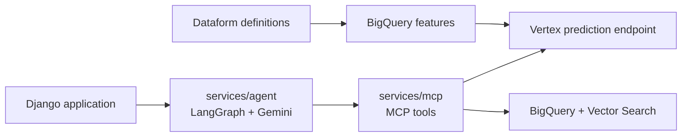

# Enterprise Clinical Copilot

Enterprise Clinical Copilot is a full-stack clinical decision-support application that
estimates 30-day readmission risk at discharge, attributes the estimate with TreeSHAP, and
lets a clinician question the result against retrieved discharge-note evidence.

The system is separated into deployable services and offline ML workflows:

```text
enterprise_clinical_copilot/
├── services/
│   ├── agent/        LangGraph + Gemini HTTP service
│   └── mcp/          MCP server, prediction tool, retrieval tool, RAG pipeline
├── mlops/            Feature encoding, training, evaluation, and model serving
├── definitions/      Dataform ELT: cohort, splits, features, and marts
├── evaluation/       Agent, retrieval, and judge workflows
├── scripts/          Operational and data-generation commands
├── tests/            Offline service and pipeline tests
└── docs/             Architecture, contracts, evaluation, and operations
```

## Runtime path



The Django application is maintained in the companion repository. It is the public
boundary for authentication, demo-cohort authorization, quota, and presentation. The
agent service owns language-model orchestration. The MCP service owns reusable prediction
and retrieval tools. Numerical prediction uses structured features only; retrieved text
supports the generated explanation and does not alter the probability.

## Subsystems

| Boundary | Location | Responsibility |
|---|---|---|
| Agent service | [services/agent](services/agent/) | HTTP `/ask`, LangGraph state, Gemini calls, guardrails, and observability |
| MCP service | [services/mcp](services/mcp/) | MCP transport, prediction and retrieval tools, cloud dependencies |
| Data layer | [definitions](definitions/) | Dataform cohort, label, split, feature, and assertion graph |
| Model lifecycle | [mlops](mlops/) | Encoding, training pipeline, evaluation, serving bundle, and deployment |
| Evaluation | [evaluation/agent](evaluation/agent/) | Agent traces, rubric judging, retrieval evaluation, and reports |
| Test suite | [tests/agent](tests/agent/) and [mlops/training/tests](mlops/training/tests/) | Offline contract, security, retrieval, pipeline, and model tests |

## Current evidence

- Test AUCPR: **0.328** versus an implemented HOSPITAL baseline of **0.251**.
- Test AUROC: **0.736**.
- Operating threshold: **0.11**, selected with beta = 2 to favor recall.
- Agent demo evaluation: **315/324** cases passed; two safety failures were recorded.
- Retrieval section recall: **100%** on the evaluated demonstration corpus.

These results are scoped to their respective datasets and evaluation artifacts. The model
is retrospective and single-site, subgroup disparities remain, and the agent evaluation
is not a clinical safety assessment. The public demonstration uses a separate synthetic
cohort; MIMIC-IV is used for training and evaluation under its data use agreement.

## Documentation

- [System overview](docs/system-overview.md)
- [Runtime contracts](docs/runtime-contracts.md)
- [Data and model lifecycle](docs/data-and-model.md)
- [Evaluation](docs/evaluation.md)
- [Operations](docs/operations.md)
- [Security and data use](docs/security-and-compliance.md)

## Running locally

The application is cloud-backed. Offline contract, retrieval, and MLOps tests do not
require deployed Vertex or Vector Search endpoints. Live prediction and retrieval require
the corresponding Google Cloud resources and credentials.

Run the offline suites from the repository root:

```bash
PYTHONPATH=. .venv/bin/pytest -q tests/agent mlops/training/tests
```

Deployments and billable-resource operations are documented in
[docs/operations.md](docs/operations.md). Review project, region, IAM, and teardown
settings before running them.