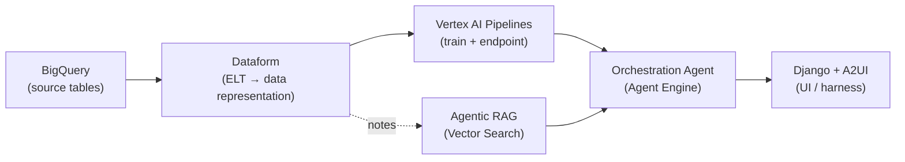

<h1 align="center">Enterprise Clinical Copilot</h1>

<p align="center">
  
</p>

A machine learning system to predict patient readmission risk at discharge. Alongside the model, this workspace will develop agentic tools that automate the risk-analysis process and provide in-depth analysis of patient status — agents reason over unstructured EHR data and combine it with ML risk scores to help healthcare professionals thoroughly assess readmission risk.

## Architecture



## Repository Structure

The monorepo is organized in two documentation tiers. The **master tier** (`docs/`) describes the whole system; each **project** under `projects/` carries its own Workflow (the WHAT), Architecture (the design HOW), and Runbook (the execution HOW).

```text
.
├── docs/                        # Master tier — the monorepo as a whole
│   ├── workflow.md              #   WHAT: the three projects and how they connect
│   ├── architecture.md          #   HOW (design): shared infrastructure + project seams
│   └── runbook.md               #   HOW (execution): repo & cloud bootstrap
│
└── projects/
    ├── mlops/                   # Readmission-risk ML system
    │   └── docs/
    │       ├── workflow.md
    │       ├── architecture.md
    │       └── runbook.md
    ├── agentic-rag/             # Retrieval over unstructured EHR data
    │   └── docs/
    │       ├── workflow.md
    │       ├── architecture.md
    │       └── runbook.md
    └── agent-harness/           # Orchestration agent + Django/A2UI UI
        └── docs/
            ├── workflow.md
            ├── architecture.md
            └── runbook.md
```

## Status

🚧 This repo is under construction and expected to be completed at end of June.
