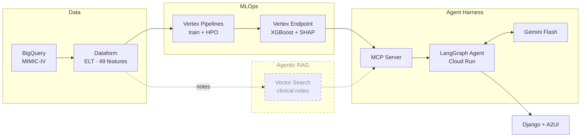

<h1 align="center">Enterprise Clinical Copilot</h1>

<p align="center">
  
</p>

Predicting 30-day hospital readmission risk at discharge — and giving clinicians an agent that can explain it.

## What this is

A production-shaped ML system built on MIMIC-IV. A gradient-boosted model scores each patient's readmission risk at discharge and attributes that score to specific clinical factors. An orchestration agent sits on top, combining the model's quantitative signal with retrieval over unstructured EHR notes so a clinician can interrogate the prediction in plain language rather than accepting a number on faith.

The engineering goal is the full path — warehouse to features to training to a served endpoint to an agent that consumes it — not a notebook that reports an AUC.

## Architecture



Dashed elements are designed but not yet built.

## Projects

| Project | What it does | Status |
|---|---|---|
| **[MLOps](projects/mlops/)** | Cohort, feature engineering, training pipeline, and the served risk model | Model trained, endpoint validated |
| **[Agent Harness](projects/agent-harness/)** | LangGraph agent, MCP tool server, and the Django + A2UI interface | Design complete, build in progress |
| **Agentic RAG** | Retrieval over discharge and radiology notes to ground the agent's reasoning | Planned |

Each project's README opens with its own architecture diagram.

## Results

The model is measured against **HOSPITAL**, a published clinical risk score used here as the baseline any learned model must beat.

| Metric | Value |
|---|---|
| HOSPITAL baseline AUCPR | 0.332 |
| Features after selection | 49 (23 parent groups) |
| Decision threshold | 0.12 |
| Serving | Custom Prediction Routine on Vertex — native XGBoost booster + TreeSHAP |

Each prediction returns a probability, a decision at threshold, and the parent-aggregated SHAP factors that drove it.

## Repository structure

```text
.
├── projects/
│   ├── mlops/              # Readmission-risk ML system  → see its README
│   ├── agent-harness/      # Orchestration agent + UI    → see its README
│   └── agentic-rag/        # Retrieval layer (planned)
│
├── definitions/            # Dataform ELT: sources → staging → features → marts
├── docs/
│   ├── NEXT_STEPS.md       # Roadmap and sequencing
│   └── rag_requirements.md # Requirements for the retrieval layer
└── Archive/                # Superseded notebooks and analysis
```

## Data

Built on [MIMIC-IV](https://physionet.org/content/mimiciv/), a de-identified critical care dataset requiring credentialed PhysioNet access and a signed data use agreement. **No patient data is contained in this repository** — only the code that transforms it.
