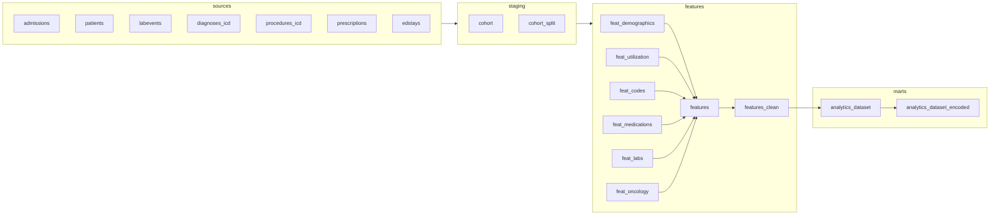

# Definitions — Dataform ELT

The semantic layer: a Dataform project that turns raw MIMIC-IV tables into the
analysis-ready, encoded dataset the model trains on. This is the single source of truth for
cohort, split, and feature logic.

## DAG



## Structure

| Directory | Purpose |
|---|---|
| `sources/` | Declarations for the mirrored MIMIC-IV BigQuery tables |
| `staging/` | `cohort.sqlx` (inclusion/exclusion), `cohort_split.sqlx` (deterministic split) |
| `features/` | `feat_*.sqlx` — one view per feature family; `features.sqlx` + `features_clean.sqlx` |
| `marts/` | `analytics_dataset.sqlx` (analysis-ready) + `analytics_dataset_encoded.sqlx` (one-hot, for training) |
| `assertions/` | `split_is_disjoint.sqlx` — blocking split-integrity gate |
| `baselines/` | `hospital_score.sqlx` — the HOSPITAL clinical baseline |

## Key guarantees

- **Cohort** is inpatient-only (observation/same-day/elective stays excluded), discharged
  alive, length of stay ≥ 1 day.
- **Split** is deterministic and patient-level (`FARM_FINGERPRINT(subject_id)`), so a
  patient never spans train/test — enforced by the `split_is_disjoint` assertion.

## Running

```bash
npx --yes @dataform/cli@3.0.0 install
npx --yes @dataform/cli@3.0.0 run
```

See [`docs/data-pipeline.md`](../docs/data-pipeline.md) for the full data-representation
story.
