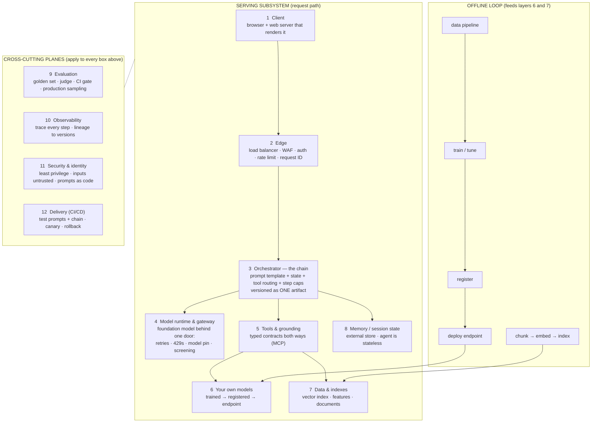

# Reference Architecture — Full-Stack AI Application on Google Cloud

This is the baseline mental model for the review. Every layer document in this
folder audits one row of the table below against the two repositories
(`enterprise_clinical_copilot` and `danielmherman`) and records what was
found, what changed, and how to explain it.

Derived from Google Cloud Architecture Center guidance, compiled 2026-09-11.
The full requirement list, with MUST/SHOULD levels, is in
`../google-cloud-ai-architecture-requirements.pdf`.

---

## 1. Sources

| Document (Google Cloud Architecture Center) | Last reviewed |
|---|---|
| Deploy and operate generative AI applications | 2024-11-19 |
| Well-Architected Framework, AI/ML perspective: Operational excellence | 2025-04-28 |
| Well-Architected Framework, AI/ML perspective: Security | 2025-11-26 |
| RAG infrastructure for generative AI (Agent Platform + AlloyDB) | 2026-02-04 |
| Choose your agentic AI architecture components | 2026-04-21 |
| Choose a design pattern for your agentic AI system | 2026-05-28 |
| Single-agent AI system using ADK and Cloud Run | 2025-12-09 |

---

## 2. The architecture

Two governing rules run through everything:

1. **The chain is the deployable artifact.** Prompt template, orchestration
   code, tool wiring, and model version are versioned together and every run
   logs its inputs, outputs, and intermediate states. Frameworks (LangGraph,
   ADK) are libraries *inside* layer 3, not the layer itself.
2. **Nothing non-deterministic is trusted.** Model output, retrieved documents,
   and tool results are all validated before they are acted on or shown. The
   layers exist to put explicit boundaries around the parts that can be wrong.

---

## 3. The twelve layers

Layers 1–8 are the request path and its dependencies; 9–12 are planes that
touch every box. Layers 6 and 7 are also fed by the offline loop.

| # | Layer | Responsibility | Google's must-haves | Reference products |
|---|---|---|---|---|
| 1 | **Client** | Render results, collect input. Holds no secrets, never calls the model. | Talks only to the agent API; streaming-capable; no state kept in the client. | Cloud Run frontend |
| 2 | **Edge / front door** | Authenticate, rate-limit, validate request and response shape, stamp a request ID. | External load balancer with default `run.app` URL disabled; Cloud Armor; IAP for internal users or Identity Platform for external. | Application Load Balancer, Cloud Armor, IAP |
| 3 | **Orchestrator — the chain** | Assemble the prompt from template plus context, keep turn state, route tool calls, cap steps. **The deployable artifact.** | Prompt + chain + tool wiring + model pin versioned as one unit; prompt-as-code vs prompt-as-data; intermediate states logged; step cap; single agent first. | ADK (recommended) on Cloud Run or Agent Runtime |
| 4 | **Model runtime & gateway** | One door to the foundation model: retries, 429s, timeouts, model pin, token accounting, safety screening. | Managed runtime; 429 handling; cheapest model that passes eval; thinking budget; prompt and response screening. | Gemini on Vertex / Agent Platform, Model Armor |
| 5 | **Tools & grounding** | How the model reaches the world: retrieval, APIs, your predictors. | MCP with typed schemas both ways; fewer than 5 parameters per tool, enums over free text; focused toolsets; tool results treated as untrusted. | MCP servers on Cloud Run |
| 6 | **Your own models** | Anything you trained, served behind a versioned endpoint with its own lifecycle. | Pipeline: train → evaluate → Model Registry → endpoint; lineage in ML Metadata; retraining triggered by monitoring. | Vertex Pipelines, Model Registry, Endpoints |
| 7 | **Data & indexes** | Vector index, feature tables, documents, artifacts. Fed by pipelines, never mutated by a live request. | Separate event-driven ingestion subsystem; same embedding model at index and serve time; scheduled index refresh; datasets versioned. | Cloud Storage → Pub/Sub → Cloud Run function → Vector Search / AlloyDB; BigQuery |
| 8 | **Memory / session state** | Conversation state and, optionally, cross-session memory. | Agent is stateless; state in an external store; long-term memory only if the product needs it. | Cloud SQL / Firestore / Memorystore; Memory Bank |
| 9 | **Evaluation** | Prove quality before and after deploy. | Custom golden set (essential, average, edge, adversarial); automated judge; metrics frozen early; **CI gate**; production sampling to BigQuery; user feedback. | Gen AI evaluation service, BigQuery |
| 10 | **Observability** | Trace every request across every layer; link failures to versions. | End-to-end lineage to prompt, model, and index version; structured per-step logs; distributed tracing; application-level first; latency, error, 429, token metrics with alerts; skew and drift; no PII in logs. | Cloud Logging, Monitoring, Trace |
| 11 | **Security & identity** | Least privilege everywhere; all inputs untrusted; prompts as code. | Per-service accounts with workload identity; input and output screening; prompts in Git; data minimization; supply-chain controls (Cloud Build → Artifact Registry → Binary Authorization); OWASP LLM red-team; incident playbook; **human-in-the-loop for clinical decisions**. | IAM, Model Armor, Artifact Analysis, Binary Authorization |
| 12 | **Delivery (CI/CD)** | Get changes to production safely and reversibly. | CI tests prompts, chain, and retrieval, not just code; CD with production-like and load tests; canary; documented rollback. | Cloud Build, Cloud Deploy |

---

## 4. What Google marks as optional or scale-dependent

VPC Service Controls perimeter · customer-managed encryption keys ·
Confidential Computing · Apigee / API Gateway · GKE instead of Cloud Run ·
Provisioned Throughput · Memory Bank / long-term memory · multi-agent patterns ·
fine-tuning / continuous tuning · Terraform-managed infrastructure ·
multi-region.

A reviewer may ask about any of these, but Google does not require them for a
defensible production system. Including one is a product decision, not an
architecture gap. This list exists so the bar does not move mid-review.

---

## 5. How the review works

- One document per layer, in request-path order: 1 → 12.
- Each document follows the same shape: what the layer is · what Google
  requires · how this application implements it (verified file and line) ·
  current state against the requirement · gaps · interview questions the layer
  answers.
- Sections 1 to 3 stay brief and carry no gaps: gaps belong in section 5 and
  nowhere else. Section 5 holds one entry per gap — the defect and its evidence,
  the `Fix.` decision, and, once it lands, a `Change.` block saying what actually
  changed and how it was checked. A gap is described once, not restated per
  section; the older layers 1–5 still use the eight-section shape (defect, then a
  separate decision section, then a separate outcome section) and are converted
  when they are next opened.
- "Done" for a layer means every MUST is met and verified live. SHOULDs are
  recorded as decisions. Nothing from section 4 is added unless chosen.
- Fixed decisions: keep LangGraph (framework is a library inside layer 3);
  minimise billable resources — spin up, verify, scale to zero or tear down.

## 6. Layer documents

| Layer | Document | Status |
|---|---|---|
| 1 Client | `layer-01-client.md` | Audited and refactored 2026-09-11. Streaming deferred to layer 3. |
| 2 Edge | `layer-02-edge.md` | Implemented and verified live 2026-09-13 (decision D: Terraform load balancer + Cloud Armor, torn down between uses). Gaps 2 and 3 closed. |
| 3 Orchestrator | `layer-03-orchestrator.md` | Audited 2026-09-13, all seven gaps closed 2026-09-15 and verified live. |
| 4 Model runtime & gateway | `layer-04-model-runtime.md` | Audited 2026-09-15, rewritten shorter and independently reviewed 2026-09-16. Gaps 1 to 8 and 10 closed; gap 9 partly addressed and open (caching cannot apply at this prompt size). Model swapped to `gemini-3.1-flash-lite` on 2026-09-16. |
| 5 Tools & grounding | `layer-05-tools-mcp.md` | Audited 2026-09-16 and independently reviewed the same day. Six gaps recorded; all six closed 2026-09-17. |
| 6 Your own models | `layer-06-own-models.md` | Audited 2026-09-17 and independently reviewed the same day. Twelve gaps recorded; gaps 1 to 10 and 12 closed, gap 1 confirmed by a completed pipeline run, gap 11 carries its options and awaits a decision. Each gap carries its own decision and outcome in section 5. |
| 7 Data & indexes | `layer-07-data-and-indexes.md` | Audited 2026-09-17 and independently reviewed the same day. Eight gaps recorded, none closed; B3 met, B1 and E1 partly, B2 and B6 not met. Gap 1 was found live: the demo index exists but no index endpoint did, so free-text retrieval returned `search_failed` while section summaries still answered. |
| 8 Memory / session state | — | |
| 9 Evaluation | — | |
| 10 Observability | — | Langfuse stack torn down 2026-09-12; to be rebuilt from a written design. |
| 11 Security & identity | — | |
| 12 Delivery | — | |
