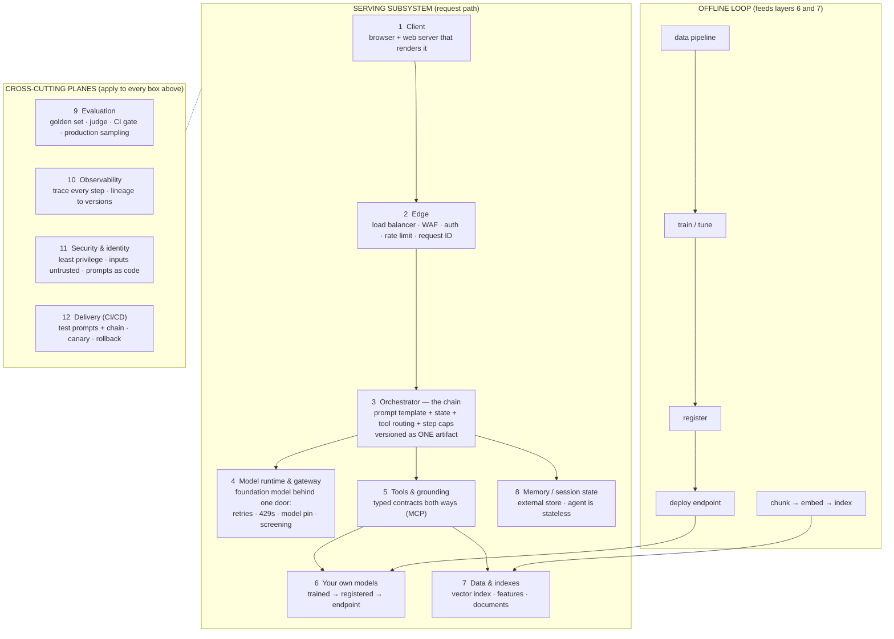

# Reference Architecture — Full-Stack AI Application on Google Cloud

Derived from Google Cloud Architecture Center guidance, compiled 2026-09-11.

## 1. The architecture

```mermaid
flowchart TB
  subgraph SERVE["SERVING SUBSYSTEM  (request path)"]
    direction TB
    FE["1  Client<br/>browser + web server that renders it"] --> EDGE["2  Edge<br/>load balancer · WAF · auth · rate limit · request ID"]
    EDGE --> AG["3  Orchestrator — the chain<br/>prompt template + state + tool routing + step caps<br/>versioned as ONE artifact"]
    AG --> MODEL["4  Model runtime & gateway<br/>foundation model behind one door:<br/>retries · 429s · model pin · screening"]
    AG --> MCP["5  Tools & grounding<br/>typed contracts both ways (MCP)"]
    AG --> STATE["8  Memory / session state<br/>external store · agent is stateless"]
    MCP --> OWN["6  Your own models<br/>trained → registered → endpoint"]
    MCP --> VEC["7  Data & indexes<br/>vector index · features · documents"]
  end

  subgraph INGEST["OFFLINE LOOP  (feeds layers 6 and 7)"]
    direction LR
    P1["data pipeline"] --> P2["train / tune"] --> P3["register"] --> P4["deploy endpoint"]
    P5["chunk → embed → index"]
  end
  P4 --> OWN
  P5 --> VEC

  subgraph PLANES["CROSS-CUTTING PLANES  (apply to every box above)"]
    direction LR
    EV["9  Evaluation<br/>golden set · judge · CI gate · production sampling"]
    OBS["10  Observability<br/>trace every step · lineage to versions"]
    SEC["11  Security & identity<br/>least privilege · inputs untrusted · prompts as code"]
    CICD["12  Delivery (CI/CD)<br/>test prompts + chain · canary · rollback"]
  end

  SERVE -.- PLANES
```

---

## 2. The twelve layers
Individual layers can be found in the [Architecture](https://github.com/DanHerman212/enterprise_clinical_copilot/tree/main/docs/architecture) directory.

Layers 1–8 are the request path and its dependencies; 9–12 are planes that
touch every box. Layers 6 and 7 are also fed by the offline loop.

| # | Layer | Responsibility | Google's must-haves | Reference products |
|---|---|---|---|---|
| 1 | **Client** | Render results, collect input. Holds no secrets, never calls the model. | Talks only to the agent API; streaming-capable; no state kept in the client. | Cloud Run frontend |
| 2 | **Edge / front door** | Authenticate, rate-limit, validate request and response shape, stamp a request ID. | External load balancer with default `run.app` URL disabled; Cloud Armor; IAP for internal users or Identity Platform for external. | Application Load Balancer, Cloud Armor, IAP |
| 3 | **Orchestrator — the chain** | Assemble the prompt from template plus context, keep turn state, route tool calls, cap steps. **The deployable artifact.** | Prompt + chain + tool wiring + model pin versioned as one unit; prompt-as-code vs prompt-as-data; intermediate states logged; step cap; single agent first. | ADK (recommended) on Cloud Run or Agent Runtime |
| 4 | **Model runtime & gateway** | One door to the foundation model: retries, 429s, timeouts, model pin, token accounting, safety screening. | Managed runtime; 429 handling; cheapest model that passes eval; thinking budget; prompt and response screening. | Gemini on Vertex / Agent Platform, Model Armor |
| 5 | **Tools & grounding** | How the model reaches the world: retrieval, APIs, your predictors. | MCP with typed schemas both ways; fewer than 5 parameters per tool, enums over free text; focused toolsets; tool results treated as untrusted. | MCP servers on Cloud Run |
| 6 | **Your own models** | Anything you trained, served behind a versioned endpoint with its own lifecycle. | Pipeline: train → evaluate → Model Registry → endpoint; lineage in ML Metadata; retraining triggered by monitoring. | Vertex Pipelines, Model Registry, Endpoints |
| 7 | **Data & indexes** | Vector index, feature tables, documents, artifacts. Fed by pipelines, never mutated by a live request. | Separate event-driven ingestion subsystem; same embedding model at index and serve time; scheduled index refresh; datasets versioned. | Cloud Storage → Pub/Sub → Cloud Run function → Vector Search / AlloyDB; BigQuery |
| 8 | **Memory / session state** | Conversation state and, optionally, cross-session memory. | Agent is stateless; state in an external store; long-term memory only if the product needs it. | Cloud SQL / Firestore / Memorystore; Memory Bank |
| 9 | **Evaluation** | Prove quality before and after deploy. | Custom golden set (essential, average, edge, adversarial); automated judge; metrics frozen early; **CI gate**; production sampling to BigQuery; user feedback. | Gen AI evaluation service, BigQuery |
| 10 | **Observability** | Trace every request across every layer; link failures to versions. | End-to-end lineage to prompt, model, and index version; structured per-step logs; distributed tracing; application-level first; latency, error, 429, token metrics with alerts; skew and drift; no PII in logs. | Cloud Logging, Monitoring, Trace |
| 11 | **Security & identity** | Least privilege everywhere; all inputs untrusted; prompts as code. | Per-service accounts with workload identity; input and output screening; prompts in Git; data minimization; supply-chain controls (Cloud Build → Artifact Registry → Binary Authorization); OWASP LLM red-team; incident playbook; **human-in-the-loop for clinical decisions**. | IAM, Model Armor, Artifact Analysis, Binary Authorization |
| 12 | **Delivery (CI/CD)** | Get changes to production safely and reversibly. | CI tests prompts, chain, and retrieval, not just code; CD with production-like and load tests; canary; documented rollback. | Cloud Build, Cloud Deploy |

---
