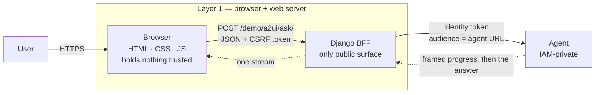

# Layer 1 — Client

Status: rewritten 2026-09-29. Supersedes `archive/layer-01-client-2026-09-29.md`. Requirement
statuses were re-verified against both repositories on 2026-09-29; two clauses of the single
requirement changed since the previous audit, both as a result of work delivered by later layers.

---

## 1. The layer

The client is the browser together with the web server that serves it. Its function is to render
results and collect input. Its defining property is that nothing it holds can be trusted:
everything delivered to a browser is readable, modifiable and replayable by the person receiving
it. That single fact determines the layer's design. Secret material cannot be placed there, a
decision cannot be delegated to it, and its network reach must be constrained by policy rather
than by intention.

The web server is a **backend for frontend**: a server whose sole purpose is to serve one
interface and mediate between that interface and private services. It is the only publicly
reachable component of the system, which is why every enforcement decision is taken there —
authentication, request validation, quota accounting, and the minting of the identity tokens the
browser must never hold.

The layer's governing principle is the separation of **rendering** from **interpretation**.
Rendering is the client's work: how a value is displayed. Interpretation — deciding *what* is to
be displayed, which passage a citation refers to, which section heading a question concerns —
belongs behind the API. The principle is not stylistic. An interpretation implemented in the
client is a second implementation of a rule, and a rule implemented twice will eventually be
implemented differently.

**Terms.**

| Term | Definition |
|---|---|
| Client | The browser, executing markup and script on the user's machine, together with the server that serves it. |
| Backend for frontend | A server existing solely to serve one user interface and mediate between it and internal services. |
| Identity token | A signed assertion of who a caller is, scoped to an audience; held by the server, never by the browser. |
| Session cookie | An opaque handle identifying a logged-in user; bears no authority beyond that identification. |
| CSRF token | A value proving a request originated from the page that the server served, rather than from another origin the user happens to have open. |
| Content Security Policy | A response header by which the server declares which origins the browser may load and connect to; enforced by the browser, not by the server. |
| Server-sent events | A one-way HTTP stream of framed events from server to browser, used here to carry progress and then the answer. |
| Progressive rendering | Display of partial state as it becomes available, rather than awaiting completion. |
| Cache-busting | A version marker in a static asset URL, forcing retrieval when the asset changes. |

**Two boundaries that are easy to misread.** The first is between rendering and interpretation,
described above; the second is between the page as a *store* and the page as a *view*. The
authoritative conversation record is server-side, and the layer 8 adjudication places it there;
what the browser holds is the conversation's identifier and a rendering copy sufficient to paint
the thread without a round trip. The distinction matters because the two fail differently: a lost
rendering copy costs a repaint, whereas a lost authoritative copy would cost the conversation.

**Boundaries.** The edge (layer 2) authenticates visitors and admits traffic; this layer assumes
an authenticated request and decides what may be sent in response. The orchestrator (layer 3) owns
the wording of the prompt, which is why the browser transmits intent — a chip name, or the user's
text, and an admission — rather than a composed question. Memory (layer 8) owns what is retained
and for how long; this layer owns only what the page may display. Security (layer 11) owns what may
be recorded, and this layer inherits it: error detail is logged server-side and never returned.

---

## 2. Requirements

| # | Requirement (Google, MUST) | Status |
|---|---|---|
| A1 | The frontend never calls the model directly; it talks to the agent over an API. A production frontend supports streaming, presents a stateless API, and keeps conversation state externalized. | **Met, all four clauses.** |

The four clauses separately, since they were not satisfied together:

- **The browser never calls the model.** The browser's only network destination is the server's own
  ask route. This is enforced rather than intended: the content policy sets `connect-src 'self'`,
  so a second origin cannot be reached even if code attempted it. The agent is IAM-private and
  requires an identity token the browser has no means of obtaining.
- **The frontend holds no secrets.** The page receives patient rows, a quota figure and a relative
  URL. The signing key is read from Secret Manager at process start; the identity token is minted
  per request inside the server and attached to the outbound call. Internal error detail is logged
  and never returned.
- **Streaming.** Delivered on 2026-09-15 by the orchestrator layer, which was where the decision to
  defer it was taken. The browser requests an event stream and the server relays framed progress
  followed by a terminal frame; the pending turn displays the current stage rather than an
  indeterminate wait. The previous audit recorded this clause as unmet; it is now satisfied.
- **A stateless API, with conversation state externalized.** A request is complete in itself, and
  the server holds no conversation in memory. Each answered turn is stored, and the browser
  carries the conversation's identifier forward so that a follow-up is recognised as one. The
  previous audit recorded conversation state as living in the page and assigned the remedy to layer
  8; that work landed on 2026-09-18 and the clause is now satisfied.

---

## 3. Gaps and recommended remediation

The requirement this layer is audited against is met in all four clauses. One defect of
documentation remains.

**G1 — the console template's header comment describes the page as offline.** The template
announces "fixture mode; same real payloads" in its opening comment, a description that was
accurate when captures were the only answers available and is false now that the page runs against
the live pipeline. The mechanism it refers to is honest — an offline notice is rendered only when
fixture mode is actually enabled — but the comment is what a reader of the template encounters
first. *Remediation:* state what the template is, not what the mode once was. The change is one
comment; its value is that a reader is not obliged to verify a claim that nothing supports.

---

## 4. Record of change

**2026-09-11 — interpretation moved behind the API.** The agent had always known which passage each
citation referred to, and the browser had been reconstructing it: a hand-copied list of clinical
section headings duplicated across two repositories, and heuristics that used the question's
intent to correct for citations the model had sometimes mis-numbered. The agent now returns a
resolved source list, and the browser performs a lookup by number. Roughly two hundred lines of
JavaScript and a duplicated vocabulary were deleted rather than corrected, which is the substance
of the change: the second implementation was removed, not repaired. Both suites were green before
and after.

**2026-09-15 — streaming delivered.** Acquired from layer 3, which took the deferral. A request may
now be answered as a stream of framed progress followed by a terminal frame, and the interface
shows the stage rather than an ellipsis. The property worth recording is the one the client
preserved while gaining the capability: progress frames update the pending turn's meta line only,
and the answer is built from the terminal frame alone, so unverified progress text cannot leak
into an answer body.

**2026-09-18 — conversation state externalized.** Acquired from layer 8. Each answered turn is
stored server-side and the earlier turns are transmitted back on the following question, so a
follow-up is answered as a continuation rather than as an unrelated question. The page still holds
the identifier and a rendering copy; the interface states that the thread belongs to the page, so
a reload is understood by the user rather than mistaken for a failure of memory.
