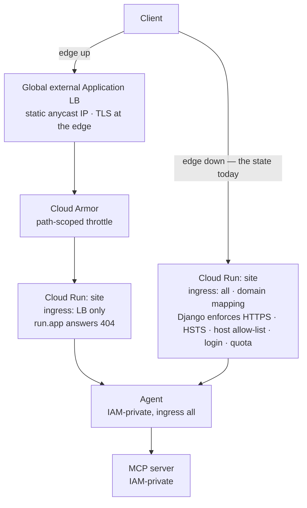

# Layer 2 — Edge (the front door)

Status: rewritten 2026-09-29. Supersedes `archive/layer-02-edge-2026-09-29.md`. Requirement
statuses and the live topology were re-verified on 2026-09-29 with `gcloud` against project
`trim-icon-498815-a0`, region `us-east1`.

---

## 1. The layer

The edge is where the public internet first meets the system: the component that terminates the
connection, decides whether to admit it, and owns the address the world is given. Its significance
is that it is the only boundary in the architecture that exists *before* authentication. Every
other layer is downstream of a decision this one makes, so a control placed here applies to
traffic that no application will ever see.

Two of the layer's properties are frequently conflated. **Existing** and **serving** are different
facts: a load balancer may be built and answering while DNS still sends clients elsewhere, and a
public hostname may answer while the load balancer that was supposed to front it is destroyed. The
interesting states are the ones in which the two disagree, which is why this system's edge is
governed by two independent switches rather than one — one for whether the infrastructure exists,
one for whether traffic is sent to it. That design also makes a **drain** possible: a change of
address in which clients holding a stale resolver answer continue to be served, rather than
directed at an address whose forwarding rule no longer exists.

**Terms.**

| Term | Definition |
|---|---|
| Ingress | The rule set governing which traffic a Cloud Run service will accept at the network layer, as distinct from which callers it will authorise. |
| Anycast | Address advertisement from many points of presence, so a client reaches a topologically near front end; the property that gives a global load balancer a single stable IP. |
| Serverless NEG | A network endpoint group whose endpoints are a managed service rather than instances, allowing a load balancer to front Cloud Run directly. |
| Cloud Armor policy | An ordered set of match rules and actions evaluated per request at the edge; a policy is the unit that is attached to a backend service. |
| Rate-based ban | A rate rule whose action denies the client for a period once a threshold is crossed. |
| Throttle | A rate rule whose action refuses the excess request without retaining a ban decision; the difference from a ban is that no state is kept. |
| Certificate map | An indirection from hostname to certificate, allowing a managed certificate to be attached without recreating the proxy. |
| Drain | Deliberate overlap of two serving paths during an address change, so that no resolver's cached answer leads to a non-answering address. |
| TTL | The duration a resolver may cache a record; the window for which a drain must be sized. |

**Why the rate limit belongs to this layer and not to the application.** A per-user quota counts
what a *user* consumes; a rate limit bounds what an *address* may attempt before it is identified.
The first cannot protect an unauthenticated path, because there is no user to count against. Only
what sits in front of authentication can bound anonymous traffic, which is why this layer owns
throttling and the application owns quota.

**Boundaries.** This layer owns admission to the system, not authorisation within it: user
authentication here would be the reference arrangement, and is currently the application's. Layer
1 owns what may be returned once a request is admitted. Layer 11 owns the identity by which
services call each other and what may be deployed; this layer owns which traffic reaches them.
Layer 10 owns alerting on the volume and shape of that traffic, which this layer can only refuse.

---

## 2. Requirements

| # | Requirement | Level |
|---|---|---|
| G5 (a) | Controlled ingress for the public service: an external Application Load Balancer in front, with the default `run.app` URL disabled. | MUST |
| G5 (b) | Cloud Armor on that load balancer for filtering, DDoS protection and rate limiting. | MUST |
| G5 (c) | User authentication at the door: IAP for internal users, Identity Platform or Firebase for external users. | MUST |
| G4 | Service-to-service calls authenticated with identity tokens, with least privilege on who may invoke each private service. | MUST |
| G5 (d) / F4 | Rate limiting and throttling per address or user; monitor request volume; alert on spikes and on unusual geographic or temporal patterns. | MUST |
| G1 | Request validation at the boundary: reject malformed or oversized input before it reaches the model. | MUST |

---

## 3. Gaps and recommended remediation

**G1 — the front door is defined and absent.** The most consequential fact about this layer today
is that its principal requirement is satisfied in source and unsatisfied in the running system.
*Remediation:* a decision, taken explicitly and recorded here, between two defensible positions.
Either the edge is stood up for any window in which the deployment is publicly reachable — it is
one command and about ten minutes, and the cost is roughly the forwarding rule and policy — or the
Cloud Run domain mapping is accepted as the front door, and the reference topology is recorded as
deliberately not adopted rather than as built and switched off. The present state is defensible
only if it is stated; a documented control that a visitor cannot observe is indistinguishable from
an absent one.

**G2 — the default hostname is live (consequence of G1).** With the edge down, ingress must be
`all` for the site to answer at all, so `danielmherman-….run.app` serves the application and
appears in the host allow-list. *Remediation:* subsumed by G1; when the edge is up, ingress is
narrowed to load-balancer traffic alone and the default hostname answers 404, which was verified
behaviourally rather than declared.

**G3 — effective invoke permission exceeds the binding list.** The agent's policy names one
invoker, and that is not the same as one caller: the project default compute service account holds
`editor` and `run.admin`, and a personal account holds `owner`, both of which contain the invoke
permission. *Remediation:* remove the broad roles from the default compute service account so that
its standing is not an ambient grant, and decide separately whether the agent should refuse traffic
that did not arrive through a front door — that is an ingress and network design, not a binding.

**G4 — nothing observes traffic volume.** No alert exists on request rate, error rate at the edge,
or anomalous geography, and the throttle rules cannot be judged adequate without one.
*Remediation:* belongs to layer 10, which records that no alert policy exists in the project at
all. The two layers share a single remedial action.

---

## 4. Record of change

**2026-09-13 — DNS moved from the registrar to Cloud DNS.** The prerequisite for everything else:
Terraform cannot rewrite records at a registrar, so without the move neither the standing up nor
the tearing down of the edge could be automated, and the edge would always have ended in a manual
step. The live record set was captured and imported, verified identical to the snapshot taken
before the move, and the zone placed under version control. Record TTLs were lowered from 600 to
300 seconds so that a drain needs five minutes rather than ten.

**2026-09-13 — the edge implemented as code, and verified live.** Seven Terraform files define
every edge resource, with state in a versioned private bucket. Two booleans govern it — whether the
infrastructure exists and whether DNS points at it — because the state worth being able to reach is
the one in which they disagree. A precondition refuses the impossible combination, verified by
requesting it. Bringing the edge up and taking it down are both three-phase operations that never
present a client with an address that does not answer; the drain was measured at 330 seconds, during
which both paths returned 200. Verified live: the domain served 200 through the load balancer with a
managed certificate, the rate limit refused the excess with 33 of 90 requests answered 429, and
after ingress was narrowed the default hostname returned 404 while the domain returned 200.

**2026-09-13 — the request identifier propagated end to end, and verified in production.** Cloud Run
stamps a trace context on every inbound request; the site now reads it, forwards it, and logs it,
and the agent logs it on every line for that request. Two real questions asked through the browser
produced one identifier appearing in both services' logs, which is the whole of the change: a single
user action became followable across the boundary. One defect had to be fixed for the evidence to
exist at all — the agent configured no logging, so its informational lines were discarded before
reaching stdout.

**2026-09-14 — the delivery identity corrected, and a redundant grant removed.** Two changes of the
same kind. The build configuration declared a dedicated deploy account and explained why builds must
not run as the project default; the trigger carried its own service account, and the trigger's wins,
so the declaration was inert and every triggered build ran as the default compute service account
holding `editor`. Correcting the trigger fixed it, and it was verified by reading the build's service
account back rather than by trusting the configuration — the build that had passed before the change
was evidence about nothing, having predated it. Separately, a redundant invoker grant on the agent
was removed, leaving one named invoker.

**2026-09-14 — the rate limit was wrong, and ordinary use found it.** The first policy applied a
single rule to every request: sixty per minute per address, with a five-minute ban on exceeding it.
The arithmetic was fine and the design was not, because one load of the console page fetches dozens
of static modules, so a single visitor consumed most of the budget and a refresh triggered the ban —
which then applied to every path, favicon included. The rule is now scoped to the two paths that can
cost money or be abused, and the action is throttle rather than ban, so the excess is refused without
denying the visitor the rest of the site. Two lessons were recorded with the change: a request
counter cannot distinguish a stylesheet from a sign-in attempt, and a ban is not path-scoped, so
narrowing a match prevents false positives without making the action surgical.

**2026-09-14 — readiness probing corrected after a race the script created.** The bring-up probe
waited on the slower half of the path first: TLS on port 443 requires both the forwarding rule and
the certificate map to have propagated, whereas port 80 requires only the redirect and proves the
entire forwarding path without involving TLS. The window was also shorter than a newly created
forwarding rule reliably needs. Readiness is now two ordered stages — the forwarding path, then the
certificate — each failing with a message naming which half failed and each leaving DNS untouched.
A third methodological lesson was recorded: a policy change continues to be enforced by the previous
rules for a minute or two, and a denial observed in that window is not evidence about the new policy.
