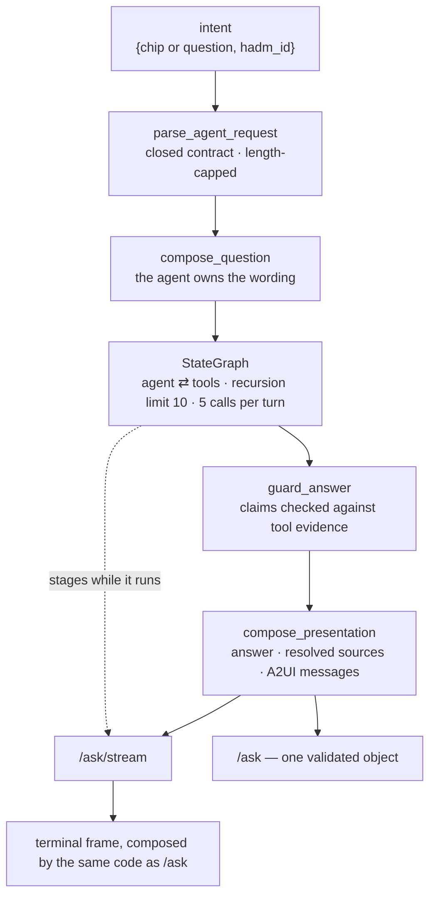

# Layer 3 — Orchestrator (the chain)

Status: rewritten 2026-09-29. Supersedes `archive/layer-03-orchestrator-2026-09-29.md`. Requirement
statuses were re-verified against the repository and the live service on 2026-09-29. Seven gaps were
recorded by the previous audit; all seven were closed on 2026-09-15, and the changes that closed
them are recorded in section 4.

---

## 1. The layer

The orchestrator is the layer that decides what happens between a question and an answer. It
assembles the prompt from a template and the context retrieved for this request, holds the state
of the turn, routes the model's requests for tools, bounds the loop, and determines when the turn
is finished. It is the layer in which the system's behaviour is actually authored.

Its defining property is that **the chain is the deployable artifact**. A component library, a
serving image and an endpoint each have independent lives; a chain does not. Its prompt template,
its orchestration code, its tool wiring and its model pin are mutually constraining, and any of
them changing alone changes behaviour. Versioning them separately produces a system whose
behaviour cannot be attributed to a revision — which is not merely an observability deficiency, but
an inability to answer the question *what changed*. The framework in use is a library *inside* this
layer, not the layer itself: replacing LangGraph would leave the layer's obligations unchanged.

Two consequences follow from that property and organise everything else here.

The first is that **the chain's identity must be derived, not declared**. A revision number typed
by a person is a claim about the code rather than a fact about it, and when it goes stale it does so
silently: a missing field is visibly absent, whereas a stale constant merges two behaviours under
one identity and silently invalidates comparison, per-version metrics and rollback.

The second is that **the answer is a composition, not the model's text**. The model's output is an
input to this layer, which then resolves citations, checks each clinical claim against the evidence
the tools returned, and composes the presentation the interface will render. This is why tokens
cannot simply be forwarded as they are generated: what the user must see is the corrected text, and
on a clinical answer the corrected part is precisely the part that matters.

**Terms.**

| Term | Definition |
|---|---|
| Chain | The versioned composition of prompt template, orchestration, tool wiring and model pin that constitutes the behaviour of one turn. |
| Superstep | One traversal of a graph's nodes; the recursion limit counts these, so it bounds the loop independently of what each step does. |
| Tool call | A model turn that requests a tool by name with typed arguments, rather than an answer. |
| Prompt-as-code | The instructions that constitute behaviour: versioned, reviewed, and tested like source. |
| Prompt-as-data | Content that varies per request and is supplied to the prompt: the question, retrieved passages, tool results. Validated and delimited rather than trusted. |
| Delimiter guard | Framing that marks retrieved content as data, so content cannot be read as instruction. |
| Execution record | One structured line per turn, emitted for failures as well as successes, carrying the chain's identity and what happened. |
| Guardrail | A post-hoc check that removes claims the tool evidence does not support, applied after the model has finished. |
| Step cap | A bound on loop iterations that holds independently of the model's willingness to stop. |

**The two properties that shape the interface.** Because the answer is composed after the model
finishes, the response cannot be a string: it is a validated object carrying the answer, the
resolved sources, the presentation the canvas renders and the tool evidence. And because the
guardrail runs last, any streaming design must choose between showing text that may be amended and
showing only what has been verified. This layer chose the second, and the partial satisfaction
recorded in section 2 is the direct consequence.

**Boundaries.** The model is reached through a gateway this layer does not own (layer 4), and
serving the model is a dependency rather than something this application hosts. Tools are exposed
over MCP with typed schemas (layer 5), and this layer owns only their wiring into the graph.
Conversation state belongs to layer 8, which owns the store and the retention policy; this layer's
obligation is to be a pure function of its request, so that its record can name the chain's inputs.
Emitting telemetry is this layer's duty; collecting, storing and querying it belongs to layer 10.

---

## 2. Requirements

| # | Requirement | Level |
|---|---|---|
| A2 | The agent is built with an agent framework and deployed on an agent runtime. | MUST |
| A1 (streaming) | A production front end supports streaming, so the user sees output as it is produced rather than awaiting the whole answer. | MUST |
| A3 | The agent is stateless, so any instance may serve any request and a restart loses nothing. | MUST |
| C1 | Prompt template, chain definition, tool wiring and model pin are versioned together as one artifact with its own revision history. | MUST |
| C2 | Prompt parts are classified: prompt-as-code, reviewed and tested, against prompt-as-data, validated and monitored for drift. | MUST |
| C3 | Every execution logs its inputs, its outputs, the intermediate state of each step, and the chain configuration used. | MUST |
| C5 | A step cap on any agent loop, to prevent runaway cost. | MUST |
| I1 | Requirements are defined before a pattern is chosen. | MUST |
| I2 | Start with a single agent; adopt multi-agent only when one agent measurably fails. | MUST |
| I3 | Every loop pattern has an explicit exit condition. | MUST |

---

## 3. Gaps and recommended remediation

The seven gaps the previous audit recorded are closed, and their dispositions are in section 4.
Two limitations remain open, both of them deliberate rather than overlooked.

**G1 — the answer text does not stream (A1, partly met).** A caller sees which step is running, not
the answer being written. The reason is structural rather than an omission: the guardrails run
after the model finishes and rewrite the text, so streamed tokens would be a draft the user watches
being corrected. *Remediation:* the design that would satisfy the clause without exposing
unguarded clinical text is to buffer the model's final turn, guard it, and stream only the
corrected text, delivering the composed payload when it is ready. It should be built knowing its
cost: it forfeits the earliest tokens, which is where most of the latency advantage of streaming
resides. The precondition for building it is a requirement for time-to-first-token on the answer
itself, which does not currently exist.

**G2 — per-request setup dominates the wait before anything is shown.** A cold streamed call
reached its first stage in about 22 seconds and a warm one in about 1.1 seconds, and the execution
record now reports the figure on every turn. The substance of the finding is that the delay before
the first stage is setup — compiling the graph, opening an MCP session, listing the tools — and not
the model, which is the opposite of where intuition points. *Remediation:* keeping an instance warm
would remove the cold component and is refused by the project's standing decision to minimise
billable resources, so the lever is the rebuild itself. A per-process cache of the compiled graph
and the tool listing would leave the per-request MCP session intact — that session is per request
by design, because the server is stateless and the load balancer may route the next request to
another instance — while removing the work that is repeated for no benefit.

---

## 4. Record of change

Seven gaps were closed on 2026-09-15. The entries below record what was done, in the order the work
was undertaken, together with the findings that change a reader's understanding of the system.

**Progress streaming, and the three defects it exposed.** The requirement was met by relaying
*events about the chain* rather than prose: a closed set of stage values, emitted where the work
happens — immediately before each tool call and each model call — with the answer delivered whole as
a single terminal frame composed by the same code path `/ask` uses, so the two routes cannot drift.
A keepalive frame keeps the connection alive across a long tool call. Three defects surfaced, and
only one was observable offline. Django materialises a *synchronous* streaming iterator before
sending it, so the first implementation delivered every frame at the same millisecond, which is
indistinguishable from not streaming; as an asynchronous generator the frames arrived as they were
produced. The relay then waited out a keepalive after the chain had finished, delaying every answer
by up to fifteen seconds — a progress stream slower than no stream — fixed by a sentinel that ends
the loop with the work rather than with the timer. The third was that an asynchronous relay runs on
the event loop, where Django refuses synchronous database access, so the quota calls were moved to a
worker thread; unfixed, the streamed path would have failed in production rather than in tests. The
live verification showed four stages and the answer, and the load balancer's backend timeout was
raised from its thirty-second default, which was shorter than the chain's own deadline and would
have truncated a streamed answer without an error.

**The artifact made one thing, and given an identity derived from the deployment.** The question
wording moved from the website into the agent beside the system prompt; the website now transmits
intent and the agent composes the question, with every string preserved character for character so
that the prompt did not move underneath the model. The model became a constant in code, because an
environment-overridable model is what made an answer unattributable in the first place. The chain's
identity is resolved from the deployment — the commit when the build supplies one, otherwise the
runtime's own revision name, otherwise the honest label for a run that is not a deployment — which
replaced a hand-maintained revision constant. The reasoning is worth keeping: a stale constant is
worse than a missing field, because a missing field is visibly absent while a stale one looks
healthy and silently merges two behaviours into a single identity.

**Execution recorded.** One structured line per turn, emitted for failures as well as successes,
verified in the log on the first live call. The record paid for itself immediately: it showed a
thirty-two second turn whose first stage began at twenty-two seconds, converting the audit's
unmeasured suspicion about per-request setup into a figure reported on every subsequent turn.

**The request contract closed.** Any field outside the accepted set is refused by name rather than
ignored, and a field implying conversation state is refused with a message stating that the agent
is single-turn. The failure being removed was silent and therefore worse than a refusal: a caller
sending a history received a confident answer to a question the model had answered without it, and
no signal that anything had been dropped. Multi-turn itself was recorded as layer 8's, with the
recommended design that the caller own the history and send it explicitly, so that the agent
remains a pure function of its request.

**The prompt put under test.** Recording the prompt-as-data classification made two couplings
visible that nothing had protected: the tool-result delimiter is a literal in the file that emits it
and in the file that names it, and the tool names are written both in the prompt and in the server's
registrations. Renaming either side would have left the rule describing a boundary that no longer
existed, with nothing failing. Tests now pin both, driving the real wrapper rather than a copy of it,
along with the operative phrases of the prompt's rules.

**Residue removed, and a correction about how deploys set configuration.** The observability module,
its enablement gate, its no-op handler, the trace-id publish in the graph, the dependency line and
the two dead service variables were removed. The claim that the same deploy would also drop the
secret-backed variables was wrong: replacing environment variables does not clear secrets, which
requires a separate removal, and the inference that one flag would sweep both was unfounded.

**Progress labels derived from the request.** The single generic line was replaced by two tiers.
The first names what is being read, when the caller said which kind of question it is, and names the
tool being called; free text keeps the generic label deliberately, because a label describing what a
free-text question concerns would require asking the model, and a model-written progress line is the
kind of narration this design refuses. The second is a result stage, emitted after each call, that
reports what came back or that the call did not respond — necessary rather than decorative, because
an action stage must remain true when the call fails and therefore cannot report its outcome, and
because "nothing was found" and "nothing was asked" are different facts that a count of zero would
conflate. The label casing was unified the same day, and a test holds the convention rather than
memory.

**The agent now deploys from a push.** The build configuration took its image name as a substitution
with no default, so it worked from the command line and failed under a trigger, which passes no
substitutions. With the default supplied — and it must be the literal project identifier, because a
built-in is not expanded inside a substitution default — a push to the main branch builds and
deploys the agent through the same dedicated build account and trigger the website uses, so neither
repository is deployed by hand.
