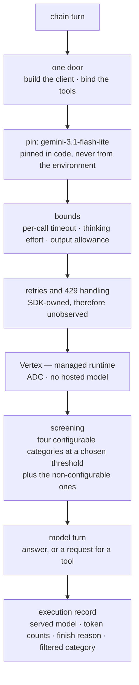

# Layer 4 — Model runtime & gateway

Status: rewritten 2026-09-29. Supersedes `archive/layer-04-model-runtime-2026-09-29.md`. Requirement
statuses were re-verified against the repository on 2026-09-29. Ten gaps were recorded by the
previous audit and closed on 2026-09-16; the changes that closed them are in section 4, and the
items that remain open are in section 3.

---

## 1. The layer

This layer is the single door through which the system reaches a foundation model, and the policies
enforced at that door. The model itself is a dependency: it is served by a managed runtime, not
hosted here, and nothing in this layer's design depends on being able to replace it. What the layer
owns is everything *about* the call — its bounds, its retries, its screening, its cost, and the
identity of the model that answered.

The layer exists because an unmediated model call is unbounded in three independent dimensions, and
each has a failure mode that is silent rather than loud:

- **Time.** A call with no timeout cannot have its retries observed, because the mechanism that
  would retry is the mechanism that waits. The bound must exist before the retry policy can
  function at all.
- **Cost.** Thinking and the answer commonly share one token allowance, and a model that exhausts it
  stops without raising: the caller receives a successful response with empty text. An allowance too
  small for reasoning therefore presents as a wrong-looking result rather than as a failed
  deployment.
- **Content.** The screening applied to a prompt and its response is partly configuration and partly
  platform default, and the defaults change across model generations. A model migration can
  therefore alter what is filtered without anyone deciding it.

The organising principle is that **a model choice is an assertion until it is measured**. Choosing
the cheapest model that passes evaluation is only meaningful if the evaluation exists, the
comparison was run, and the judge applying it is not the model under test. Where the evidence does
not exist, the honest instrument is a record structure that refuses to let the pin change quietly:
the cost of an unevidenced decision is not the decision itself but its invisibility.

**Terms.**

| Term | Definition |
|---|---|
| Gateway | The single code path through which all model calls pass, where bounds, retries, screening and accounting are applied. |
| Model pin | The exact model revision the system calls, held in version control rather than resolved from the environment at deploy time. |
| Thinking budget | The allowance for the model's internal reasoning, as distinct from its emitted answer; on current models expressed as an effort level rather than a token count. |
| Finish reason | The model's own account of why generation stopped; the field that separates a truncation from a refusal from a completed answer. |
| Retry-on-timeout | A retry policy that can only function where a timeout exists, since the two are the same mechanism observed from opposite ends. |
| Implicit context caching | Platform-side reuse of an unchanged prompt prefix, discounted because it is not reprocessed; subject to a per-family minimum prefix length. |
| Safety threshold | The level at which a configurable content category blocks; distinct from the non-configurable categories, which always apply. |
| Escalation | Routing a request to a more capable model when a cheaper one is insufficient; the second half of "cheapest model that passes". |
| Served model | The model that produced a response, which need not be the one requested. |

**Two facts that are easy to conflate.** A pin is not a version in the immutable sense: it names a
revision with a retirement date, so a pin is a schedule as well as a choice. And the endpoint a
model is reached on is a separate decision from the region the system's data lives in — a pinned
model may have no regional endpoint at all, which is why the two constants were separated rather
than shared.

**Boundaries.** Prompt and model versioning as one artifact is layer 3's, and this layer supplies
the pin that artifact carries. Filtering content *before* it enters a prompt is layers 5 and 11;
this layer owns what the platform screens and what it records about screening. Per-version metrics
are layer 10's, which this layer feeds. The comparison that would justify the pin is layer 9's,
because it requires that layer's harness and a judge that is not the model under test. The query
embedding is a second Vertex call outside this door and belongs to layers 5 and 7.

---

## 2. Requirements

| # | Requirement | Level | Status |
|---|---|---|---|
| A6 | The model is served from a managed model runtime; serving it is a dependency, not something the application hosts. | MUST | **Met.** Vertex, reached with application default credentials, with no model hosted here. |
| H1 | Retries, timeouts, exception handling and 429 handling on model calls. | MUST | **Met in part.** A single call is bounded, the bounds nest coherently with the chain deadline and the caller's wait, and the response's own reason for stopping is recorded and acted upon — so a deterministic refusal no longer reaches the caller as advice to retry. What remains absent is observation: retries, including those caused by 429 and by timeout, occur without being counted, because the policy is the SDK's. |
| H2 | Establish baseline QPS and tokens per second before launch; monitor afterwards. | MUST | **Met in part.** Every execution records what it was billed for — input, output, thinking and cached tokens, and the model that served it — so a baseline is derivable from the records. No baseline has been written down, and the monitoring half belongs to layer 10, which records that no metric or alert exists. |
| H3 | Start with the cheapest model that passes evaluation, then escalate; control the thinking budget; route simple work to smaller models. | MUST | **Met in part.** The pin is the entry tier of its family and thinking is bounded by a chosen effort level rather than left to the model's default, with the measurements that informed the level recorded beside it. What is missing is the evidence: the comparison has not been run, there is no escalation path, and the judge that would apply it is the model under test. |
| H4 | Concise prompts; context caching for repeated high-token context. | SHOULD | **Met in part.** Caching was decided by measurement rather than assumption: the prompt is 3,088 input tokens and the family's minimum cacheable prefix is 4,096, so nothing this system sends can be cached at the size it sends it. The requirement's other half has not been addressed: the prompt's own size, resent on every turn, has never been reviewed. |
| H5 | Simulate failures and load before production. | MUST | **Met in part.** Failure is exercised: a model that raises, stalls, or returns nothing is driven through the route, and each outcome is asserted on both the caller's response and the execution record, including the chain's own deadline, which previously had no test of any kind. Load is not simulated. |
| G2, B4 | Layered defence: screen prompts and responses for injection, jailbreak and harmful content, applying responsible-AI filters before returning to the user. | MUST | **Met in part.** The four configurable categories are pinned to a chosen threshold rather than left at the platform default, and a filtered response records which category flagged it, so a refusal can be counted rather than merely experienced. Injection and jailbreak are unaddressed at this door by decision: that policy belongs to layer 11, which carries it as an open gap. |

---

## 3. Gaps and recommended remediation

**G1 — the retry path cannot be observed (H1).** Retries occur, including those caused by throttling
and by timeout, and nothing counts them, because the response reports why a turn ended rather than
how many attempts it took. *Remediation:* the count becomes observable only if the retry policy
becomes this application's, which is a real trade rather than an obvious improvement — owning the
policy means reimplementing backoff and giving up the SDK's knowledge of which failures are
transient. The cheaper alternative is to alert on the aggregate that already exists: repeated
successful-but-slow turns are the observable shadow of retry-on-timeout, and they are already
recorded.

**G2 — no baseline is written down (H2).** The quantities are recorded on every turn and no figure
has been derived from them. *Remediation:* derive the baseline from the execution record once
records exist for a period of ordinary use, and let layer 10 own the series and the alert. The two
layers share one action; neither is complete alone.

**G3 — the pin rests on a debt rather than on evidence (H3).** The record structure that exists to
make a model change deliberate holds an acknowledgement that no comparison was run: the swap was
made under a retirement date, and the harness meant to precede it does not exist. Four questions put
to both pins on one day make the absence substantive rather than formal — on one the two refused in
opposite directions, so the pins do not draw the same screening line. *Remediation:* run the
comparison through layer 9's harness, which carries it as an open gap, and judge it with something
other than the model under test. Until then no claim about the pin's adequacy should be made.

**G4 — the prompt's size has never been reviewed (H4).** Three thousand and eighty-eight input
tokens are resent on every turn, and while that is below the threshold at which caching could help,
it is a cost paid per request and it has never been examined as a design question. *Remediation:*
review the system prompt for material that does not change behaviour, which is the only version of
this work that does not risk the answers. Separately, whether caching applies *above* the family
minimum is unresolved rather than negative: prefixes of five and eight thousand tokens produced no
cache hit across twenty-eight measured calls, one hit was observed and did not reproduce, and the
platform documents the capability as supported. That discrepancy is worth resolving before anything
is built on it.

**G5 — load is not simulated (H5).** *Remediation:* a load test, which is also layer 12's unmet
requirement for a production-like test, and which would establish the capacity figure layer 10
needs before an alert threshold can mean anything. One action serves three layers.

**G6 — injection and jailbreak are unaddressed at this door (G2).** The screening that exists is
platform category filtering and a post-hoc faithfulness guardrail; neither addresses an instruction
carried in retrieved content. *Remediation:* layer 11 owns it, carrying the same gap, and the
adversarial evidence that will confirm the fix lives in layer 9. The remediation is a screening
service or an equivalent validated filter at the retrieval boundary, not a change here.

---

## 4. Record of change

Ten gaps were closed on 2026-09-16.

**Failure made visible.** Nothing under the agent read `finish_reason`, `safety_ratings` or
`prompt_feedback`, so a truncation, a safety block and a blocked prompt all reached the caller as
the same error advising a retry — which is wrong advice for a deterministic refusal. The finish
reason is now recorded and branched upon, so the caller's message distinguishes a case that
retrying might fix from one that cannot change.

**One call bounded, three ways.** The model call had no timeout, and because the request was made
without one the SDK's retry-on-timeout could never fire; thinking drew on the same allowance as the
answer with no cap of its own; and the only bound was the deadline over the whole question. A
per-call timeout now exists, thinking is bounded separately through an effort level, and the
timeout chain validates three legs rather than two.

**The response's own numbers recorded.** Every response reports its input, output, thinking and
cached token counts and the model that served it. None of these was recorded, and the record carried
the model that was *requested* rather than the one that answered — which left no basis for a token
metric. Both are now recorded.

**The choice of model put on the record, and the pin moved.** The pin was the mid tier, while a
cheaper generally-available tier existed on the same lifecycle table and had never been evaluated.
It is now the entry tier of its family, and the choice is a structure rather than a constant: it
names the model, the date, the tier, the retirement date, the predecessor, and an evidence slot. A
test refuses a pin that disagrees with the structure, so the next change cannot happen quietly and
whoever makes it must supply the justification. The swap itself was made under a retirement date,
and the model named after hearing from both pins.

Two findings from that work are worth keeping. The first is why the newer sibling was *not* chosen:
it is on the SDK's list of models with fixed sampling defaults, so a request for zero temperature is
silently dropped with a warning that a serverless log would not surface — and both the refusal
sentence and the empty-text guard reason from determinism at zero temperature, so on that model the
reasoning would have been quietly false. This was measured rather than argued: eight repeats of one
question on each candidate, with the newer one scattering at zero temperature exactly as it did at
the default. The second is the consequence of the swap itself: on one of four questions put to both
pins, the two refused in opposite directions, so the screening threshold is now a measured question
rather than a theoretical one.

**Screening pinned, and refusals made countable.** The four configurable categories blocked at a
platform default because nothing passed a setting to them, and nothing recorded that a response had
been filtered. The categories are now set to a chosen threshold, and a filtered response records
which category flagged it, so refusals can be counted.

**The pin's expiry scheduled, and a silent filtering change identified.** The retired pin had a
retirement date and nothing scheduled the move. The replacement was chosen with the same fact in
view: platform filtering defaults change across model generations, so a migration can remove a
filter that was previously applied without anyone deciding to remove it.

**The region and the output allowance pinned in code and guarded.** Both were environment reads, so
a deploy could move either with no commit anywhere, and both fail silently — a wrong region surfaces
as a request-time error rather than a failed deployment, and an allowance too small for reasoning
surfaces as an empty answer with a successful status. Both are now constants, and the model's
endpoint was separated from the regional constant that also names the index, the prediction endpoint
and the data warehouse, because the pinned model has no regional endpoint in any region checked.

**Failure simulated, including the deadline.** Nothing previously injected a throttle, a stall, an
empty candidate or a safety block, and no test constructed a failing model; two cases were covered
only at the route's seam, which tests the route and leaves the chain's own handling unexercised. The
deadline in particular had no test of any kind — the control bounding one question's spend had never
been observed doing its job. Each outcome is now asserted on the caller's response and on the
execution record.

**Caching decided on a number rather than an assumption.** Implicit caching is enabled by default,
discounts the reused prefix, and stores nothing at cost. The document had carried the minimum
cacheable prefix for the model family that stopped being ours when the pin moved: the current
family's minimum is 4,096 tokens and this system's prompt is 3,088, so the discount cannot apply to
anything this application sends at the size it sends it.
