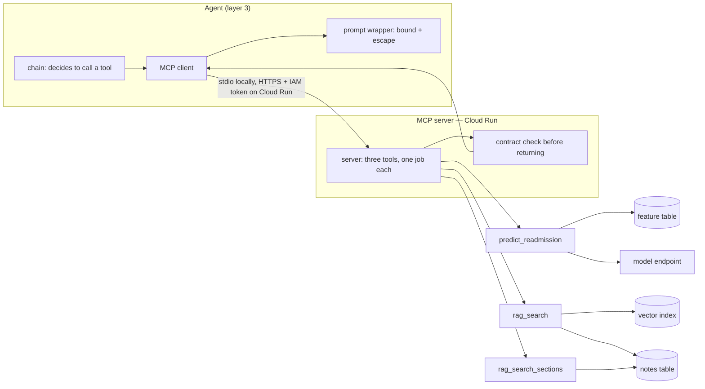

# Layer 5 — Tools & grounding, summary

Source of truth for evidence, decisions and citations: `layer-05-tools-mcp.md`.

## 1. The layer

This is how the model reaches the world. The model can only produce text; this layer is where
that text becomes a real action — a retrieval against a patient's notes, or a readmission
score — and where the answer comes back as evidence the model can cite. It is also the only
place where text from outside the application enters the prompt, so it is the layer that
decides what is allowed in.

| Component | What it is |
|---|---|
| `services/mcp/server.py` | One MCP server exposing three tools, plus a health route and the auth gate |
| `tools/prediction.py` | `predict_readmission`: reads one admission's features, returns a probability and the factors behind it |
| `tools/retrieval.py` | `rag_search` (meaning-based search over the notes) and `rag_search_sections` (one passage per note section, in a fixed order) |
| `retrieval/` | The deterministic chunker, the note-section parser, and the single definition of the embedding space |
| `contracts.py` | The declared shape of every tool result, and the validators that enforce it |
| `dependencies/` | The feature source and the model-endpoint client the tools read |
| `services/agent/mcp_client.py` | The consumer side: turns the server's tools into functions the model can call, unwraps and validates what comes back |

**Upstream:** the agent's tool node calls these tools, on a decision the model made, and it is
where the boundary policy is enforced from the consumer side.
**Downstream:** the vector index, the note and feature tables, and the prediction endpoint.

| Term | Meaning here |
|---|---|
| MCP | A standard protocol for exposing tools to a model, so the tool list and its schemas travel over the wire instead of being hand-wired |
| Tool calling | The model returns a structured request to run a named function with arguments, rather than prose |
| Tool schema / contract | The declared shape of what a tool accepts and returns — checked on both sides of the boundary |
| RAG | Retrieval-augmented generation: fetch passages first, then answer from them with citations |
| Embedding / vector index | Text reduced to a numeric vector; the index returns the vectors nearest to a query, which means the passages closest in meaning |
| Restrict | A filter applied inside the vector search, so one admission's query can only ever rank that admission's notes |

## 2. How it works today

The server advertises three tools with typed schemas. The client turns that list into
functions the model can call, and the model either answers directly or returns a tool call
with arguments. Arguments are validated against the declared schema at the boundary, before
the tool body runs, so a mistyped argument is refused rather than acted on.

Each tool then does one thing. `predict_readmission` reads one admission's feature row and
scores it. `rag_search` embeds the question, asks the vector index for the nearest passages
within that admission, then re-reads the note text from the warehouse and re-checks that every
note it fetched belongs to the admission that was asked for — a mismatch refuses to serve the
text rather than trusting the index. `rag_search_sections` skips search entirely: it re-parses
the note with the same chunker that built the index and returns one passage per section, so a
summary cites every section deterministically.

Every result is checked against its contract before it leaves the server, and checked again by
the client against the same definition before the model sees it. What crosses into the prompt
is bounded per passage and its delimiter is escaped, so note text is read as data and cannot
close the wrapper that marks it as data.

At the edges: an empty result is a real answer and says so; an admission that does not exist
is an error, not an empty record; a failed tool returns a stable code and a sentence, with the
diagnostic detail going to the log rather than into the prompt or the API response. The
execution record carries which tools ran, their codes and their timings, so a refusal can be
counted rather than only read.

## 3. Gaps

**1 — The tool contract was enforced inside the server and nowhere else.**
*Was:* clients saw an output schema with no declared fields, so nothing on the consumer side
could check what arrived.
*Fix:* each tool declares its result shape in its signature, which makes the server advertise a
real schema — and the client now validates against the same definition.
*Changed:* `contracts.py`, both tool modules, `mcp_client.py`, the agent image (so it ships the
contract), plus tests on the advertised schema and on a bad payload being refused.

**2 — The one bounded parameter did not declare its bound.**
*Was:* `top_k` reached the model as a plain integer, so its 1–20 range was learned by failing a
call rather than by reading the schema.
*Fix:* the range is declared in the signature, so it reaches the model and is enforced at the
boundary; the existing check stays as the guard for a caller that ignores the schema.
*Changed:* `retrieval.py`, a declared dependency for the annotation, and a test asserting the
advertised bound.

**3 — Tool results entered the prompt unbounded and unescaped.**
*Was:* a whole-note fallback could put an entire discharge note into the prompt, and note text
containing the wrapper's own closing tag could close it early — putting everything after it
outside the rule that says the wrapper holds data, not instructions.
*Fix:* one projection at the wrapper: a per-passage ceiling (an oversized passage is refused
visibly, never silently truncated), the delimiter escaped rather than stripped, and a log line
when a note carries tag-shaped text.
*Changed:* the agent's tool node, plus tests for the ceiling, the escape, and the record
keeping what the model never saw.

**4 — Error messages carried internals into the prompt and back to the caller.**
*Was:* the isolation refusal named the foreign note ids — another patient's identifier, in the
one path built to prevent that — and other failures leaked table names, raw index ids and
column names. The record could not compensate, so a refused call and a failed one looked alike.
*Fix:* every failure returns a stable code and a sentence; the detail goes to the log. The
record now carries the error codes, so refusals are countable.
*Changed:* both tool modules, the MCP client, the record writer and its response fields, with
two tests that pinned the old leak inverted and four added.

**5 — The embedding space was defined in four places, and the serving copy was settable.**
*Was:* the parameters that decide which vector space is searched lived in four files, and the
copy the serving path used read the environment — so a deploy flag, with no commit, could point
the query embedder at a different space and return plausible passages that were not the
relevant ones.
*Fix:* one definition, imported by the serving path, the pipeline loader and the pipeline
default; the environment reads and the YAML copy are gone, and the loader refuses the block if
it returns.
*Changed:* the feature of record, the serving config, the pipeline config and default, the
pipeline YAML, plus a test asserting every consumer resolves the same object.

**6 — An unknown admission was indistinguishable from an admission with no notes.**
*Was:* two of the three tools answered a nonexistent admission with an empty success while the
third answered with an error, so the same typo produced two different clinical statements —
including a patient reported as having no notes when the truth was that no such patient exists.
*Fix:* both retrieval tools now answer `unknown_patient` for an admission the service does not
serve, from the same source the prediction tool asks; the lookup runs only when a tool has
nothing to return, and an empty result now names which empty it is.
*Changed:* the feature source (a cheap existence check), `retrieval.py`, and six tests —
including one that an unreachable lookup is never reported as a missing patient.

### Requirements this layer is audited against

| Requirement | Status | One-line reason |
|---|---|---|
| A4 typed schemas both ways | Met | Input schemas derived from signatures; output contract declared and enforced on both sides |
| A5 small definitions, enums | Partly | One to three primitive parameters per tool, on focused tools; the one bounded parameter now declares its range. No enum exists to use |
| G1 tool results untrusted | Partly | Provenance re-checked, prompt input bounded and escaped, failures report codes only. Screening note text for injection is not this layer's job |
| B3 same embedding both sides | Met | One definition, resolved by build and serving alike; which model the deployed index used is a deployment fact |
| F2 tools, latency, tracing | Partly | Tool names, error codes and per-step latency are recorded; payloads are absent by design; no trace id crosses to the server |
| G4 least privilege, service auth | Partly | The agent holds an identity token and the server refuses unauthenticated requests; the IAM bindings themselves are not visible from this repository |
