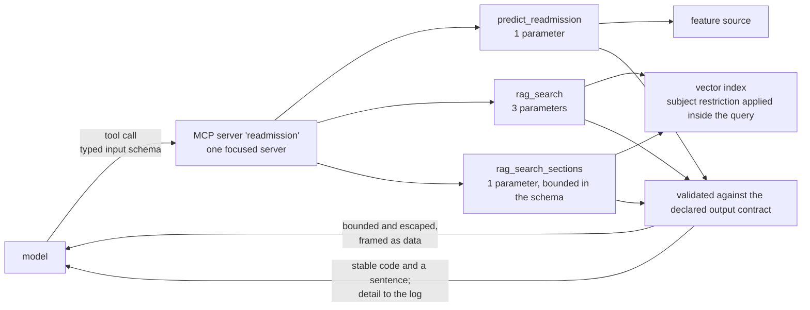

# Layer 5 — Tools & grounding

Status: rewritten 2026-09-29. Supersedes `archive/layer-05-tools-mcp-2026-09-29.md`. Requirement
statuses were re-verified against the repository on 2026-09-29. Six gaps were recorded by the
previous audit and closed on 2026-09-17; the changes that closed them are in section 4.

---

## 1. The layer

This layer is how the model reaches anything outside itself: retrieval over a corpus, calls to a
predictive model, and the typed contracts that govern both directions of that traffic. It is the
point at which the system's answers become grounded in evidence rather than in the model's prior,
and therefore the point at which "the system said so" acquires a meaning that can be checked.

Its governing property is that **a tool result is untrusted input**. A tool result is produced by
this application, which does not make it trustworthy: it contains text authored by an outsider —
in this system, clinical note text — and it enters the prompt in the position where instructions
normally appear. The layer therefore treats a tool boundary as a trust boundary, and the controls
that matter are the ones that remain correct when the content is adversarial rather than merely
malformed.

Two distances matter here, and they are frequently confused. The first is between the *advertised*
contract and the *enforced* one: a schema the model sees is a claim about what the tool accepts,
and a claim that is narrower than the enforcement wastes a round trip when the model guesses
beyond it, while a claim that is wider than the enforcement turns a programming error into a
runtime refusal. The second is between an *empty* result and an *absent* subject: retrieval that
legitimately finds nothing and retrieval whose subject does not exist are different facts, and
conflating them produces an answer that is confidently wrong about a patient rather than
unavailable.

**Terms.**

| Term | Definition |
|---|---|
| Tool | A capability exposed to the model with a name, a typed input schema and a typed output schema. |
| MCP | A protocol for exposing tools over a transport, so the model client discovers and invokes them without compiled-in knowledge of the server. |
| Input schema | The declaration of what a tool accepts; derived from the implementation's signature and presented to the model. |
| Output schema | The declaration of what a tool returns; distinct from the input schema and frequently omitted, at the cost of downstream validation. |
| Structured output | A result returned as typed fields rather than as text, so the consumer validates rather than parses. |
| Graceful failure | A tool failure returned as a payload with a stable code, rather than raised, so a caller can distinguish it from a transport fault. |
| Provenance | The property that content is attributable to the subject it was retrieved for, enforced so that a retrieval cannot return another subject's content. |
| Semantic isolation | Restricting a retrieval by an identifier *inside* the query, rather than by filtering the results afterwards. |
| Embedding space | The model and parameters that define a vector's coordinates; two spaces are incomparable, so serving and ingestion must agree exactly. |

**Why the direction of a contract is not symmetric.** An input schema is a convenience for the
caller and a first line of validation. An output schema is the only mechanism by which the layer
above can validate without knowing the tool: without one, the consumer's check reduces to asking
whether a dictionary arrived. This asymmetry is why an unannotated return type is not a stylistic
matter — it is the absence of a contract on the side that has no other way to obtain one.

**Boundaries.** The index, the note tables and the pipelines that build them are layer 7's; this
layer consumes them. What may be *screened* of retrieved content is layer 11's injection policy —
this layer's obligation is the narrower one of what may enter a prompt and in what form. The
record's shape and the distributed-tracing clause belong to layer 10, which this layer feeds.
Least privilege over who may invoke the MCP service is layer 11's; this layer supplies the identity
token it is enforced with.

---

## 2. Requirements

| # | Requirement | Level |
|---|---|---|
| A4 | Tools exposed through MCP, each with typed input and output schemas. | MUST |
| A5 | Tool definitions kept small: primitive types, fewer than five parameters, enums in preference to free text; focused toolsets rather than a monolithic server. | MUST |
| B3 | Serving uses the same embedding model and parameters as ingestion. | MUST |
| G1 | All inputs treated as untrusted, including tool results; external content validated before it enters a prompt. | MUST |
| F2 | Structured logging of which tools were called, with inputs and outputs and per-step latency; distributed tracing across the services. | MUST |
| G4 | Least-privilege service accounts, with service-to-service authentication by workload identity. | MUST |

---

## 3. Gaps and recommended remediation

**G1 — retrieved text is not screened before it enters the prompt (G1).** The controls that exist
preserve provenance, bound the volume, and escape the delimiter; none of them inspects content.
A passage can therefore carry a complete, well-formed instruction and be read as one. *Remediation:*
layer 11 owns the policy and carries the same gap, and layer 9's uncovered adversarial case is the
same defect seen from the evaluation side — an instruction embedded in a discharge note, which
requires authoring a note into the corpus and rebuilding the index. One action closes all three
records; it is not a change to this layer's code.

**G2 — the deployed index's embedding space is not evidenced (B3).** The code can no longer
disagree with itself, and the index is a deployment fact that no artifact in the repository
attests. The failure this guards against is not an exception but plausible neighbours from an
incomparable space. *Remediation:* record the space, and the model that produced it, as an artifact
of the index build, and compare it against the serving definition before a promotion. Layer 7 owns
the build; the check belongs at its gate, which already refuses a promotion on a measured verdict
and could carry this one.

**G3 — no trace identifier reaches the MCP server (F2).** A tool-side latency can be seen but cannot
be joined to the request that caused it. *Remediation:* layer 10's, and it is the same action as
that layer's gap 3 — propagating the retrieval index's identity and the trace context together,
since both are one-line additions to a payload that already crosses the boundary.

**G4 — tool inputs and payloads are absent from the durable record (F2).** This is a decision
rather than an oversight, and it is recorded here so that it is not mistaken for one: the record
carries shape, not content, because the content is patient-derived. *Remediation:* none is
recommended. If an incident ever requires the payloads, that is a decision about retention and
access taken deliberately, not a field added to a log line.

---

## 4. Record of change

Six gaps were closed on 2026-09-17.

**The tool contract completed and declared.** All three tools advertised an object schema with no
declared properties, so nothing downstream could validate a result: the client asked only that a
dictionary had arrived, and two fields the tools actually returned were declared nowhere. The cause
was the return annotation — the SDK derives the output schema from the return type, and every tool
was annotated as a bare mapping. Each tool now annotates its declared contract, and the contract is
enforced by the tool before it returns and by the client before anything downstream sees the result.
The measurement that established the cause is worth keeping: over the installed SDK, a union of two
typed dictionaries advertises a schema whose only property is the union's common wrapper, the
payload arrives wrapped in it, and any key the schema does not declare is dropped from the
advertised shape.

**The bounded parameter made self-describing.** The one bounded argument reached the model as an
integer with no minimum, no maximum and no default, because the schema cleaner strips defaults
before the model sees them. Its range lived in prose and in a check that refused an offending call,
so the constraint rejected rather than prevented: a model that guessed a value above the range spent
a tool round trip to be told what the schema could have stated. The range is now in the schema, and
the framework enforces it at the boundary before the tool body runs.

**What may enter the prompt bounded and escaped.** Nothing capped the size of a tool result, and a
fallback retrieval can return an entire discharge note; several may arrive at once. Nothing handled
the delimiter characters either: the serializer in use escapes quotes and newlines but not angle
brackets, measured, so a passage whose text contains the closing tag produced a second closing tag
in what the model received — and the prompt's rule covers the contents of the frame, which leaves
text outside the frame outside the rule. Both are now closed at the wrapper, and the tests that
previously checked only that the prompt and the wrapper named the same literal now drive a passage
containing the delimiter through the real path.

**Error detail removed from the contract.** A transport failure was returned as the exception's type
and message, so a wrongly typed argument arrived carrying the validation library's message and a
documentation URL, and was indistinguishable from a broken connection. Worse, several refusals
returned internals: the isolation refusal named the note identifiers it had refused, and a note
identifier is a composition of the subject identifier, so that is another patient's identifier
reaching both the prompt and the caller; other paths embedded a table name, a raw datapoint
identifier, or internal column names. Every one of those *is* a tool result, so each entered the
prompt and each was returned to the caller verbatim. Failures now return a stable code and a
sentence, and the detail goes to the log.

**The embedding space single-sourced.** The space was defined in four places: a serving copy
resolvable from the environment, a configuration file, a pipeline default, and the module that
ought to have been the only definition. The quietest of the divergences was the namespace filter,
whose drift would have matched nothing and returned an empty result with no error at all — a
failure that presents as a corpus with no relevant content rather than as a defect. There is now one
definition, imported by both the serving path and the pipeline loader, with a test asserting
identity rather than equality so that a copy agreeing today still fails. The shape of the fix is
notable: the section vocabulary in the same package was already single-sourced, so the repository
contained both the correct pattern and the violation of it side by side.

**An unknown subject made distinguishable from an empty result.** One tool returned an error for an
admission absent from the feature source; both retrieval tools returned success with a count of
zero, including for an identifier that did not exist. The model therefore reported that no notes
were found for a patient who did not exist, and a mistyped identifier read as an empty record — a
confidently wrong answer about a patient rather than an unavailable one. The prompt made this worse
rather than better, instructing the model that an all-empty result is a real answer while separately
teaching it the meaning of the error only one of the three tools produced. All three now agree on
one meaning for "this admission has nothing", and the fault was found by auditing one tool's
contract against another's rather than from any requirement row.
