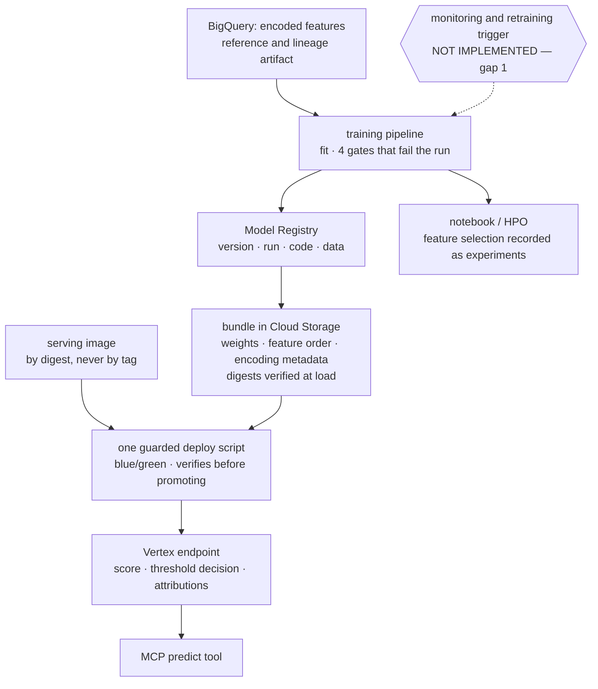

# Layer 6 — Your own models

Status: rewritten 2026-09-29. Supersedes `archive/layer-06-own-models-2026-09-29.md`. Requirement
statuses were re-verified against the repository on 2026-09-29. Twelve gaps were recorded by the
previous audit; eleven were closed on 2026-09-17 and one awaits a decision. Re-verification moved
one status: E1 recorded the image-identity gap as its remaining failure, and that gap was closed.

---

## 1. The layer

This layer owns anything the system trained itself, together with the pipeline that produces it and
the lifecycle that governs it. Its distinguishing property is *duration*: a foundation model is
replaced by changing a constant, whereas a model of one's own is replaced by re-running a pipeline
against a dataset, and the result is an artifact with its own identity, its own evidence and its
own retirement.

That duration is what makes the layer's obligations specific. A trained artifact must be
**reproducible** — the code, the data and the configuration that produced it must be identifiable
from the artifact alone, because the artifact will outlive the recollection of how it was made. It
must be **gated** — the pipeline must be capable of failing, since a pipeline that cannot fail is
a pipeline that ships whatever it is given. And it must be **identified at the point of use** —
the serving path must be able to say which artifact answered, because an answer attributed to a
model in general is an answer attributed to nothing.

The layer has one further obligation that is easy to state and hard to satisfy: the labels against
which performance is judged must be independent of the system being judged. Where a label is derived
from the model's own output, any metric computed against it is circular, and it will be
flattering — which is worse than absent, because it substitutes for the evidence it mimics.

**Terms.**

| Term | Definition |
|---|---|
| Feature view | A served view over a feature table, materialised for lookup by the serving path rather than recomputed from raw data at request time. |
| Bundle | The set of artifacts a trained model requires to serve — weights, the feature-order manifest, the encoding metadata — treated as one versioned unit. |
| Gate | A check inside the pipeline that fails the run rather than logging a warning; its threshold is code or a versioned artifact, never a submission parameter. |
| Model Registry | The platform's record of a model version: what was registered, from which run, against which data. |
| ML Metadata | The platform's artifact-and-execution graph, from which the provenance of a registered model can be read rather than reconstructed. |
| Lineage | The traceable relation from a served artifact back to the code, run and dataset that produced it. |
| Calibration | Agreement between a predicted probability and observed frequency; distinct from ranking performance, which the same model can possess while being badly calibrated. |
| Discrimination / ranking metric | A metric such as area under the precision–recall curve, which measures ordering rather than absolute probability. |
| Attributions | Per-feature contributions to one prediction, expressed in probability units so that they sum with the model's own output. |
| Mutable tag | A container image reference that may resolve to different bytes over time, and therefore cannot identify an artifact. |
| Digest | Content-addressed image reference; the only reference that identifies bytes. |
| Label maturity | The delay before an outcome is known, which bounds how soon performance can be measured on production traffic. |

**Why the pipeline, and not the model, is the deliverable.** A model file is inert; a model file
plus the means to produce it again is a system. This layer's changes were almost all to the second:
making the pipeline runnable from the repository, refusing a gate baseline supplied at submission
time, ordering a metric's computation after the digest that guards it, and recording the immutable
identity of the image that served. The model itself did not change.

**Boundaries.** The tool contract and the validation of what reaches the model are layer 5's. The
feature view, the note tables and the retrieval index are layer 7's, which owns the ingest pipeline
and the cohort rows the served path reads. Judging a retrained model belongs to layer 9, which owns
the harness. Image scanning and approved-image admission belong to layer 11; the execution record
and queryable lineage belong to layer 10. Prompt and chain versioning is layer 3's, and this layer's
model pin is the one artifact its pipeline registers.

---

## 2. Requirements

| # | Requirement | Level | Status |
|---|---|---|---|
| E5 | Own models go through a pipeline: train, evaluate, Model Registry, endpoint, with lineage in ML Metadata. | MUST | **Met.** The chain exists and runs: a pipeline that fits the model, four gates that fail the run and whose thresholds are code or a versioned artifact rather than submission inputs, a registry entry naming the run, the revision and the data, and an endpoint reached by one guarded deploy script. The lineage is in ML Metadata, with the dataset artifact an input of the load step and the registered model an output of registration, inside the run's own context. Verified by a completed run on 2026-09-17. |
| E6 | Retraining or re-tuning triggered by monitoring, not by hand. | SHOULD | **Not met, awaiting a decision.** No monitoring job, schedule, topic or trigger exists anywhere in the repository or its deploy scripts; retraining is a person running the pipeline. The environment script enables the messaging and scheduling APIs and grants the pipeline account publish rights, which is scaffolding for a loop rather than a loop. |
| E1 | Version control for weights, datasets and images — the model's own half. | MUST | **Met, with one residual.** Weights are one bundle per run in object storage, with digests verified at load against a partially written file, a non-executable format, and the gate numbers travelling with the artifact. The dataset has a recorded reference and a lineage artifact. The training image is named by build tag on every submission, and the serving image is now recorded by digest, with the mutable tag removed from every place it existed. The residual is that the deployment serving today was uploaded before that change, so its record names a tag; the next deploy records a digest. |

---

## 3. Gaps and recommended remediation

**G1 — no monitoring, and therefore no trigger (E6).** This is the layer's one open requirement, and
it is a SHOULD, so the question is which of three positions to take rather than whether to repair a
defect.

The constraint that shapes the decision is not obvious and it rules out the metric a monitoring
story would ordinarily lead with. The served cohort's table carries a readmission column, and it
looks like an outcome; it is not. The feature-generation step ranks rows by the model's own
probability and labels the top fraction positive, so the label is a function of the score it would be
used to judge. Any discrimination metric computed against it is circular and would appear near
perfect. Performance monitoring therefore has no usable label in this deployment, because a real
one matures a month after discharge and the cohort is frozen.

What remains observable is worth stating in descending order of value: the serving path's own
structured error codes, which already exist and would reduce to a log-based metric and an alert —
this is the signal that would have caught a broken feature source mechanically rather than by a
person noticing; a per-call prediction log, which nothing currently writes and which is the
substrate for everything else; and drift, which needs no labels at all, since the statistic already
exists for the training data and the serving-side case is the same computation applied to requests.

*Remediation:* the three options are recorded in the previous audit and remain the choices. Correct
the operations document and leave the requirement unmet; correct the document and build the three
label-free signals, so that detection becomes real while the trigger does not; or build the full
loop, which in a frozen demonstration cohort could never fire. **The defensible minimum is to stop
the operations document describing a loop that does not run**, because a document asserting an
unbuilt mechanism removes the absence from view — and it has already misled one audit of this layer.

**G2 — the serving deployment's record names a tag rather than a digest (E1).** The change that
closed the image-identity gap applies to future deploys; the deployment currently serving predates
it. *Remediation:* not a separate task — the next deploy records the digest, and the residual is
recorded here so that a reader of the registry does not infer the rule was never applied.

**G3 — the local prediction harness is not runnable.** It loads the predictor from a path that
predates a rename, so nothing can execute it and nothing depends on it. It is the same class of
leftover as the training smoke script. *Remediation:* correct the path or delete the harness.
Deleting is defensible only if the coverage it provided exists elsewhere; otherwise the path is a
one-line correction, and a harness that cannot run is indistinguishable from one that does not
exist — except that it appears in inventories as though it did.

**G4 — the prediction table is an orphan.** A table of predictions exists with tens of thousands of
rows, last written in early August, and no code in the repository reads or writes it. It is either
an abandoned experiment or the seed of the prediction log that gap 1 identifies as valuable.
*Remediation:* decide which. Adopting it as the prediction log is the better of the two, since it
would make "which model answered, at which threshold" auditable, which is both this layer's
evidence and a question layer 4 cannot answer from its own records.

---

## 4. Record of change

Eleven gaps were closed on 2026-09-17. The entries below group them by what they changed; the model
itself was not among the things changed.

**The pipeline made runnable from the repository, and made guarded.** It could not be run from the
repository as it stood, and one of the deployment script's two paths deployed the wrong artifact.
The pipeline now runs from a checkout, and the deployment step is guarded, with the submission
requiring the serving image to be resolvable and refusing an empty or tagged reference. The pattern
established here — a precondition that stops and explains how to satisfy it — was applied twice more
during the same work.

**Lineage recorded in the registry.** The registry entry named neither a version, nor a run, nor the
code that produced it, and the model did not state what it had been trained on. Both are now
recorded: the entry carries the run and the revision, and the dataset is an input artifact of the
load step and the registered model an output of registration, inside the run's own context — so the
provenance is readable from the platform rather than reconstructed from a person's recollection.

**A single writer, and a detectable one.** Nothing prevented a second writer from taking the newest
position, and nothing could tell that it had. The pipeline now holds that position as a deliberate
act rather than by recency alone.

**The gates made unoverridable, and ordered correctly.** The gate baselines could be overridden at
submission time, which reduces a gate to a suggestion for whoever is submitting; and the metrics
were written before the digests meant to guard them, so a run could publish a verdict before the
artifact it described was fixed. Both are corrected: the thresholds are code or a versioned
artifact, and the ordering is enforced.

**A reconciliation rather than a fix.** The repository held a mixture: one month's model with a
later month's threshold, an inconsistency that no single change had introduced and that no gate
would have caught.

**The feature contract single-sourced.** It was restated in five places, so a divergence would have
arrived as a prediction computed against a feature order the model was not trained on — a failure
that produces plausible numbers rather than an error.

**The serving image pinned to immutable bytes.** The image was tagged by a hash over its source, so
changed source produced a changed tag; two things nevertheless fell short of the requirement. A
mutable tag was published beside the pinned one and was not decorative, being recorded on a
registry entry when no image was supplied explicitly. And the digest the script resolved was used as
a boolean and discarded, so the one identifier of the bytes that ran was fetched and thrown away,
leaving no artifact recording it. The build also resolves dependency ranges when it runs, so the
image is reproducible by tag content rather than by bytes, which is acceptable only when stated and
was neither stated nor compensated.

The fix was to make the digest the reference: the deploy now returns a digest-addressed reference,
records it on the uploaded model and on the deployment, and stops rather than proceeding if a digest
cannot be read back. The mutable tag was removed everywhere it existed — from the build, from the
registry, from the fallback in registration, and from the local harness — and the stale tag was
deleted from the registry. One rule, in one place, so the three call sites cannot drift, with
seventeen tests over it. It was verified against the real registry rather than by test alone: the
first build after the change published one tag and no mutable one, the deploy printed its digest as
the reference, and listing the registry's tags showed three content-hash tags and no mutable name.
The stale tag had pointed at bytes older than the newest build, which is the defect in miniature — a
name that tells you nothing about what it resolves to.
