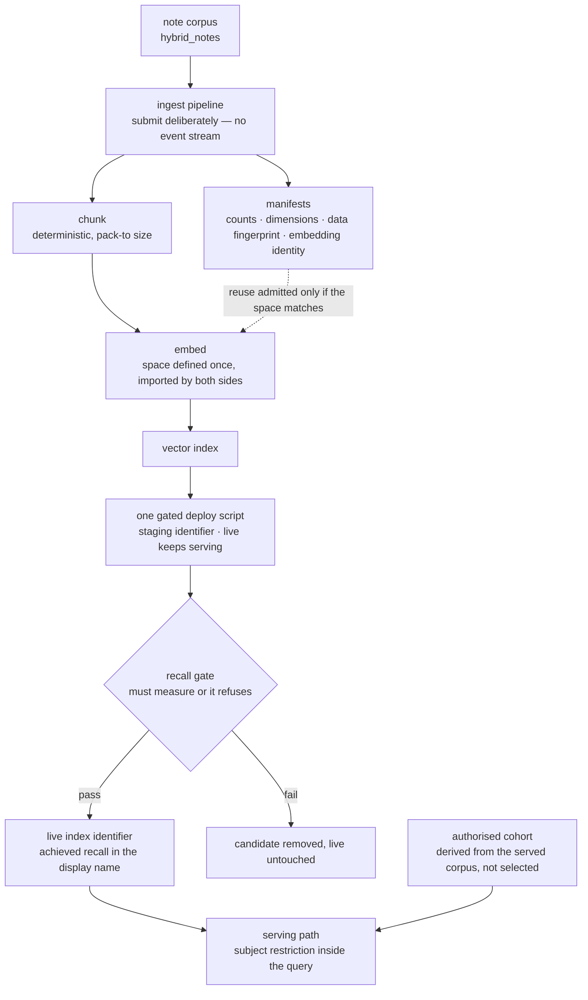

# Layer 7 — Data and indexes

Status: rewritten 2026-09-29. Supersedes `archive/layer-07-data-and-indexes-2026-09-29.md`.
Requirement statuses were re-verified against the repository on 2026-09-29. Nine entries were
recorded by the previous audit: one withdrawn, eight closed on 2026-09-18. Two requirements are
unmet by recorded decisions rather than by incomplete work, and that distinction is preserved here.

---

## 1. The layer

This layer owns the data the system answers from: the analytical tables, the note corpus, the
vector index built over it, and the pipelines that produce all three. Its defining property is that
it is the only layer whose state **outlives every deployment of the code**. A container is replaced
by a deploy; a dataset is replaced by a migration, and a vector index is replaced by an ingest run
that may take twenty minutes and cost money. That asymmetry is the source of the layer's obligations.

Three follow from it.

**A live request must never mutate the data.** The serving path reads an index; it does not extend
it. Where a request could write, the read path acquires the write path's failure modes, and the
index acquires state that no artifact describes.

**Every artifact must carry the identity of the data it read.** An index, a chunk manifest and an
embedding manifest are all claims about a state of the tables. Without a recorded fingerprint, an
artifact cannot be traced to what it was built against, and a later divergence is unattributable.

**A measurement that is absent is not a measurement that failed.** This is the layer's hardest
lesson and it is stated as a rule because it was learned expensively. A gate enforcing a threshold
over a metric that no component reports will refuse a promotion and name the metric, which reads as
a verdict on the data. The data may be entirely healthy. The distinction is between a system that
measured and disliked the result and a system that never measured at all, and only the report can
tell them apart.

**Terms.**

| Term | Definition |
|---|---|
| Ingestion | The offline pipeline that reads notes, chunks them, embeds the chunks and writes an index. |
| Chunk | The unit of retrieval: a section of a note, packed to a target size, so retrieval can return the relevant part rather than the whole document. |
| Deterministic chunking | Chunking whose boundaries are a pure function of the text, so the same note yields the same chunks and a stored identifier can be resolved by recomputation rather than by lookup. |
| Embedding space | The model, dimensionality and task type that define a vector's coordinates; vectors from two spaces are incomparable. |
| Manifest | The artifact written beside a pipeline output recording what it was built from: counts, dimensions and, since this layer's changes, the data state and the embedding identity. |
| Data fingerprint | A compact reduction of a table's state — modification time and row count — sufficient to distinguish one state from another. |
| Reuse artifact | A cached embedding set that a later run may build on; admitted only if its recorded space matches the current one. |
| Recall gate | The measurement of whether the index returns the passages the questions require, applied before promotion. |
| Blue/green promotion | Bringing a candidate up under a staging identifier while the live one keeps serving, and promoting only on a passing measurement. |
| Authorised cohort | The set of admissions the system will answer about; the boundary of what the tools may reach. |

**One requirement is in tension with another, and the resolution is recorded rather than hidden.**
B1 asks that ingestion, serving and evaluation share the database layer but *not* code paths; B3
requires that serving embed in exactly the space ingestion built. Satisfying B3 by identity rather
than by agreement — one definition imported by both sides — means a shared module between the two
subsystems, which is a narrower sharing than B1 forbids but is sharing nonetheless. The alternative
is two definitions that agree today, which is precisely the failure B3 exists to prevent. The
resolution is recorded with its reasoning rather than presented as full compliance.

**Boundaries.** The tool contract and what may enter a prompt are layer 5's; this layer supplies the
content. The embedding call is a Vertex request outside the model gateway and is noted here and
there. Serving-side request logging for offline analysis (B5) belongs to the observability plane,
which records that nothing consumes the execution record. Safety screening of served responses (B4)
is audited at the model runtime layer. Scheduled index maintenance is this layer's requirement and
is unmet by decision.

---

## 2. Requirements

| # | Requirement | Level | Status |
|---|---|---|---|
| B1 | Three separate subsystems — ingestion, serving, evaluation — sharing the database layer but not code paths. | MUST | **Met in part.** They are separate processes, separate images and separate entry points, and no serving request executes ingestion code. The shared surface is the retrieval package's definitions, which are imported by both sides deliberately, because B3 requires the two to embed in one space and a second definition is the failure B3 names. The deviation is narrow, reasoned, and recorded rather than presented as compliance. |
| B2 | Ingestion is event-driven and offline, and a live request never mutates the index. | MUST | **Not met, by decision.** The second clause is satisfied absolutely: nothing on the request path writes to the corpus or the index. The first clause is not: ingestion is submitted deliberately, because a demonstration environment has no event stream and embedding cost should be incurred by an act rather than by an arrival. The production mechanism is recorded for release planning. The verdict stays *not met* so that a reviewer sees the deviation rather than an argument that the clause does not apply. |
| B3 | Serving uses the same embedding model and parameters as ingestion. | MUST | **Met.** One definition, in one module, imported by the serving path and resolved by the pipeline loader, with a test asserting identity rather than equality so that a copy which agrees today still fails. The manifests now record the model, dimensionality and task type, and a test resolves those recorded values to the same constants the serving module defines, so the artifact states what it was built in rather than only what it counted. |
| B6 | Index maintenance is a scheduled operational task, versioned alongside the dataset. | MUST | **Not met, by decision.** The versioning half is now satisfied: every artifact an ingest writes records the data state it read, and reuse is refused where the recorded space disagrees with the current one. The scheduling half is not: there is no schedule, and the refresh is an operator's act. The verdict stays *not met* for the same reason as B2. |
| E1 (data half) | Version control for the external datasets and stored objects. | MUST | **Met in part.** The analytical tables are produced from versioned transformations, and the corpus and cohort artifacts are in version control. The tables themselves are not versioned snapshots, which is what the data fingerprint compensates for rather than cures: an artifact now says which state of the table it read, but a past state cannot be reconstructed from the repository. |

---

## 3. Gaps and recommended remediation

No entry from the previous audit remains open. Four limitations are current and are recorded here
because a refresh document should not present a closed audit as an absent constraint.

**G1 — ingestion is manual (B2).** *Remediation:* none for this environment; the deviation is
accepted and its reasoning is recorded. The production mechanism, should this become one, is an
object landing area, an event, and a function that writes the table and submits the ingest. The
value of the entry is that the deviation is visible.

**G2 — index maintenance is unscheduled (B6).** *Remediation:* a scheduled rebuild that re-runs the
gated deploy path. Half the machinery exists: the deploy measures before it promotes, so a scheduled
invocation would be safe by construction. The obstacle is not technical — a corpus whose contents do
not change has nothing to refresh — so this is a decision rather than a task, and the verdict
remains *not met*.

**G3 — the corpus descriptions were wrong, and one naming remains.** Four descriptions and one
docstring were corrected; the deploy guard's constant and function names still use the word
*synthetic*, while the text is public MTSamples transcriptions re-keyed to demonstration
identifiers, with features derived from the note and the outcome label derived from the model.
*Remediation:* a rename, which is an identifier rather than a statement and was deliberately left to
the owner. It matters more than a naming preference: the guard is the component that decides whether
the real corpus may reach a public endpoint, so its vocabulary is read by whoever next changes that
boundary.

**G4 — two leftovers from an earlier layout.** The cohort seed script refers to a feature-store
resynchronisation script that is not in this repository, and one consequence of the cohort change is
recorded as unfixed: the site's own database is seeded from the cohort artifact, so the corrected
boundary takes effect there only after a deploy reseeds it — which the build performs on every
deploy, making this a statement about ordering rather than a standing defect. *Remediation:* correct
or remove the seed script's reference; the reseeding resolves itself on the next deploy and is
recorded so that a reader does not mistake the ordering for an omission.

---

## 4. Record of change

Eight entries were closed on 2026-09-18; one was withdrawn the same day.

**The data state recorded in every artifact, and reuse made conditional.** The dataset was not
versioned, and the artifact a run reused was a single shared object that each run overwrote. The
state of the source tables, reduced to a fingerprint over each table's last modification and row
count, is now computed once per submission and written into every manifest an ingest produces, so
any artifact can be traced to the data state it was built against. The reuse artifact is keyed by
corpus and by that fingerprint rather than by a shared path, and the embed step reads the manifest
beside it before streaming a single record: if the recorded model, dimensionality or task type
differs from the constants this repository embeds with, the run stops with both identities printed
rather than mixing two vector spaces in one index. A reuse artifact with no manifest beside it is
refused on the principle that absent provenance is not good provenance. Fifteen tests pin the
behaviour, one of which holds the standalone driver and the pipeline to the same conventions for
manifest contents and upload paths — conventions stated in two files that must agree.

**The embedding identity recorded on the artifact.** The manifest recorded counts and dimensions but
not the model or the task type, so an artifact could not state the space it was built in. Both write
paths now record the model, the dimensionality and the task type, and a test resolves those recorded
values to the constants the serving module defines, so a name written out literally fails rather
than passes.

**One deploy path, and a gate that cannot be skipped.** The runbook and the launcher named different
deploy scripts, and the one they named was not the gated path; the recall gate was optional, wrote
its evidence to a temporary directory, and was not run by the path in the runbook. There is now one
path: it finds the ingest run that built the index it is about to promote by reading each recent
run's manifest, stops if no run records building it, brings the candidate up under a staging
identifier while the live one keeps serving, runs the recall job against the staging identifier,
applies the configured thresholds, and promotes only on a pass — undeploying the candidate and
leaving the live index answering on a failure. Evidence is written to the artifact bucket, and the
achieved recall is recorded in the promoted deployment's own name, so the number that authorised the
promotion is visible on the endpoint rather than in a directory that has since been emptied. Four
scripts with fewer safeguards were deleted. The check that the measurement describes the *candidate*
is the subtle part: reading the newest successful run would have produced a report about the
previous index, which authorises the next one just as convincingly and for no reason.

**The cohort derived rather than selected.** Three sets of admissions existed under one name: the
table the configuration called the authorisation boundary held twenty-four, the corpus the tools
serve held eighty-nine, and the fixtures held one hundred and eight. Sixty-nine admissions were
therefore outside the boundary and reachable by anything that reached the tools without passing the
site's allowlist, and six captured answers described admissions that never existed in the served
corpus. The shortfall had been invisible because the argument beside it held — the tables cannot
reach real clinical data, which answers the disclosure question and says nothing about
authorisation. The resolution is a derivation: a script writes the boundary table from the served
features table, refuses to run against anything but the demonstration corpus, and refuses to finish
unless the two are the same set by identifier, which took the table from twenty-four to eighty-nine.
The fixtures were trimmed to the served admissions, the files describing unserved ones removed, and
five tests hold the invariant that the smaller artifacts are subsets of the authoritative list
rather than selections beside it.

**Descriptions corrected where the claim was made.** The corpus was described as synthetic in four
places, including the guard that decides whether the real corpus may reach a public endpoint, and
one docstring described a chunk store that does not exist — serving resolves a stored identifier by
re-parsing the note and re-running the deterministic chunker rather than by looking a row up. Each
now states what the data is, keeps the claim that was load-bearing throughout, that no
real-clinical note text reaches the demonstration path, and describes what serving actually does.

**The ingest image made rebuildable, and the launcher made to gate on it.** This entry was found
while closing the gate entry, and it is the layer's most instructive. The command that rebuilds the
image the recall gate measures *with* had been broken since the ingest subtree moved: it named a
build context that contains no pipeline configuration, and the Dockerfile copied a directory that no
longer existed. The image was therefore four weeks older than the source and predated the metric the
gate had begun to enforce. The next attempt to promote was refused, and the refusal named that
metric — so it read as a verdict on the corpus, which had a recall of 0.992 and no empty results at
all. Nothing had been measured. The build path was repaired, and the launcher now rebuilds to
completion before deploying and stops that half if the build fails, so the gate always measures with
the checkout it is deploying. The lesson is recorded in the gate's own output: an absent measurement
is not a failed measurement, and the message now prints the gap rather than a verdict.

**Withdrawn rather than closed.** One entry had recorded the absence of the two hourly-billed serving
endpoints as a defect, because free-text retrieval fails closed while section retrieval continues to
answer. The absence is the project's deployment practice — those endpoints exist during a test and a
release, and their billing continues regardless of traffic — so the entry now records the behaviour
a request observes between tests. It is retained rather than deleted, because the behaviour it
describes is what a reader will see.
