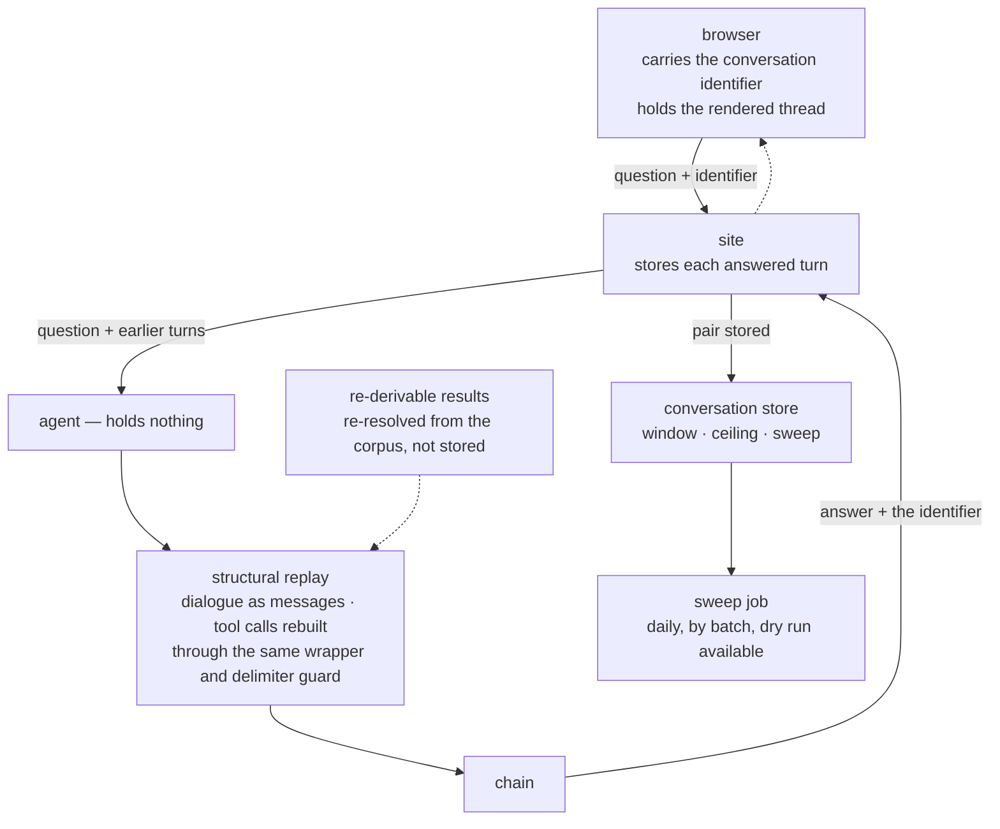

# Layer 8 — Memory and session state

Status: rewritten 2026-09-29. Supersedes `archive/layer-08-memory-session-state-2026-09-29.md`.
Requirement statuses were re-verified against both repositories on 2026-09-29. Five entries were
recorded by the previous audit; all five were closed by implementation on 2026-09-18, and the
changes that closed them are in section 4.

---

## 1. The layer

This layer owns what the system remembers, where it is kept, how long it is kept, and what a
conversation is. Its governing constraint comes from the layer it serves: the agent must hold
nothing between requests, so that any instance may answer any request and a restart loses nothing.
Continuity therefore cannot be a property of the agent. It must be constructed by the caller, from
state held somewhere that is not the process.

Two distinctions organise the layer, and both are frequently collapsed.

The first is between **a store and a display**. A thread rendered on a page and a transcript held in
a database are different objects that look identical on screen, and the difference is only visible
when they diverge — on a reload, on a second tab, or when the record outlives the session. A system
in which the display outlives the store presents continuity it cannot honour; a system in which the
store outlives the display discards work the user believes is retained. Which of the two the user
experiences must be stated in the interface rather than discovered.

The second is between **a conversation's continuity and a session's boundary**. Continuity is the
ability to answer a follow-up in the light of what came before. A session is the interval during
which that continuity is available, and it must be defined by something observable — a page load, a
cookie lifetime, an explicit end — because every retention promise, every cost rule and every
isolation guarantee is made relative to it.

**Terms.**

| Term | Definition |
|---|---|
| Session | The interval during which a conversation is available; defined here as a page load, and stated in the interface. |
| Conversation | A stored sequence of answered turns, pinned to one subject, with a retention window and a turn ceiling. |
| Turn | One question and its answer, stored as the pair it was, so that a replay reproduces what happened rather than a summary of it. |
| Structural replay | Reconstructing earlier turns as the message structure a live turn would have produced — dialogue as messages, tool calls as a call and its result — rather than pasting their text into the prompt. |
| Retrieval re-resolution | Re-deriving retrieved passages from the corpus on replay rather than storing them, so that note text never enters the session store. |
| Retention window | The maximum age of a stored conversation, enforced by a sweep rather than by expiry on read. |
| Turn ceiling | The maximum number of user turns in one conversation; the bound on what a single credit buys once only the first turn is charged. |
| Re-derivable | A tool result that can be recomputed from its arguments and the corpus, and which is therefore not stored. |

**Why replay is structural rather than textual.** Retrieved content enters the prompt inside a
framed, delimited region that marks it as data, and the prompt's rule holds only for text inside
that frame. Pasting a stored passage into the prompt as ordinary history would place it outside the
frame, re-opening the channel the frame exists to close — and the guardrails depend on the model
having been told that content is data, rather than sanitising imperatives themselves. Replay
therefore reconstructs the frame: a replayed tool call is re-inserted as the call and its result,
rendered through the same wrapper and delimiter guard a live result passes.

**Boundaries.** The agent's statelessness is layer 3's; this layer supplies the continuity that
makes single-turn behaviour unnecessary without making the agent stateful. The shape of what may
enter the prompt is layer 3's prompt classification, which this layer's replay must respect. The
tool result wrapper and its delimiter guard are layer 5's. What may be logged is layer 11's, and
what is retained for evaluation is layer 9's; this layer's policy is stated alongside those rather
than in isolation from them.

---

## 2. Requirements

| # | Requirement | Level | Status |
|---|---|---|---|
| A1 (conversation-state clause) | A production front end reaches the agent over an API and keeps conversation state externalised. | MUST | **Met.** The interface never calls the model. Conversation state is external to the agent and external to the page: the site stores each answered turn, the browser carries only the conversation's identifier, and the site supplies the agent the turns it is asked to consider. What the page holds is a rendering copy, and the interface states that the thread belongs to the page. |
| A3 | The agent is stateless and session state lives in an external store, so any instance may serve any request and a restart loses nothing. | MUST | **Met.** The agent holds nothing between requests: the services run without session affinity, the tool server is stateless, and no transcript is retained in the process. Session state lives in the site's database, behind an authorisation boundary, with the retention window and the ceiling read from settings and enforced. |
| A7 | Long-term, cross-session memory in an external store, existing only if the product needs personalisation across sessions. | SHOULD | **Not applicable, declined on the record.** The requirement's own condition is that the product need personalisation across sessions, and it does not: a clinician's question about an admission is answered from that admission's evidence, and nothing about a previous session would improve it. Declining a SHOULD whose condition is unmet leaves nothing unresolved. |

One requirement outside this group governs the retention question and is named here so that the
policy was not written without it: no personal or confidential data in logs, and data minimisation.
Both are audited in other layers; this is where they apply to the decision about what a conversation
may keep.

---

## 3. Gaps and recommended remediation

Every entry from the previous audit is closed. Three matters remain open, and are recorded because a
refresh document should not present a closed audit as an absent constraint.

**G1 — resuming a rendered thread from the store is deferred.** A conversation is stored, and the
thread that rendered it is not: the canvas and the passages behind citations are composed by the
agent from live evidence, so a resumed thread would be a transcript without its artifacts. Storing
the artifacts would place note text and prediction scores in the site's database, which the
retention policy refuses. Resuming was therefore deferred rather than rejected. *Remediation:* two
routes, neither of them a small change. Either the stored shape is extended to a composed artifact
with its own retention policy and its own access boundary, or the agent gains the ability to
recompose a stored turn from the store's identifiers alone — which is possible only for the parts
that are re-derivable, and the prediction scores are not. The second is closer to the layer's
existing grain, since re-derivation is already how retrieval is handled.

**G2 — the turn ceiling is provisional.** The ceiling exists, is enforced, and is accompanied by a
way forward rather than a dead end; its value was chosen as a starting point rather than derived
from use. *Remediation:* settle it against observed conversations once there are any, which is the
same evidence the cost baseline needs.

**G3 — cross-session memory is not built (A7).** This is a declined SHOULD and not a defect.
*Remediation:* none is recommended. It is recorded so that its absence reads as a decision.

---

## 4. Record of change

The strategy session was held on 2026-09-18 and settled every decision the entries raised. Seven
pieces of work followed the same day, in the order the session put them.

**A correction to the layer's own account, before anything was built.** The first version of this
layer's document asserted that the layer held no conversation state, that the browser held nothing,
and that the interface offered no field for a follow-up. All three were false: the browser kept one
episode per patient, the console page had a follow-up composer and a rendered thread throughout. The
accurate statement of the defect was narrower and more useful — the thread was *displayed and not
transmitted*, so the interface claimed a continuity the answers did not have. Two earlier layer
documents had already recorded the fact as belonging to someone else; this layer was the first to
treat it as its own subject. The correction is recorded because the wrong version was more
flattering: it described a system with no problem rather than one with a misleading interface.

**The site's request boundary closed.** The proxy read three keys and silently discarded every
other, which is the failure the agent's closed contract had been written to prevent, at the boundary
a browser can actually reach. It now refuses an unknown field using the same two-part refusal —
a conversation field refused as a product decision made visible, any other unknown field refused by
naming what the endpoint accepts — and the check runs before the fixture branch, so neither mode can
answer a request whose extra fields it discarded.

**The conversation store built.** Two models behind one authorisation boundary, the subject pinned
in code rather than accepted from the caller, the retention window and the turn ceiling taken from
settings, and a sweep that deletes by batch under a dry run. The sweep is a job rather than expiry
on read, for the reason that decided it: a row that is never read is never swept by a reader, and
the database has no native row expiry.

**The agent given a turn shape.** The agent accepts earlier turns under a closed and bounded shape
and replays each as its own messages between the prompt and the current question, so the template
stays a template and the replayed material stays data — an answer the user saw is an assistant
message here, exactly as it would be mid-turn, and never becomes part of the instruction that frames
the question. The site's closed set and the agent's differ, deliberately: the site accepts the
conversation identifier and the agent does not, because the requirement that the agent hold nothing
is precisely why the caller sends the turns instead. The difference is the requirement rather than an
inconsistency.

**The replay completed structurally.** A replayed turn's tool calls are rebuilt as the assistant's
call and its result, rendered through the same wrapper and delimiter guard a live result passes,
with stored payloads used where they exist and retrieval re-resolved from the corpus where they do
not. Two additions were required for the replay to be faithful rather than merely plausible: every
emitted tool call carries its arguments and a statement of whether its result can be obtained again,
because a replayed call without its arguments misstates what was asked; and the answer carries the
code revision behind it, because a stored turn with no revision cannot be explained later. The
classification of which tools are re-derivable is held exhaustive over the tools the server
registers, so a newly added tool fails the suite rather than defaulting into a privacy decision.

**The money and continuity rules placed in the ask path.** A credit is claimed when a conversation
opens and not when it continues, which decouples spend from the allowance and leaves the turn
ceiling as the bound on what one credit buys. The ceiling refuses with the way forward named, so the
refusal is something the user can act on. A turn is counted only once an answer exists, so a failed
first turn keeps both its credit and its place and the retry is the first successful turn. The
subject is pinned when a conversation opens and re-asserted on every turn, and a conversation cannot
be answered about an admission other than the one it was opened for.

**The interface wired to the store, and the session boundary defined.** An answer is written as the
pair it was; the next question carries the earlier turns in the agent's replay shape; the browser
carries the identifier and is told what it means; and the offline path is labelled as the
single-turn thing it is. The final question was what a session is, and it was exposed by the work
rather than anticipated: the rendered thread was always the page's, while the store's copy outlives
it, so a reload produced a new conversation and a second credit for a first turn. The decision is
that a session is a page load — the thread and the conversation end together — and the interface
says so in one line while a conversation is open, so the boundary is understood rather than
discovered. Resuming a rendered thread was considered and deferred, with the reason recorded in
section 3.

One property is worth recording as a positive finding. Before this work the system could not answer
about the wrong patient by carrying an identifier forward, because there was nothing on the wire to
carry; that property followed from the single-turn contract rather than from a constraint that would
have survived the addition of continuity. It is now a design requirement rather than a side effect:
the subject is pinned at the point the conversation opens, and re-asserted on every turn.
