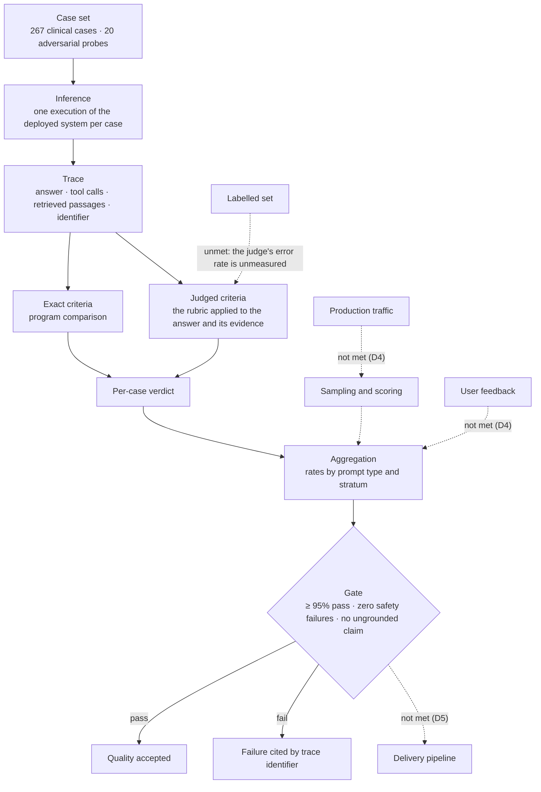

# Layer 9 — Evaluation

## 1. The layer

**Definition.** Evaluation is the measurement of the quality of a system's output
against a stated standard, performed over a fixed set of cases and recorded in a
form that permits the measurement to be repeated. Its subject is the output: a
case presents an input, the system produces an answer, and the answer is compared
against the standard. The layer produces verdicts, and verdicts are the evidence
on which a release decision rests.

**What the layer comprises.** Five things are required for a measurement to exist,
and each is versioned because the others depend on it.

- A **case set**: the inputs, each paired with the standard its answer is judged
  by. A set may be a census of the population the system serves or a stratified
  sample of it, and the distinction governs what a pass rate is a statement about.
- An **instrument**: the automated means by which an answer is compared with the
  standard. The requirement admits either a judge or a rubric, and excludes
  surface-overlap measures such as BLEU and ROUGE, which do not establish whether
  a statement is supported by the evidence.
- A **trace**: the record of one inference, holding the answer, the tool calls
  with their results, the retrieved passages, and an identifier by which a failure
  can be cited.
- An **aggregation**: the reduction of individual verdicts to rates, grouped so
  that a rate is interpretable — by prompt type, by case class, by stratum.
- A **threshold**: the value of an aggregate below which a release is refused.

**Two classes of criterion.** A criterion is either *exact* or *judged*, and the
classification is architectural rather than stylistic. An exact criterion is a
comparison a program performs over the trace, and it has no error rate: whether a
request carried a particular field, whether a figure in the answer equals the
figure a tool returned, whether every tool call named the case's subject. A judged
criterion requires reading prose — whether a claim is supported by the passages
shown, whether the register is appropriate — and it carries an error rate, which
is itself a quantity requiring measurement. Where a criterion admits an exact
formulation, the exact form is preferred, because it introduces no quantity that
must then be estimated.

**Offline and online evaluation.** Offline evaluation runs a fixed case set
against a frozen system, and establishes whether a change altered quality. Online
evaluation samples traffic the system is serving, and establishes whether quality
holds under the distribution it actually meets. The two answer different
questions and neither substitutes for the other.

**Governing property.** Comparability. Two measurements may be compared only when
the case set, the standard and the instrument that applies it are the same,
because a pass rate is a function of all three. A rate quoted without the versions
it was produced under is not a measurement of a change; it is a number.

**Terms.**

| Term | Definition |
|---|---|
| Evaluation | The measurement of output quality against a stated standard, over a fixed set of cases. |
| Case | One input presented to the system, together with the standard its answer is judged by. |
| Case set | The cases one measurement uses. Versioned, because comparison between measurements depends on it. |
| Prompt type | The class of question a case asks, e.g. risk, medications, summary. |
| Stratum | A partition of the case set by a property of the case, so that a rate can be reported within it. |
| Adversarial probe | A case constructed to elicit a failure: instruction override, disclosure, fabrication, cross-patient access, citation integrity, malformed input. |
| Inference | One execution of the system over one case. |
| Trace | The record of one inference: the answer, the tool calls with their results, the retrieved passages, and an identifier. |
| Evidence | The tool results and retrieved passages the system held while answering. Supplied to the rater, because whether a claim is supported cannot be assessed without it. |
| Rubric | The standard, expressed as dimensions with a scale and a rule that reduces them to a verdict. Versioned. |
| Dimension | One axis of a rubric, scored independently before the verdict is derived. |
| Rater | The agent that applies the rubric. It is a program for an exact criterion and a model for a judged one. |
| Judge | A rater that is a model, and therefore an instrument with an error rate of its own. |
| Exact criterion | A criterion decided by program comparison over the trace. It has no error rate. |
| Judged criterion | A criterion requiring the reading of an answer. It carries an error rate. |
| Verdict | The per-case outcome derived from the rubric. |
| Pass rate | The proportion of cases whose verdict is a pass. |
| Gate | A threshold over an aggregate, below which a release is refused. |
| Offline evaluation | Measurement over a fixed case set, performed so that measurements are comparable across releases. |
| Online evaluation | Measurement of sampled production traffic, performed to reflect real use. |
| Agreement | The concordance of two raters on the same cases, corrected for concordance expected by chance. It is the measure of a judge's error rate against a labelled set. |

**The layer.**

---

## 2. Requirements

The requirements below are the evaluation group of the Google Cloud AI
architecture requirements, and the identifiers are that document's.

| # | Requirement |
|---|---|
| D1 | A custom evaluation dataset covering essential, average, and edge cases. Synthetic ground truth is acceptable when real ground truth is missing; refine with human feedback over time. |
| D2 | Evaluation is automated (LLM-as-judge or rubric; BLEU/ROUGE are insufficient) and metrics and approach are frozen early so runs are comparable. |
| D3 | Eval set includes adversarial prompts (injection, leakage, fuzzing). |
| D4 | Continuous evaluation in production: sample outputs, score them, store scores with prompts/responses in BigQuery; collect direct user feedback. |
| D5 | Evaluation runs as a gate in CI/CD before deploy. |

---

## 3. Gaps and recommended remediation

Each entry states a shortfall and what should be done about it. An entry names the
requirement it concerns, and a requirement not named here is met.

**G1 — nothing measures the system in service (D4).** The requirement asks that
production output be sampled and scored, and that the scores be stored with the
prompts and responses they concern. There is no traffic to sample, because the
deployment is a demonstration. *Remediation:* when traffic exists, draw a bounded
sample from the trace store on a schedule, apply the same rubric offline
measurement uses, and write the scores to the warehouse alongside the prompt and
the answer. The bounds — sample size, window, and the method by which the sample
is drawn — are properties of the sampling policy and must be stated when it is
built, because a sample drawn by an unstated rule cannot be interpreted. The
storage clause also requires a decision about retaining prompts and answers, and
about the tenancy in which they are held.

**G2 — no channel for user feedback (D4).** The interface gives a user no way to
report that an answer is wrong. *Remediation:* a per-answer rating, a positive or
negative mark with an optional comment, attached to the trace identifier of the
answer it concerns. Two considerations belong with the design. A user's mark is a
label, and labels are the only external check on a judge, so the channel serves
the instrument as well as the measurement. And an opinion expressed about a
synthetic record is not evidence about clinical practice, so the interface must
state the provenance of the data it displays.

**G3 — no gate in the delivery path (D5).** The requirement places a measurement
before deployment such that a failing one prevents it. Nothing in the delivery
path executes the measurement, and no threshold is enforced. *Remediation:* a
required pipeline step that runs the case set and fails the build when an
aggregate falls below the threshold, or when a safety failure appears at all. What
such a step is permitted to stop must be decided before it is added: a deployment
to an environment with no users is not equivalent to one that reaches patients,
and the threshold's consequence should be proportionate to what is exposed.

**G4 — the judge's error rate is unmeasured (D2).** The instrument that decides
judged criteria has not itself been measured against a labelled set, so the
uncertainty on every judged score is unknown, and a comparison between two runs
cannot distinguish a change in the system from a variation in the instrument.
*Remediation:* produce a labelled set, by hand, over cases drawn so that both
outcomes are represented, and report agreement between the judge and those labels,
corrected for chance. A labelled set containing one outcome cannot serve: with no
failures present, agreement is uninformative and the corrected statistic is
degenerate. Complete this before any judged rate is compared across runs.

**G5 — adversarial coverage is confined to the question channel (D3).** The
probes arrive as user input. The more consequential variant is an instruction
embedded in retrieved clinical text, which reaches the model as evidence and is
therefore subject to a weaker privilege boundary than a question. *Remediation:*
author an adversarial note, load it into the corpus, rebuild the index, and add the
cases that exercise it. This is a corpus and index change, not a case to append to
the existing file, and it should be scheduled as one.

---

## 4. Record of change

Each entry records a change that closed a gap, with the finding that made it worth
recording.

**Adversarial case set delivered (D3).** The requirement for adversarial prompts
was recorded unmet. Twenty probes now span six families, each carrying the
criteria its answer must satisfy: instruction override, fabrication pressure,
directive advice, cross-patient access, citation integrity, and malformed input.
They are judged against their own criteria rather than the clinical rubric, and
the finding that forced the separation is structural: the correct answer to most
probes is a refusal, a refusal makes no claim, and a rubric defined over claims
scores it at zero on the dimensions that decide the verdict. Averaging the two
sets would conceal both numbers, so they are reported separately. Coverage
remains confined to the question channel, recorded as G5.

**Judge scores attached to traces (D2).** Scores were computed and archived in a
file, and did not reach the trace they described, so a reviewer could read a score
or a run but not both. Dimension scores and the verdict are now written to the
trace the answer produced, keyed by the identifier the answer returns, which makes
a scored answer inspectable in the trace store.

**The judge separated from the model under test (D2).** The rater loaded the same
model constant as the agent. A model cannot be relied on to detect a failure mode
it shares, so the verdicts rested on the system's blind spots and measured
agreement with itself. The judge is now pinned to a different model of a different
generation, on the endpoint that serves it, recorded beside the agent's constant
so the separation is visible. Availability was established by measurement. This is
not family independence, which would require a second vendor, and the instrument's
error rate remains unmeasured, recorded as G4.

**The judge given the whole passage.** The rater had been shown a truncated
excerpt of each retrieved passage, so a medication list held at the end of a long
note was absent from the evidence, and answers that reproduced it faithfully were
recorded as fabricated. The evidence supplied to the rater was raised so the whole
passage reaches it. The finding is worth recording because the failure was in the
instrument and appeared in the results as a defect of the system.
