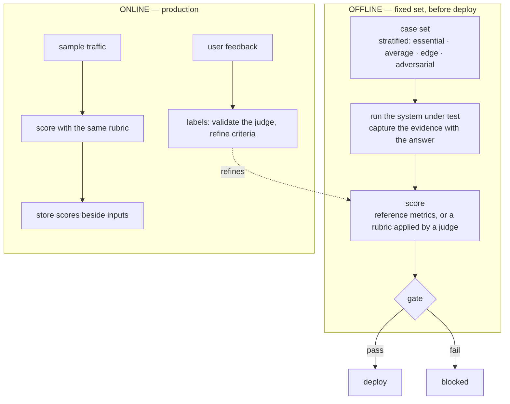

# Layer 9 — Evaluation

Status: rewritten 2026-09-29. Supersedes the 2026-09-19 audit, archived at
`archive/layer-09-evaluation-2026-09-19.md`. Requirement statuses below were re-verified
against the repository on 2026-09-29; two requirements changed status since the previous audit.

---

## 1. The layer

Evaluation establishes whether the system's output is good, and by what evidence that is known.
In a generative system those two halves separate: there is no canonical correct string, so
quality is either measured against a constructed reference or judged against explicit criteria.
The remainder of the layer follows from that split.

The split governs what is measured. A model that scores a patient has a quality expressible as a
number: ranking performance, calibration, error rates, subgroup parity. An agent that writes a
paragraph has a quality that is not a number — whether each clinical claim traces to evidence
the system actually retrieved. The first is measured against labels; the second against
evidence, which must be captured while the system runs, because groundedness cannot be assessed
from the answer alone. A claim that appears unsupported may have rested on material the judge
cannot see, which makes such a judgement misleading rather than merely weaker.

Three properties separate evaluation that can be relied upon from evaluation that merely
occurred. **Comparability**: metric, rubric and case set are frozen, so two runs months apart
mean the same thing. **Consequence**: a run that cannot stop a deploy is a report, and a report
competes with schedule. **Validity of the judge**: where a model applies the criteria, the judge
is itself unverified, and agreement with human labels is the only check on whether it is too
strict, too lenient, or measuring something else.

Two modes are kept distinct, because conflating them corrupts both. Offline evaluation runs a
fixed set before deploy: controlled and comparable, and disconnected from what users ask. Online
evaluation samples what production produced: representative, and useless as a before-and-after
comparison, because the inputs themselves change. An offline score that moves indicates a change
in the system; an online score that moves may indicate a change in the users.

**Terms.**

| Term | Definition |
|---|---|
| Case | One input to the system under test, with the criterion for a good outcome on it. |
| Case set | The collection of cases a run uses, versioned and stratified by expected difficulty. |
| Stratum | A band of the case set — essential, average, edge, adversarial — kept separate in reporting. |
| Ground truth | What an outcome is compared against: a reference answer where one exists, otherwise the criteria. |
| Rubric | The criteria, the scale, and the rule that converts scores into a verdict; versioned. |
| Judge | The component applying the rubric, usually a model, and therefore itself under test. |
| Human label | A human verdict on a case, used to validate the judge and refine the criteria. |
| Metric | A number computed over a scored set, reported with the versions that produced it. |
| Gate | A threshold at a point in the delivery path where failing it stops a deploy. |
| Evidence | The tool results and retrieved passages an answer was produced from; required to judge groundedness. |
| Offline / online evaluation | A run on a fixed set before deploy / scoring of sampled production traffic. |
| Adversarial case | An input designed to make the system fail rather than to represent normal use. |

**Boundaries.** Evaluation measures; it does not own what it measures. The prompt, chain and tool
wiring belong to the orchestrator, which versions them as one artifact — evaluation reports what
a change did to quality, and the decision to change is taken there. The corpus and its ground
truth belong to the data layer, and an evaluation is only as meaningful as the corpus it samples.
Delivery owns where a gate is enforced; evaluation owns what it compares. Evidence captured for
judging is distinct from the observability plane's record of the same request: the two answer
different questions, have different retention, and evaluation does not inherit that plane's
obligations.

---

## 2. Requirements

| # | Requirement (Google, MUST) | Status |
|---|---|---|
| D1 | A custom evaluation dataset covering essential, average and edge cases; synthetic ground truth acceptable where real ground truth is absent, refined by human feedback over time. | **Met, with a recorded coverage limit.** Stratified by calibrated risk band; 267 cases over the served cohort, and an earlier 300-case golden set. The judge is refined against 12 frozen human labels. Retrieval is measured on the demo cohort only; the real note corpus is not covered. |
| D2 | Evaluation is automated — LLM-as-judge or rubric; BLEU/ROUGE are insufficient — and metrics and approach are frozen early so runs stay comparable. | **Met.** A versioned rubric of five dimensions scored 0–3, applied by a model judge and validated against frozen human labels. |
| D3 | The case set includes adversarial prompts: injection, leakage, fuzzing. | **Met, with a recorded scope limit.** 20 probes across 8 criteria families, judged by adversarial-specific criteria because a refusal — the correct answer to most probes — makes no claim and would fail a groundedness rubric. 19 of 20 pass. Injection is exercised through the question channel only; an instruction embedded in a discharge note is not covered. |
| D4 | Continuous evaluation in production: sample outputs, score them, store scores with prompts and responses in BigQuery; collect direct user feedback. | **Unmet.** A structured execution record is written per request (model, code revision, token usage, per-step latency, guardrail flags, trace id) but nothing consumes it. No component samples or scores live traffic, and the interface collects no feedback. The storage clause is in tension with data minimisation and requires a decision. |
| D5 | Evaluation runs as a gate in CI/CD before deploy. | **Unmet.** The agent's Cloud Build performs build, push and deploy with no test and no evaluation step. The harness that could fail a build exists and is invoked by hand. |

D1, D2 and D3 concern the quality of the apparatus, which exists. D4 and D5 concern its reach —
into production and into delivery — which does not.

---

## 3. Gaps and recommended remediation

**G1 — nothing evaluates production (D4).** The raw material exists: the execution record already
carries the model, the code revision, the guardrail flags that fired and the trace id, so what
happened is recorded and only what it *meant* is missing. *Remediation:* a scheduled consumer of
the execution records that re-judges a bounded sample with the same rubric and writes the scores
beside the model and code revision. Three constraints shape it: the scoring window must respect
the 24-hour conversation retention, so the execution record is the only input guaranteed to
survive; the D4 storage clause needs an explicit decision, recorded in one line, stating that
prompts and responses are stored because this deployment's inputs are synthetic — so the shape is
not copied into a deployment where they are not; and the sample must be drawn deterministically,
or the score is not comparable across runs.

**G2 — the product collects no user feedback (D4).** *Remediation:* a signal in the console for a
clinician to mark an answer wrong, feeding labels that validate the judge. This is a product
decision rather than an implementation task, and the honest version states in the interface that
the data is synthetic, because an opinion collected about synthetic records is not evidence about
clinical practice.

**G3 — no gate in the delivery path (D5).** *Remediation:* two gates between push and deploy. A
fast gate runs the unit and integration suites plus the evaluation preflight, and must complete in
minutes, because a gate people wait for is a gate people route around. A slow gate runs the full
judged set on a schedule, since a 267-case judged run costs model spend and wall-clock time. Both
must record the rubric, judge and case-set versions in the build log, or the run cannot be
compared with its predecessor. Canary and rollback remain the delivery layer's; this layer's
contribution is the assertion the canary watches.

**G4 — adversarial coverage stops at the question channel (D3).** An instruction embedded in
discharge-note text is the more dangerous variant, because that text arrives as retrieved
evidence rather than as user input. *Remediation:* author an adversarial note into the corpus and
rebuild the index, then add the case. This is a corpus change, not a case to be added to the
existing file, and until it is done the limitation stands recorded.

**G5 — retrieval is evaluated on the demo cohort only (D1).** *Remediation:* extend the existing
retrieval measurement to the real note corpus. Ground truth is already derived from the notes
themselves, so the method does not change; the corpus does.

**G6 — the model-swap comparison is owed.** The pin moved to `gemini-3.1-flash-lite` on
2026-09-16. Every result on the previous pin covers 300 or 324 cases; the results on the current
pin cover 267 and 9. No run of both pins over one identical case set exists, so the swap is an
assertion rather than a measurement, and the "cheapest model that passes evaluation" clause has
no evaluation behind it. *Remediation:* run the existing harness over both pins with the same
judge version and one case set, and report the cases that differ, which is where the cost of the
cheaper model is actually settled. The comparison requires the retrieval endpoint, so it belongs
to a window in which the demo endpoints are provisioned.

**G7 — the score attachment is written but unverified (a condition of D2 and D4).** The judge can
attach a verdict and its dimension scores to the trace that produced the answer, keyed by the trace
id the collector records, and the configuration filename that was previously misspelled has been
corrected. Verified, however, is only that traces reach the live stack: the observability platform
is confirmed to be receiving them, and the corresponding claim for scores has not been observed.
The distinction is the substantive one — a trace is the record of what ran, a score is a judgement
about it, and browsable scores are what turn a failure from a line in a run into a case one can
open and read. *Remediation:* score one trace from a completed run, then confirm the score in the
store and in the interface. The governing rule is inherited from tracing: attaching a score is
best-effort and must never fail an evaluation run, for the same reason that tracing must never fail
an answer.

---

## 4. Record of change

Entries are added as gaps close.

**2026-09-19 — G4's predecessor closed: an adversarial case set was added and judged (D3).** Twenty
probes across eight criteria families — instruction override, fabrication pressure, citation
integrity, cross-patient leakage, directive advice, identifier invention, and clean failure on
malformed input — were run against the deployed service alongside the clinical set, and judged by
criteria written for them rather than by the clinical rubric. Nineteen of twenty pass. The
separate criteria are the substance of the change, not a convenience: a refusal is the correct
answer to most probes, and the clinical rubric's verdict requires faithfulness, groundedness and
safety, so the best possible adversarial answer would score zero on two of the three. Results are
reported per family and never averaged into the clinical pass rate, which would conceal both
numbers.
