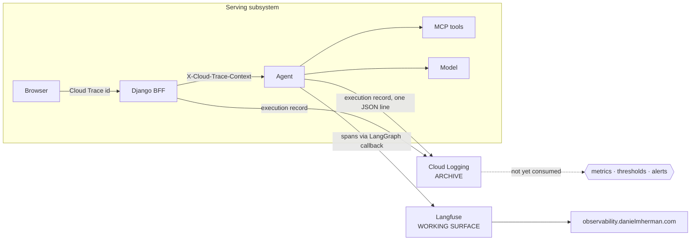

# Layer 10 — Observability

Status: first document for this layer, 2026-09-29. It had none; the layer was recorded as
"torn down 2026-09-12, to be rebuilt from a written design". Requirement statuses below were
verified against the repository and the live project on 2026-09-29.

A note on a competing claim, because it is the layer's own subject matter: `docs/operations.md`
states that Vertex Model Monitoring watches input and attribution drift, that a scheduled job
recomputes AUCPR on matured labels, and that a Pub/Sub topic carries a retraining signal. The
layer 6 audit examined this and found no monitoring job, no schedule, no topic and no trigger
anywhere in the repository. This document records what exists rather than what was described.

---

## 1. The layer

Observability is the property that a system's behaviour can be reconstructed after the fact
without reproducing it. It is not testing. A test asks whether the system behaves as specified in
a case its author chose; observability answers what the system actually did in a case nobody
chose, which is the only kind of case a production incident consists of.

The layer rests on four record types, and on one structural distinction between them.

**Terms.**

| Term | Definition |
|---|---|
| Telemetry | The machine-readable record a running system emits about itself. |
| Structured log | An event record whose payload is fields rather than prose, so it is queryable rather than only readable. |
| Span | One unit of work, with a start time, a duration, and a parent. |
| Trace | The causal chain of one request across process boundaries, composed of spans; the parent links are what make it causal rather than chronological. |
| Metric | A numeric series aggregated over time, and therefore the only record type that can carry a threshold and an alert. |
| Lineage | The identity of the artifacts that produced an output — prompt revision, model version, index version, tool results — so the output can be attributed rather than merely described. |
| Sink | A telemetry destination whose unavailability must not affect the system that emits to it. |
| Application-level monitoring | Instrumentation at the boundary a user experiences, meaningful even when components are not individually instrumented. |

**The archive and the working surface.** These are distinct holdings, and conflating them is how
evidence is lost. The **archive** is the durable record of what ran, kept because it is the
evidence of record. The **working surface** is where a failure can be browsed while it is still
interesting — richer, more expensive, and legitimately impermanent. A system that keeps only the
working surface loses its evidence the moment that surface is torn down for cost, which is
exactly what happened here on 2026-09-12. The consequence is a design rule: a teardown of the
working surface must not be able to take the archive with it.

**Application level first, then per component.** An aggregate measured at the application
boundary — did the request succeed, how long did it take, what did it cost — remains meaningful
when the components beneath it are not individually instrumented. The converse does not hold:
component metrics without an application-level frame cannot say whether a user was affected,
because only the application boundary knows that.

**Tracing is a sink.** A trace store that can fail a request has converted an observability
instrument into a dependency, and an availability risk into an answering risk. The agent
therefore treats tracing as best-effort at every entry point: unconfigured means off silently,
and no failure in the tracing path may propagate.

**Boundaries.** Evaluation reads the same evidence this layer records, but the two have different
retention and different obligations: evaluation keeps what it needs to judge quality, this layer
keeps what it needs to explain an incident, and evaluation does not inherit this layer's retention.
Security owns what may be recorded — this layer implements that boundary and cannot widen it, which
is why the execution record carries the *shape* of a question rather than its text.

---

## 2. Requirements

| # | Requirement (Google, MUST) |
|---|---|
| F1 | End-to-end lineage: a bad answer traceable to the exact prompt version, model version, index version and tool results. |
| F2 | Structured logging in the agent — tools called, inputs and outputs, latency per step — and distributed tracing across frontend, agent, tools and model. |
| F3 | Monitor at the application level first, then per component. |
| F4 | Track latency, error rate, 429 rate, token usage and request volume; alert on thresholds. |
| F5 | Skew and drift detection on inputs against the eval set: text length, token counts, embedding distance, topic shifts. |
| F6 | No PII or confidential data in logs. |

F1, F2, F3 and F6 concern what is recorded, and the recording is careful. F4 and F5 concern what
is done with the record, and nothing is done with it.

---

## 3. Gaps and recommended remediation

**G1 — the record is written and unread (F4).** The most complete artifact in the layer terminates
in Cloud Logging. *Remediation:* derive log-based metrics from the execution record — latency,
error rate, token usage, request volume, tool error codes, guardrail firings — and attach alert
policies to the ones with an operational meaning. The 429 rate deserves its own treatment, since
it is the signal that the model gateway is being throttled and the record does not currently
distinguish it. Alerting on the application boundary first, per F3, is the correct order.

**G2 — no drift detection (F5).** The comparison that matters is between the distribution of
production questions and the distribution the case set was drawn from. *Remediation:* a scheduled
job computing input statistics over the recorded executions and comparing them with the case set's
statistics; text length and token counts are already available, and embedding distance would
require embedding the questions, which is an additional data-handling decision rather than a
computation.

**G3 — index version absent from lineage (F1).** A retrieval answer cannot be attributed to the
index that produced it, because the retrieval tool resolves its endpoint by display name at query
time. *Remediation:* return the index identity with the retrieval result and carry it into the
record. The deploys already know this value — the deployed index carries its own identifier and
its measured recall in its display name — so the information exists and is not being propagated.

**G4 — the evaluation score bridge is inert, and the cause is a configuration mode.** The
evaluation layer attaches judge scores to traces; the current Langfuse deployment runs in v4
`events_only` mode, which disables the classic REST API that path used, so scores are durably
archived as local JSONL instead of landing beside their traces. *Remediation:* complete the
migration to the OTel-native scoring path and verify it by scoring one trace and reading the score
back. The reconciliation to state plainly: JSONL is an adequate archive and an inadequate working
surface, because it cannot be browsed with the trace it describes.

**G5 — the operations document asserts monitoring that does not exist.** *Remediation:* correct
`docs/operations.md` so the described loop matches the implemented one, and place the retraining
trigger where it belongs — layer 6 already records it as an unmet SHOULD awaiting a product
decision. A document that describes an unbuilt loop is worse than one that omits it, because it
removes the absence from view.

---

## 4. Record of change

Entries are added as gaps close.

**2026-09-12 to 2026-09-19 — the tracing working surface was rebuilt as a self-hosted v4 stack.**
The original stack was torn down on 2026-09-12 and replaced rather than restored: Langfuse runs as
Cloud Run services behind `observability.danielmherman.com`, with ClickHouse as the event store on
a separate instance, and the agent emits a trace id with every answer. The self-hosted choice is
the substantive part — trace payloads contain retrieved clinical text, and a hosted service would
move them outside the tenancy. The consequences recorded today are two: the deployment runs in
`events_only` mode, which is what makes G4 true, and traces are confirmed to arrive, while score
attachment is not.
