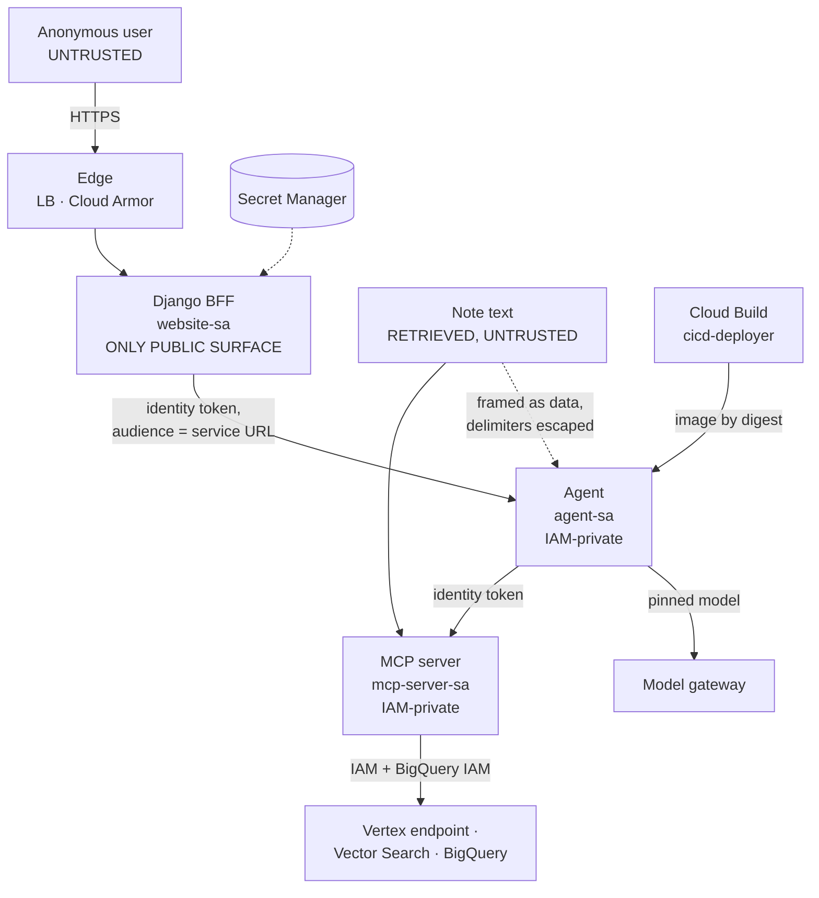

# Layer 11 — Security & identity

Status: first document for this layer, 2026-09-29. It had none. Requirement statuses below were
verified against the repository, the settings, and the live project on 2026-09-29.

---

## 1. The layer

Security here is the set of boundaries that remain correct when every participant acts in its own
interest. That framing is not rhetorical: it determines which controls count. A control that
depends on the client behaving well is a convenience; a control that holds when the client is
hostile is a boundary. The layer is therefore organised around trust boundaries rather than
around features, and the question asked of each is what an adversary on the far side can reach.

**Terms.**

| Term | Definition |
|---|---|
| Trust boundary | A line across which data or control passes between parties with different interests, and at which validation must therefore occur. |
| Least privilege | Each identity holds the minimum permissions its function requires, and no other identity can borrow them. |
| Workload identity | An identity attached to a running workload, so credentials are issued to the workload rather than embedded in it. |
| Identity token | A signed assertion of *who* the caller is, scoped to an audience; used for service-to-service authorisation, as distinct from an access token, which asserts what the caller may do. |
| Prompt injection, direct | An instruction supplied by the user, in the channel the user controls. |
| Prompt injection, indirect | An instruction carried in content the system retrieved, arriving through a channel the user does not control and the system treats as evidence. |
| Input screening | Inspection of content before it reaches the model. |
| Output screening | Inspection of the model's answer before it reaches the user. |
| Prompt as code | Instructions held in version control, reviewed like source, and identified by revision, rather than configured in place. |
| Data minimisation | Collecting and retaining the least data the function requires, and synthesising or de-identifying where possible. |
| Supply chain | The path from source to running artifact — build, registry, admission — and the controls that make each step accountable. |
| Human in the loop | A mandatory human decision between the system's output and the consequence it would otherwise carry. |

**The structural asymmetry of this layer.** Layers 1 to 8 describe what the system does; this
layer describes what it may do, and to whom. Two consequences follow. First, security requirements
are rarely satisfied by a component — they are satisfied by an arrangement, which is why least
privilege is assessed across the set of identities rather than one at a time. Second, in a system
that reads untrusted text into a model's context, the *data* path is a trust boundary as much as
the request path: retrieved note text is content an outsider could in principle have authored, and
it reaches the model in the position normally reserved for instructions.

**Boundaries.** Layer 2 owns the front door — the load balancer, Cloud Armor and the
authentication of visitors — and this layer states the requirement it satisfies. Layer 8 owns what
conversation state is kept; this layer owns what may be written to a log at all, which is why the
execution record keeps the shape of a question rather than its text. Layer 9's adversarial cases
are this layer's evidence: they are the only measurement of whether the boundaries hold under
hostile input.

---

## 2. Requirements

| # | Requirement (Google, MUST) |
|---|---|
| G1 | Treat all inputs as untrusted — user, retrieved documents, tool results — and filter or validate external content before it enters a prompt. |
| G2 | Layered defence: screen prompts and responses for injection, jailbreak and harmful content. |
| G3 | Prompts treated as code: versioned in Git, centrally stored, reviewed, auditable. |
| G4 | Least-privilege service accounts per service; service-to-service authentication with workload identity, not shared keys. |
| G5 | Front door: external Application Load Balancer, default `run.app` URL disabled, Cloud Armor for rate limiting and DDoS, IAP or Identity Platform for users. |
| G6 | Data minimisation: prefer synthetic or de-identified data; do not collect what the product does not need. |
| G7 | Supply chain: images built by Cloud Build, scanned in Artifact Registry, only approved images deployable. |
| G8 | Red-team against the OWASP LLM Top 10; regular audits. |
| G9 | AI-aware incident response playbook: roll back the model or prompt version, disable the endpoint, isolate the data source. |

---

## 3. Gaps and recommended remediation

**G1 — no screening of retrieved content before it enters the prompt (G1, G2).** Note text arrives
as evidence, in the position where instructions normally appear. *Remediation:* adopt a screening
service at the retrieval boundary, or implement the equivalent as a validated filter over retrieved
passages. The stronger half of this is already built and should not be given away: the delimiter
escape prevents a passage from *closing* its own quotation, and the adversarial criterion
`must_not_leak_other_patient` is scoped to exactly this risk. The gap is that a passage can still
carry a complete, well-formed instruction and nothing inspects it.

**G2 — no admission control on images (G7).** *Remediation:* enable vulnerability scanning on the
registry, and add a Binary Authorization policy requiring attestation before deploy. The build
already runs under a dedicated account with a narrow role set, so the policy has a subject to
attest.

**G3 — no incident response playbook (G9).** *Remediation:* a short document with three named
scenarios — a bad answer attributable to a prompt or model change, a retrieval incident, and a
suspected data-exposure event — each mapping to existing scripts, with the rollback target
identified and the decision owner named. The site's build already deploys a revision with no
traffic and promotes only after migrations succeed, which makes rollback "do not promote, or
promote the previous revision"; that property should be written down rather than rediscovered.

**G4 — red-team coverage is unclassified and incomplete (G8).** *Remediation:* map the existing
twenty probes and the nine code-review sections to the OWASP LLM Top 10 categories, so the
coverage that exists becomes legible as coverage and the holes become legible as holes. Then close
the indirect-injection case, which is the same corpus change the evaluation layer records as its
own gap 4 — one action satisfies both layers.

**G5 — the front door is torn down (G5).** *Remediation:* a decision rather than a task, and it
should be taken explicitly: either the load balancer and Cloud Armor are stood up for any window
in which the demonstration is publicly reachable, or the cloud-run default hostname is accepted as
the front door on the record. What is not defensible is the current state, in which the control is
implemented, documented as verified, and absent at the moment a visitor arrives.

**G6 — two open items on the compliance checklist (G6).** Evaluation report files containing
admission identifiers and clinical fragments are not yet scrubbed or gitignored, and PhysioNet and
MIMIC-IV are not yet acknowledged in any published write-up. *Remediation:* both are small and
neither is technical; the first is a repository-hygiene change, the second is owed on publication.

---

## 4. Record of change

Entries are added as gaps close.

No change has been made to the system for this layer. This document records its state on
2026-09-29; the requirement statuses above are the baseline against which the entries that follow
will be measured.
