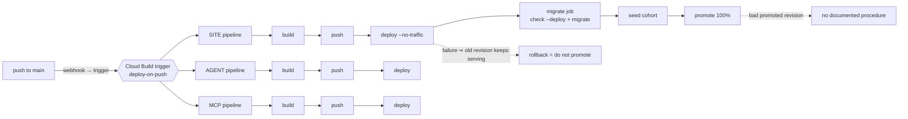

# Layer 12 — Delivery (CI/CD)

Status: first document for this layer, 2026-09-29. It had none. Requirement statuses below were
verified against the three build configurations and the live trigger on 2026-09-29.

---

## 1. The layer

Delivery is the property that a change reaches production safely, reversibly, and identically
each time it is attempted. It is the layer in which the claims of the others become enforceable:
a threshold that nothing can trip is documentation, and an evaluation harness that no build
invokes cannot prevent a regression.

The layer has one governing idea. A pipeline is not a conveyor that moves code to production; it
is a control whose *function is to fail*. A pipeline that has never failed a change is
indistinguishable from one that cannot, and the second is the common case.

**Terms.**

| Term | Definition |
|---|---|
| Continuous integration | Building and testing every change on a shared, automated path before it is merged. |
| Pipeline | The ordered, machine-executed sequence from a source revision to a running artifact. |
| Artifact | The immutable built output — a container image, identified by digest, not by tag. |
| Build once, promote | The rule that the artifact tested is the artifact deployed; rebuilding for production reintroduces everything the test ruled out. |
| Environment parity | The property that the tested environment and the production environment differ only in the ways the test accounts for. |
| Config as code | Runtime configuration held in version control so a service recreated from the repository is correctly configured rather than accidentally permissive. |
| Staged release | Deployment in which a new revision is created and receives no traffic until an explicit promotion step. |
| Canary | A release that receives a defined fraction of traffic while the remainder continues to the previous revision, with an analysis deciding whether to continue. |
| Rollback | Reinstatement of a previous known-good artifact and its configuration, whose feasibility depends on the artifact being immutable and retained. |
| Gate | A step whose failure stops the pipeline. |
| Provenance | The record of what produced the artifact and what the artifact ran as. |

**Why ordering matters as much as content.** Two properties in this system are ordering
properties rather than step properties. The first is that schema migrations run *before* the new
revision serves traffic, because deploying first would briefly run new code against an old schema.
The second is that the configuration for each environment is declared in the pipeline rather than
stored in console state, so that a service rebuilt from the repository comes up configured as it
was designed to be — a fail-closed setting cannot be lost to a console edit. Neither property is
visible in a list of pipeline steps, and both are the kind of thing that is lost when a pipeline
is edited by hand.

**The trigger is part of the pipeline.** A pipeline's reliability is bounded by the reliability of
the event that starts it. Where a push to a branch is the event, the webhook that reports it is
inside the system's boundary even though it is operated by a third party; an undelivered webhook
produces a pipeline that silently did not run, and the absence of a signal is indistinguishable
from the absence of a change.

**Boundaries.** Layer 9 owns what a gate compares; this layer owns where the gate is enforced —
the two must agree or the gate will be removed the first time it is inconvenient. Layer 11 owns
what may be deployed and under which identity; this layer owns the path by which an image arrives.
Layer 6 owns the model's own pipeline, train through registry to endpoint, which is E5 and is
audited there rather than here.

---

## 2. Requirements

| # | Requirement (Google) | Status |
|---|---|---|
| E1 | Version control for prompt templates, chain code, external datasets, adapter weights and container images. | **Met.** Prompts and chain code are one versioned artifact in Git, and its revision is stamped into every execution record. Images are tagged and referenced by commit digest rather than by a floating tag. Runtime configuration for all three services is declared in the build configurations, including the fail-closed environment setting, so a service recreated from the repository cannot come up in a permissive mode. Datasets are versioned by the data layer's own artifacts. |
| E2 | CI runs unit and integration tests on prompts, chain logic, embedded models and retrieval — not only application code. | **Unmet.** Neither the agent's pipeline nor the MCP server's pipeline contains a test step; both build, push and deploy. The site's pipeline runs `check --deploy --fail-level WARNING`, which is a genuine gate but a gate on framework configuration, not a test of behaviour. Test suites exist for all three components and are run by hand, which is what makes this a wiring gap rather than a gap in the tests. |
| E3 | CD tests the API in a production-like environment, including load tests, before release. | **Unmet.** No production-like environment exists, no load test exists, and no capacity figure has been established against which a release could be judged. |
| E4 | Canary or gradual release to a subset of users; documented rollback to the last known-good version. | **Met in part.** The site's pipeline deploys a revision with no traffic, runs migrations and the cohort seed, and only then promotes — a staged release with a designed safety property: if any step fails, the previous revision keeps serving and rollback is "do not promote". The index deployment is stronger still, being Blue/Green with a measurement taken before promotion. Absent are the two clauses the requirement names: no gradual traffic split with analysis, and no documented rollback procedure for a revision that was promoted and then found faulty. |
| E6 | Retraining or re-tuning triggered by monitoring, not by hand. (SHOULD) | **Not met.** Retraining is a person running a pipeline. Layer 6 records this as an unmet SHOULD awaiting a product decision, and notes that the operations document describes the loop as if it ran. |

E1 is satisfied, and E4 is partly satisfied in a way that is more careful than the requirement
demands. E2 and E3 are absent, which is the significant fact: the artifact that ships is not
tested by the pipeline that ships it.

---

## 3. Gaps and recommended remediation

**G1 — the pipelines run no tests (E2).** A change that breaks a golden case reaches production as
quickly as one that does not. *Remediation:* a test step in the agent and MCP pipelines, placed
between push and deploy. It must be fast, because a gate people wait for is a gate people route
around — the unit and integration suites plus the evaluation preflight, which exists precisely to
fail in seconds rather than after a long run. The full judged set belongs on a schedule rather
than on every push, since it costs model spend and wall-clock time. Both must record the rubric,
judge and case-set versions, or a run cannot be compared with its predecessor.

**G2 — no production-like environment and no load test (E3).** *Remediation:* a load test against
a staging revision establishes the capacity figure that both this requirement and the model
runtime layer's baseline requirement need, and it is the only way to know whether the concurrency
bound in the BFF is set above or below the load the system will actually see.

**G3 — no canary, and no documented rollback (E4).** *Remediation:* two separate things. The
canary is a traffic split with an analysis attached; the site already deploys with no traffic, so
the step that would carry a fraction is a change to the promotion step rather than a new
mechanism. The rollback document is the cheaper and more valuable of the two: which artifact to
return to, which migrations are reversible, and who decides. Its absence is currently masked by
the staged release working as designed, which is a property that holds only while nothing goes
wrong after promotion.

**G4 — the trigger is unreliable, and its failure is silent.** A push to `main` on 2026-09-15
produced no build at all, while other pushes in the same hour produced builds within seconds; the
webhook is operated by a third party, so a dropped delivery leaves no log on either side and can
only be inferred from the missing build. *Remediation:* treat the trigger as part of the
delivered system. The practical form is a check that a build exists for the current head of
`main`, alerting when it does not, since the absence of a build cannot be detected from the build's
own side. Routing around it by starting builds by hand removes the signal without restoring the
guarantee.

**G5 — retraining is manual (E6, SHOULD).** *Remediation:* this is a product decision rather than
a defect, and it belongs to layer 6. What belongs here is the consequence: if retraining is later
automated, the trigger will need a monitoring signal, and no such signal currently exists — the
observability layer records that nothing consumes the execution record and that no drift detection
is implemented.

---

## 4. Record of change

Entries are added as gaps close.

No change has been made to the system for this layer. This document records its state on
2026-09-29; the requirement statuses above are the baseline against which the entries that follow
will be measured.
