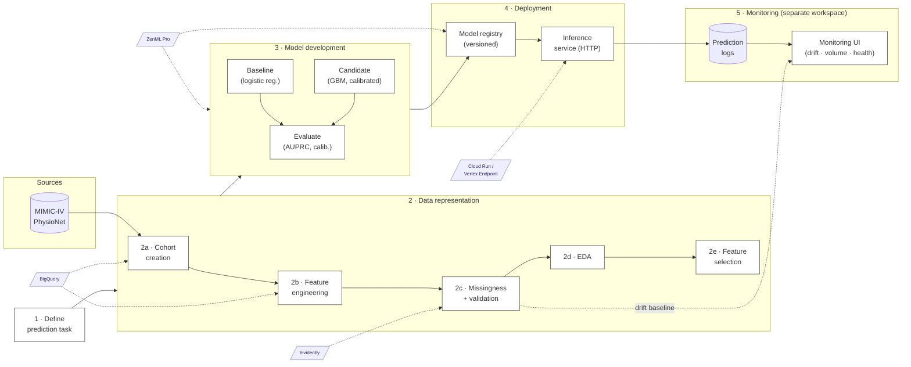

# MLOps Pipeline — Canonical Plan

> One page. Plain language. This is the source of truth.

---

## Architecture

---

## 1. Define prediction task

**What:** Given a patient at hospital discharge, predict the probability of an **unplanned readmission within 30 days**.

**Why:** Unplanned readmissions are costly and often preventable; a risk score helps care teams target follow-up.

**Inputs:** structured EHR data available at discharge time (demographics, comorbidities, vitals, labs, ICU summary, prior utilization).
**Output:** one probability in `[0, 1]` per discharge.

---

## 2. Build a data representation

### 2a. Cohort creation
Pick which hospital admissions count as a prediction event. Apply inclusion/exclusion rules (adult, completed stay, etc.), label each row with the 30-day outcome, and split into train / val / test / demo.

### 2b. Feature engineering
Compute one row per admission with features from each family (demographics, comorbidities, prior utilization, vitals, labs, ICU severity, index-stay).

### 2c. Missingness & data validation
Define an expected schema, measure per-column missingness, and check that val / test look like train (no drift). This is the gate that protects everything downstream.

### 2d. EDA
Quick sanity look — label prevalence, family-level distributions, obvious red flags. Done alongside feature selection; no standalone deliverable.

### 2e. Feature selection
Drop features that are constant, redundant, leaky, or have too little signal. For each surviving feature, record a missingness policy so Step 3 knows how to handle NaNs.

---

## 3. Model development

Build two models:
1. **Common-sense baseline** — logistic regression with class weighting. The number every fancy model has to beat.
2. **Production candidate** — gradient-boosted trees, calibrated.

Use group-aware cross-validation (no patient leaks across folds). Report AUPRC as the headline metric (prevalence is ~18%), plus calibration and a chosen operating threshold.

---

## 4. Model deployment

Wrap the trained, calibrated model in a real-time inference service:
- Single HTTP endpoint that takes one admission's features and returns a probability + decision.
- Versioned (model + feature contract pinned together).
- Logs every prediction.

---

## 5. Model monitoring

A simple UI that shows:
- recent predictions and their inputs,
- input-distribution drift vs. training,
- prediction volume and outcome (where available),
- a single "is the model healthy?" status light.

Lives in a separate workspace; consumes logs from Step 4 and drift reports from Step 2c.

---

## Working agreement

- One step at a time. Each step gets executed end-to-end and documented before we move to the next.
- Existing assets are reused where they fit; we don't rebuild for the sake of rebuilding.
- New code lands in `src/` as importable modules; notebooks are for exploration and demonstration only.
- Decisions are recorded inline in this doc, not scattered across other files.
