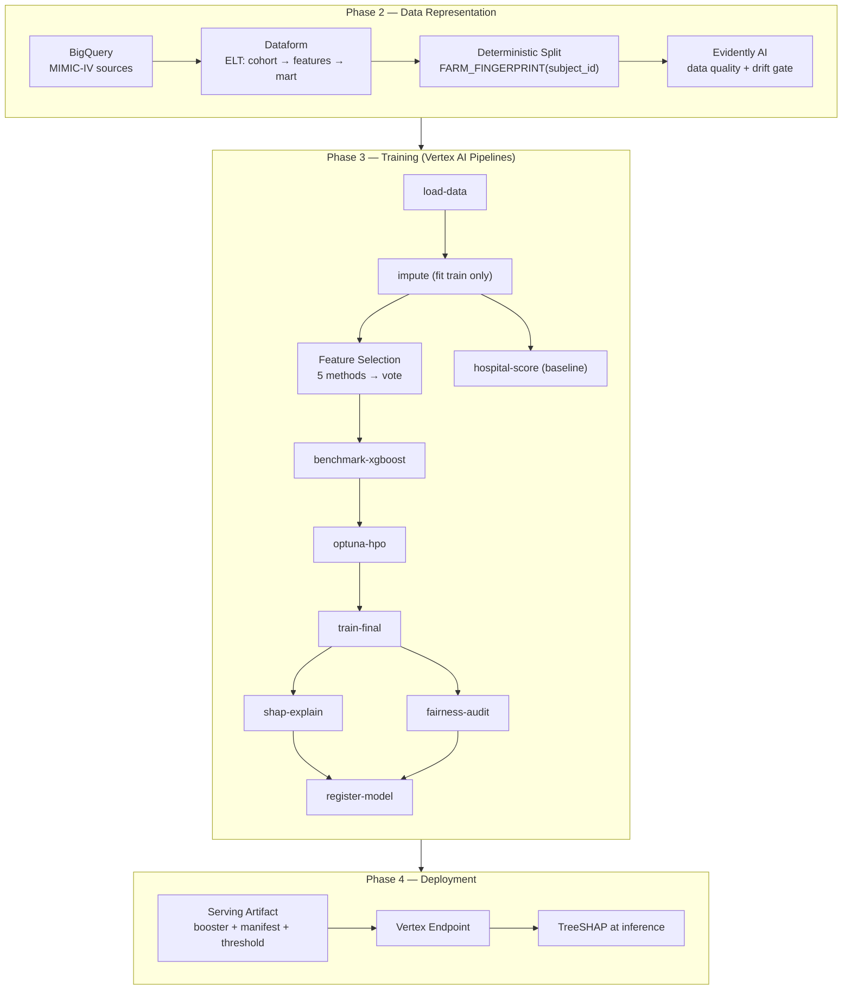

# MLOps — Readmission Risk

The machine learning system: cohort construction, feature engineering, model training, and
the served endpoint that returns a 30-day readmission risk with an explanation.

## Architecture



Source of truth: [`docs/diagrams/mlops.mmd`](../docs/diagrams/mlops.mmd).

## The prediction task

Predict whether a patient discharged from Beth Israel Deaconess Medical Center will be
readmitted within 30 days. The prediction is made **at discharge**, so every feature must
be knowable at that moment — no post-discharge leakage. The cohort is heavily imbalanced
(~14.7% positive), which is why **AUCPR** is the headline metric.

## Results

| Metric | Value |
|---|---|
| Test AUCPR | **0.328** |
| HOSPITAL baseline AUCPR | 0.251 |
| Test AUROC | 0.736 |
| Brier score | 0.112 |
| Decision threshold | 0.11 (Fβ, β = 2) |
| Features | 49 across 23 parent groups |

Full model documentation: [`docs/data-and-model.md`](../docs/data-and-model.md). Evaluation (including the
fairness audit): [`docs/evaluation.md`](../docs/evaluation.md).

## Approach

**Data representation.** Dataform runs the ELT DAG (`sources → staging → features →
analytics_dataset`) in BigQuery. The cohort is **inpatient-only**; the split uses
`FARM_FINGERPRINT(subject_id)` for deterministic, patient-level assignment, guarded by a
`split_is_disjoint` assertion. Evidently AI gates data quality and drift before training.

**Feature selection.** Five methods vote over the candidate set, then XGBoost gain +
grouped-CV RFE produce the final 49 features — deliberately broader than HOSPITAL's seven
variables.

**Training.** Imputation is fit on train only. A default-parameter XGBoost benchmark is
gated on beating HOSPITAL before Optuna HPO (TPE sampler, median pruner) runs against
AUCPR. Final training is followed by SHAP interpretability and a fairness audit before
registration.

**Serving.** The registered bundle is a native XGBoost booster (`model.bst`) plus a feature
manifest (`manifest.json`) and the decision threshold (`threshold.json`). A Custom
Prediction Routine computes **TreeSHAP** at inference and aggregates attributions to parent
groups:

```json
{
  "probability": 0.1314,
  "decision": 1,
  "threshold": 0.11,
  "top_factors": [
    {"feature": "prior_inpatient_days", "contribution": -0.114},
    {"feature": "age",                  "contribution": -0.086},
    {"feature": "rdw_max",              "contribution": -0.065}
  ]
}
```

This response shape is what the [agent service](../services/agent/) consumes as its
`predict_readmission` tool.

## Layout

```text
mlops/
├── data/          # Feature schema, encoding, and BigQuery helpers
├── training/      # Vertex AI pipeline and training components
├── evaluation/    # Baselines, validation, and feature selection
├── serving/       # CPR explainer and deployment scripts
└── notebooks/     # Exploration (gitignored)
```

## Deeper reading

| Document | Contents |
|---|---|
| [`../docs/data-and-model.md`](../docs/data-and-model.md) | Data and model lifecycle |
| [`docs/workflow.md`](docs/workflow.md) | The full methodology |
| [`../docs/system-overview.md`](../docs/system-overview.md) | System boundary and responsibilities |
