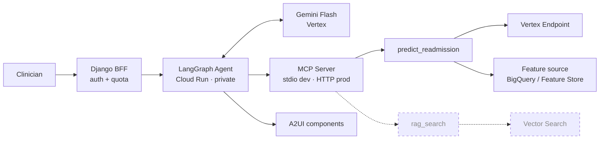

# Agent Harness

The orchestration layer: an agent that reasons over the risk model's output, exposed to
a clinician through a web interface. The model answers *what* the risk is; this project
answers *why*, and lets a clinician push back.

## Architecture

Dashed elements are designed but not yet built.

## Stack

| Concern | Decision | Why |
|---|---|---|
| Agent framework | **LangGraph** | Portable and model-agnostic; not coupled to one cloud's agent product |
| Runtime | **Cloud Run** | Serverless, scales to zero, we own the container |
| LLM | **Gemini Flash** via Vertex | Near-free per token, managed, and keeps clinical text inside GCP |
| Tool exposure | **MCP server** | Reusable by this agent, by desktop clients, by future agents |
| Transport | **stdio** (dev) + **streamable HTTP** (prod) | One implementation; develop locally, deploy remote |
| Feature source | Pluggable — **Feature Store or BigQuery** | Low-latency for demos, near-free for dev and CI |
| Rendering | **A2UI** | Agent output is designed to be renderable as components, not just prose |
| UI ↔ agent auth | **Thin BFF in Django** | Agent stays private; auth and quota centralized in one place |
| Shared state | **Cloud SQL (Postgres)** — no Redis | Postgres covers quota, sessions, and checkpoints durably across instances |

## Design notes

**Tools are stateless.** `predict_readmission(hadm_id)` hides all feature plumbing
behind a single identifier: resolve features from the configured source, call the Vertex
endpoint, return probability + decision + parent-aggregated TreeSHAP factors. It is a
pure function of `hadm_id`, which makes it trivially testable and cacheable.

**The MCP server is the reusable seam.** Putting tools behind MCP rather than wiring
them directly into the agent means the same server works from a local stdio client
during development and over authenticated HTTP in production, with no change to tool
logic. Adding retrieval later is adding a tool, not rearchitecting.

**Orchestration is deliberately thin at first.** With one tool, the agent's routing is
nearly trivial — and that is the point. The value of the first build is the plumbing
(MCP + runtime + deploy path) so that the second tool is cheap.

**Cloud Run is stateless and scales to zero**, so anything crossing requests — per-user
quota, sessions, agent checkpoints — lives in Postgres. Redis is deliberately absent;
it would only be warranted for WebSocket broadcast to multiple simultaneous viewers,
which is out of scope.

## Evaluation

Two tiers, kept separate because conflating them is how agent projects lose credibility.

**Tier 1 — integration (deterministic, CI-able).** Did the agent call the right tool
with the right arguments? Did it route through MCP rather than bypassing it? Does the
response schema validate? Does `hadm_id=20924467` return the known-good `0.1314`? Does
an invalid ID fail gracefully?

**Tier 2 — output quality (semantic).** Is the narrative *faithful* to the tool
outputs — no invented SHAP factors — and, once retrieval lands, *grounded* in retrieved
passages? Measured against a golden set with expected key facts, plus LLM-as-judge
against a versioned rubric.

The critical principle: this is **not** re-evaluating the model. Model correctness is
the MLOps AUCPR, already established. Agent evaluation measures only whether the
narrative is supported by what the tools actually returned.

## Cost posture

Cloud Run scales to zero and is near-free idle. The **Vertex endpoint and online
Feature Store bill continuously**, so development runs against BigQuery and a local
serving container; both are brought up only when a live demo needs them.

## Open items

- Confirm Gemini region availability against the `us-east1` MLOps footprint
- MCP HTTP server authentication on Cloud Run
- A2UI maturity check before it lands on the critical path
- Conversational session model (deferred until the demo needs multi-turn)
- PhysioNet DUA review for sending clinical text to a hosted LLM

## Deeper reading

- [architecture.md](docs/architecture.md) — full component design and rationale
- [BUILD_GUIDE.md](docs/BUILD_GUIDE.md) — step-by-step build plan (MCP → agent → A2UI demo)
- [a2ui_spike_findings.md](docs/a2ui_spike_findings.md) — verified A2UI rendering recipe and the four failure modes behind it
- [rag_requirements.md](../../docs/rag_requirements.md) — contract for the planned retrieval tool
- [NEXT_STEPS.md](../../docs/NEXT_STEPS.md) — build sequencing
