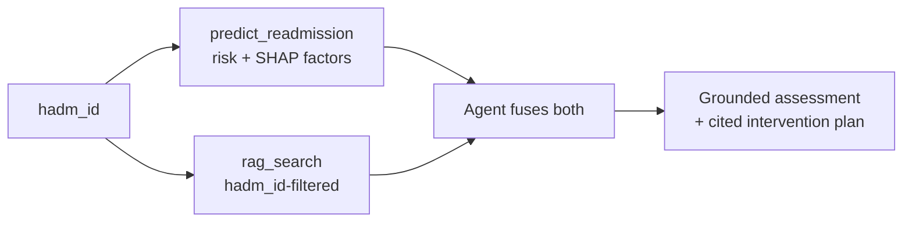

# RAG Build Guide

_Date: 2026-08-04 · Status: plan, not yet executed_

A step-by-step guide for building the **enterprise RAG system** that becomes the agent's
second tool, `rag_search`. Written for someone implementing RAG for the first time, so
each section explains *why* before *how*.

Companion to:
- [rag_requirements.md](../../../docs/rag_requirements.md) — the WHAT/WHY this guide implements
- [BUILD_GUIDE.md](BUILD_GUIDE.md) — the agent + MCP guide this one extends (RAG is step 6 of its roadmap)
- [architecture.md](architecture.md) — system context

**Guiding principle (inherited):** walking skeleton first. Every step ends with something
verifiable. Do not start a step until the previous one's verification passes.

---

## 0. What we are actually building

A RAG system is four moving parts. Naming them explicitly, because the vocabulary is
where most of the confusion lives:

| Part | What it does | Our choice |
|---|---|---|
| **Chunker** | Splits long documents into passages small enough to retrieve precisely | Section-aware splitter over discharge notes |
| **Embedder** | Turns text into a vector — a numeric "meaning fingerprint" | Vertex text embeddings |
| **Vector index** | Finds the nearest fingerprints to a query fingerprint, fast | Vertex AI Vector Search |
| **Retriever tool** | Takes a question, returns original passages + citations | `rag_search` MCP tool |

Three ideas that matter more than any of the above:

1. **The embedding is only a lookup key.** The agent never reasons over vectors. It reads
   the original English text. Vectors exist so we can search *by meaning* instead of by
   keyword.
2. **The index returns IDs, not text.** Vector Search hands back datapoint IDs and
   distances. We look the text up ourselves in BigQuery. This is why chunk storage and the
   index must stay in sync — the most common way a RAG system silently breaks.
3. **Filtering is the correctness requirement, not the search.** Returning patient B's
   note in patient A's summary is the failure mode that would disqualify this system in any
   clinical setting. Vector Search calls this a **restrict**, and R1 makes it non-negotiable.

### The target flow



Both tools feed the assessment. Per your correction on 2026-08-03: the notes are an
**input to the risk assessment**, not a decoration applied after the model has spoken.

---

## Decisions recorded

| Question | Decision |
|---|---|
| Vector store | **Vertex AI Vector Search** — demonstrating it is a goal, not incidental |
| Corpus | `mimiciv_note.discharge`, test split. Radiology copied but **not** indexed in v1 |
| Index scope | Full test split (~33,929 notes), not the 20-patient cohort |
| Filtering | `hadm_id` as a Vector Search **restrict**, applied at query time |
| Chunk store | BigQuery `readmission.note_chunks`, keyed by datapoint ID |
| Tool contract | `rag_search(hadm_id, query, top_k)` → passages + citations, plain JSON |
| Empty results | A real result the agent must report, never silently filled in |
| Dev workflow | Local until you approve deployment. No GCP writes without explicit sign-off |
| Feature Store | Removed 2026-08-03 (cost). BigQuery is the only feature path |

### Open — needs your decision

| # | Question | Options |
|---|---|---|
| D1 | Embedding model | `text-embedding-005` (768 dims, cheap) vs `gemini-embedding-001` (3072, truncatable) |
| D2 | Chunk size | ~1,500 chars w/ 200 overlap vs whole-section chunks |
| D3 | Index algorithm | `BRUTE_FORCE` validation index first, then `TREE_AH` for scale — or straight to `TREE_AH` |
| D4 | Concept list for §2 | Confirm or replace the proposed list |

---

## Table of Contents

1. [Prerequisites and layout](#1-prerequisites-and-layout)
2. [The evidence gate](#2-the-evidence-gate)
3. [Corpus preparation](#3-corpus-preparation)
4. [Chunking](#4-chunking)
5. [Embeddings](#5-embeddings)
6. [Build the Vector Search index](#6-build-the-vector-search-index)
7. [Deploy the index endpoint](#7-deploy-the-index-endpoint)
8. [The `rag_search` MCP tool](#8-the-rag_search-mcp-tool)
9. [Verify retrieval end to end](#9-verify-retrieval-end-to-end)
10. [Rebuild the demo cohort](#10-rebuild-the-demo-cohort)
11. [Agent fusion](#11-agent-fusion)
12. [Evaluation](#12-evaluation)
13. [UI](#13-ui)
14. [Cost control and teardown](#14-cost-control-and-teardown)
15. [Troubleshooting](#15-troubleshooting)

---

## 1. Prerequisites and layout

### Already true (verified 2026-08-03)

- Vertex prediction endpoint live; `predict_readmission` working; harness suite 42 passing
- `trim-icon-498815-a0.mimiciv_note.discharge` — 331,793 rows, 3.52 GB
- `trim-icon-498815-a0.mimiciv_note.radiology` — 2,321,355 rows, 2.82 GB
- Both copied from `physionet-data`, US multi-region, byte-identical to source
- Label column is `readmission_30d`; split column is `split_name`

### New files this guide creates

```
projects/agent-harness/
  rag/
    __init__.py
    chunking.py          # pure functions, no cloud calls
    sections.py          # discharge-note section grammar
    embed.py             # Vertex embedding client wrapper
    index_client.py      # Vector Search query wrapper
  mcp_server/tools/
    rag_search.py        # the second MCP tool
  scripts/
    probe_note_signal.py # §2 evidence gate
    build_chunks.py      # §4 notes -> readmission.note_chunks
    embed_chunks.py      # §5 chunks -> vectors -> GCS JSONL
    deploy_index.py      # §6-7 index + index endpoint
    build_demo_cohort.py # §10 rewrite
  tests/
    test_chunking.py     # offline, synthetic text
    test_rag_search.py   # offline, fake index client
    test_rag_live.py     # live tier, marked
```

### Enable the API

```bash
gcloud services enable aiplatform.googleapis.com --project trim-icon-498815-a0
```

Already enabled for prediction; Vector Search lives under the same API.

**Verify:** `ls projects/agent-harness/rag/` exists and `pytest projects/agent-harness/tests -q` still passes.

---

## 2. The evidence gate

**This step can invalidate the design. Do it first.**

The premise is that discharge notes carry readmission-relevant context the 49 tabular
features cannot see. If they don't, we are building expensive infrastructure to retrieve
noise, and we should know that now rather than after §7.

### Why this is a real question

An informal probe on 2026-08-03 found that the **Social History** section — the most
obvious home for "lives alone", "unreliable transportation" — is **fully redacted in
95.5% of test-split discharge notes** (only 611 of 33,929 have any content). MIMIC's
de-identification strips it.

So the first bullet of rag_requirements.md's "what the notes contribute" list is largely
**unavailable in this corpus**. The other three bullets are unmeasured.

### `scripts/probe_note_signal.py`

One committed script, writing to `readmission.note_signal_probe`, reporting:

1. **Section inventory** — every `^[A-Z][A-Za-z /]+:` header, with frequency across the test split
2. **Redaction rate per section** — fully redacted (`___` only) vs partial vs has content
3. **Concept lift** — for each concept, its rate in `readmission_30d = 1` vs `= 0`

Proposed concept list (D4 — confirm or replace):

| Concept | Why it might matter |
|---|---|
| Non-adherence | Predicts return regardless of physiology |
| Missed / no follow-up scheduled | The discharge plan failed before it started |
| Left against medical advice | Incomplete treatment |
| Substance use | Strong readmission driver, often not in coded features |
| Functional decline / needs assistance | Discharge destination mismatch |
| Polypharmacy / complex regimen | Medication error risk post-discharge |
| Goals of care / palliative | Readmission may be clinically expected, not a failure |
| Clinician hedging ("borderline", "guarded") | The subjective signal in R-list bullet 3 |

### The gate

Read the output and decide:

- **Pass** — at least some concepts show meaningful lift over base rate, and live in
  sections that survive de-identification. Continue to §3.
- **Fail** — the notes are mostly boilerplate and redaction. Then we change the design
  before building on it. Options in that case: pivot the retrieval target to the
  **discharge plan and instructions** (which are not redacted and are clinically real),
  or reconsider the corpus.

**Verify:** the probe table exists, you have read it, and you have said pass or fail.

---

## 3. Corpus preparation

Build one flat, queryable view of the notes actually in scope, so nothing downstream
re-derives the join.

`readmission.rag_corpus`:

| Column | Notes |
|---|---|
| `note_id` | From `discharge` |
| `hadm_id` | Join key, and the future restrict value |
| `subject_id` | For cross-patient retrieval later (out of scope now) |
| `charttime` | Provenance for citations |
| `split_name` | Guard: test split only |
| `text` | Raw note |

Measured for sizing: test split has **33,929 admissions with exactly one discharge note
each**, avg 11,143 chars, **378M chars total**.

> **Why test split only.** Indexing train-split notes would let the demo retrieve evidence
> about admissions the model was fitted on. Keeping the corpus and the model's holdout
> aligned means anything the demo shows is genuinely out-of-sample.

**Verify:** row count is 33,929; no `split_name` other than `test`; no null `hadm_id`.

---

## 4. Chunking

### The tradeoff

Whole notes are too big — an 11,000-character note embedded as one vector averages
everything into mush, and retrieval can't point at a specific passage for citation.
Too-small chunks lose the context that makes a passage meaningful.

Discharge notes have **consistent section headers**, so we do not need blind sliding
windows. We can split on clinical structure, which means every chunk is already a
citable unit ("Brief Hospital Course, note 12345").

### `rag/sections.py` and `rag/chunking.py`

Pure functions. No BigQuery, no Vertex, no network. That makes them unit-testable against
synthetic text and keeps the interesting logic out of the cloud path.

Chunk record shape:

| Field | Purpose |
|---|---|
| `chunk_id` | Deterministic: `{note_id}:{section}:{ordinal}`. Becomes the Vector Search datapoint ID |
| `hadm_id` | The restrict value |
| `note_id`, `section`, `char_start`, `char_end` | Citation provenance |
| `text` | What the agent actually reads |

> **Deterministic IDs matter.** Re-running the chunker must produce identical IDs, or a
> re-index orphans every stored chunk and citations start pointing at the wrong text.

Rules: split on section boundaries; sections over the size limit split on paragraph then
sentence; **drop chunks that are entirely redaction** (`___` and whitespace) — they cost
money to embed and can never support a citation.

### `scripts/build_chunks.py`

Reads `rag_corpus`, writes `readmission.note_chunks`. Idempotent — safe to re-run.

**Verify:** `pytest tests/test_chunking.py` passes; spot-check that `chunk_id` values are
unique; confirm the chunk count is in the expected range (~200-250k) before spending money
on embeddings.

---

## 5. Embeddings

### `rag/embed.py` and `scripts/embed_chunks.py`

Batched calls to the Vertex embedding model, writing vectors back to BigQuery **and**
out to GCS as JSONL — the format Vector Search ingests.

JSONL datapoint shape:

```json
{
  "id": "12345:brief_hospital_course:0",
  "embedding": [0.013, -0.221, "..."],
  "restricts": [{"namespace": "hadm_id", "allow": ["20924467"]}]
}
```

That `restricts` block is R1. It is what makes per-patient filtering possible at query
time, and it must be written at **index build time** — you cannot add it later without a
rebuild.

### Sizing (measured)

| Quantity | Value |
|---|---|
| Chunks (est.) | ~220,000 |
| Dimensions (D1: `text-embedding-005`) | 768 |
| Index size | 220,000 × 768 × 4 bytes ≈ **0.63 GiB** |
| Index build cost | 0.63 GiB × $3.00/GiB ≈ **$1.90** |
| Embedding generation | ~94M tokens — billed separately per 1M input tokens; **confirm the current rate before the batch run** |

### Requirements

- **Idempotent and resumable.** A 220k-chunk embedding run should not restart from zero
  because of one transient error. Track completion in BigQuery, skip what's done.
- **Confirm model availability in `us-east1`** before the full run, or accept a
  cross-region call.
- **Dry-run mode** that embeds 100 chunks and reports projected cost and wall time.

**Verify:** dry run succeeds; projected cost is acceptable to you; vector dimension matches
the model's documented dimension; no null embeddings.

---

## 6. Build the Vector Search index

### Two-index approach (D3 — recommended)

Build a **small `BRUTE_FORCE` index over the 20-patient cohort first.** Brute force is
exact — it checks every vector — so it is slow at scale but *correct by construction*.
That gives a ground truth to test the `TREE_AH` approximate index against. It is the
cheapest way to answer "is retrieval broken, or is approximation just imperfect?", which is
otherwise a genuinely hard question to untangle.

Then build the full `TREE_AH` index over the test split.

### `scripts/deploy_index.py`

Creates the index from the GCS JSONL. Key settings:

| Setting | Value | Why |
|---|---|---|
| `dimensions` | Match the embedding model exactly | Mismatch fails at build, not at query |
| `distance_measure_type` | `DOT_PRODUCT_DISTANCE` | Standard for normalized text embeddings |
| `index_update_method` | `BATCH_UPDATE` | Cheaper and simpler; streaming is $0.45/GiB ingested |
| `approximate_neighbors_count` | Tune with recall | Only for `TREE_AH` |

**Verify:** index reaches created state; datapoint count matches the JSONL line count. A
silent shortfall here means chunks were dropped.

---

## 7. Deploy the index endpoint

> **Cost gate. Do not run this step without explicit approval.**

Creating the index costs a one-time ~$1.90. **Deploying it to an index endpoint starts an
hourly meter that runs until you tear it down** — the same billing shape as the Feature
Store retired on 2026-08-03, though far cheaper.

| Resource | Rate | ~Monthly |
|---|---|---|
| Feature Store Bigtable node (retired) | $0.94/hr | ~$677 |
| **Vector Search `e2-standard-2`** | **$0.0938/hr** | **~$68** |
| Vertex prediction endpoint (`n1-standard-2`) | ~$0.11/hr | ~$80 |

Deploying the index endpoint is what makes the demo live. Leaving it deployed over a
weekend costs about $4.50.

`teardown.py --only vector-index` already exists and handles this: it deletes the index
**endpoint** but keeps the **index**, so standing the demo back up does not re-pay the
build charge.

**Verify:** `gcloud ai index-endpoints list --region=us-east1` shows the deployed index;
one query returns neighbors; `teardown.py --only vector-index --dry-run` correctly
identifies it.

---

## 8. The `rag_search` MCP tool

### Contract

```python
rag_search(hadm_id: int, query: str, top_k: int = 5) -> dict
```

Returns plain JSON, never A2UI — same rule as `predict_readmission`. A tool that returns UI
is welded to one presentation layer.

```json
{
  "hadm_id": 20924467,
  "query": "discharge barriers, medication adherence, follow-up plan",
  "passages": [
    {
      "chunk_id": "12345:brief_hospital_course:0",
      "note_id": "12345",
      "section": "Brief Hospital Course",
      "charttime": "2180-05-12T00:00:00",
      "text": "...",
      "score": 0.81
    }
  ],
  "returned": 1,
  "index_version": "readmission-notes-20260804"
}
```

### Non-negotiables

1. **The `hadm_id` restrict is applied server-side, always.** Not a filter the caller can
   omit, not a post-filter on results. It is R1 and it is the difference between a demo and
   a liability.
2. **Empty is a real answer.** `{"passages": [], "returned": 0}` — the agent must say "no
   supporting evidence found", never fabricate. This is the project's signature failure
   mode (silence or a plausible-but-wrong answer instead of an error), so it gets an
   explicit test.
3. **Text comes from BigQuery, keyed by the returned IDs.** The index stores no text.
4. **Structured errors, not stack traces** — matching `predict.py`'s `_error` pattern.

### Tests

- `test_rag_search.py` — offline, fake index client: restrict always applied; empty result
  shape; malformed `hadm_id`; a returned ID missing from BigQuery must error, not silently drop
- `test_rag_live.py` — marked live tier, real index

**Verify:** offline tests pass with no cloud credentials present.

---

## 9. Verify retrieval end to end

Register in `mcp_server/tools/__init__.py` and `server.py` alongside `predict_readmission`.

The test that matters most: **query with patient A's `hadm_id` using text lifted verbatim
from patient B's note.** Correct behaviour is returning A's passages or nothing at all.
Returning B's note means the restrict is not working, and everything downstream is unsafe.

**Verify:** MCP `list_tools` shows both tools; the cross-patient test passes; a nonsense
query returns few or no results rather than confident garbage.

---

## 10. Rebuild the demo cohort

The current 32-patient cohort was assembled hastily and has no defensible selection
rationale. Replace it with 20 admissions chosen against explicit criteria, expressed as
code in `scripts/build_demo_cohort.py`:

- Test split only
- Stratified by predicted risk, weighted near the calibrated threshold
- All four confusion-matrix quadrants represented
- ≥3 cases where notes carry context absent from structured features
- ≥1 case where notes add nothing — an honest demo shows that too
- Documentation floor: every admission has substantive, non-redacted note text

**Verify:** you review all 20 by hand and approve.

---

## 11. Agent fusion

Where the two signals become one assessment.

1. `predict_readmission(hadm_id)` → probability, calibrated threshold, SHAP factors
2. Agent forms a retrieval query from that context
3. `rag_search(hadm_id, query)` → passages
4. Agent produces: risk + band, drivers, evidence with citations, **conflict callout**,
   intervention plan

### The two rules from your requirements

- **Conflicts must surface.** If risk is low but the notes contain high-risk observations,
  the output says so. A system that only confirms the model is not adding value.
- **Every intervention cites something** — a feature contribution or a note passage. No
  free-floating clinical advice.

Read the threshold from the model artifact. It is calibrated during training, not a
constant, and hardcoding it will eventually make the UI lie.

**Verify:** tests assert every intervention carries a citation, and that a constructed
low-risk/high-concern case produces a conflict callout.

---

## 12. Evaluation

Two things, measured separately, because they fail for different reasons.

**Retrieval quality** — for a set of hand-labelled query/admission pairs, is the passage a
clinician would want in the top-k? Compare `TREE_AH` against the §6 `BRUTE_FORCE` ground
truth to separate "retrieval is broken" from "approximation is imperfect".

**Groundedness** — does every claim in the output trace to a retrieved passage or a feature
contribution? This is the Tier 2 eval already planned in NEXT_STEPS.md.

---

## 13. UI

Extend the existing A2UI risk card: risk + band, drivers, evidence with citations, conflict
callout, intervention plan. Function over polish.

Keep note-text rendering behind a clean boundary. The credentialing question — what a
non-credentialed viewer may see — is deferred, not resolved, and that decision will be much
cheaper if excerpt rendering is one component rather than scattered through templates.

---

## 14. Cost control and teardown

```bash
# See what is billing, change nothing
.venv/bin/python projects/agent-harness/scripts/teardown.py --dry-run

# Vector index endpoint only
.venv/bin/python projects/agent-harness/scripts/teardown.py --only vector-index

# Everything hourly-billed
.venv/bin/python projects/agent-harness/scripts/teardown.py --yes
```

Kept by design: the index itself, model registry entries, GCS bundles, BigQuery tables.
Storage is pennies; rebuilding is not.

Standing back up: `deploy_cpr.py` for the prediction endpoint, `deploy_index.py` for the
index endpoint. Neither needs a rebuild of the underlying artifact.

---

## 15. Troubleshooting

| Symptom | Likely cause |
|---|---|
| Index build fails on dimension | Embedding model dimension ≠ index `dimensions` |
| Query returns no neighbors, ever | Restrict namespace mismatch — `hadm_id` written as int, queried as string |
| Neighbors returned, text lookup fails | `note_chunks` rebuilt after indexing; IDs no longer align |
| Cross-patient leakage | Restrict not applied server-side; check it is not a post-filter |
| Datapoint count < JSONL lines | Malformed records dropped silently at build |
| Endpoint still billing after teardown | Endpoint deleted but index endpoint in another region |

---

## Sequencing summary

| Step | Blocking gate |
|---|---|
| §2 evidence gate | **Your pass/fail** — can invalidate the design |
| §3–5 corpus, chunks, embeddings | Local + BigQuery, no hourly cost |
| §6 index build | ~$1.90 one-time |
| §7 deploy index endpoint | **Your cost approval** — starts the hourly meter |
| §8–9 tool | Cross-patient isolation test must pass |
| §10 cohort | **Your review of all 20** |
| §11–13 fusion, eval, UI | — |
