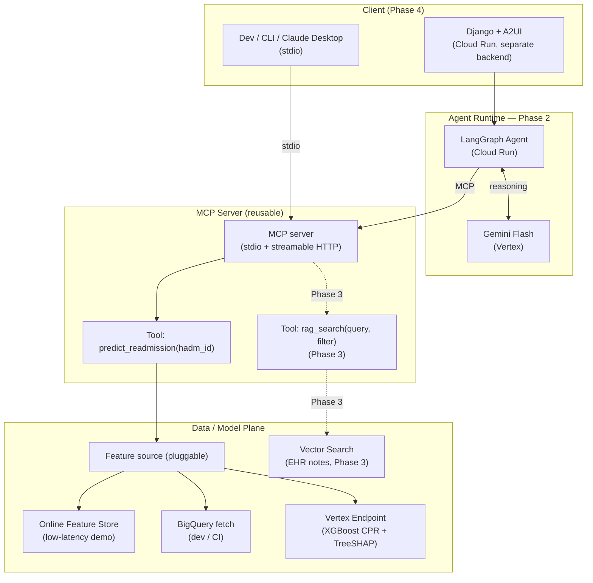

# Agent Engine + Harness — Architecture

The **HOW (design)** for the orchestration agent and Django + A2UI harness: components
and services. See the [project README](../README.md) for the summary.

_Status: Phase 2 design (2026-07-24). Captures the agreed stack and component plan.
Phase 3 (RAG) and the Django/A2UI UI are shown as planned extensions._

## Diagram

## Chosen stack (Stack 2 — portable / self-run)

| Concern | Decision | Why |
|---|---|---|
| Agent framework | **LangGraph** | Portable, model-agnostic, most visible engineering; not Google-coupled |
| Runtime host | **Cloud Run** | Serverless, scales to zero, we own the runtime |
| LLM provider | **Gemini Flash** (via Vertex) | Near-free per token, fully managed, stays in-GCP (no PHI egress) |
| Tool exposure | **MCP server** | Reusable across clients (this agent, Claude Desktop, future agents) |
| MCP transport | **stdio (dev) + streamable HTTP (prod)** | One transport-agnostic server; dev locally, deploy remote |
| Feature source | **Pluggable: online Feature Store OR BigQuery** | Low-latency showcase for demo; cheap BigQuery path for dev/CI |
| Agent shape | **Stateless tools; single-turn now, conversational-ready** | Phase 2 integration test is single-turn; multi-turn deferred to demo |
| Rendering layer | **A2UI** (committed) | Agent output contract designed A2UI-renderable from the start |
| UI ↔ agent auth | **Thin BFF in Django** (service-to-service ID token) | Agent stays private; no CORS; auth + quota centralized |
| Shared state | **Cloud SQL (Postgres)** — no Redis | Auth-gated demo → Postgres covers quota, sessions, LangGraph checkpoints durably across instances (saves ~$43/mo) |

## Components

### MCP server
Hosts the tools and is deliberately **reusable** (usable by this agent, by Claude
Desktop, or any MCP client). A single transport-agnostic implementation exposes:
- **stdio** for local dev and desktop-client reuse (no network/auth, simplest).
- **streamable HTTP** for the deployed agent on Cloud Run (network service, authed).

Develop over stdio, deploy over HTTP; the tool logic does not change.

### Tool: `predict_readmission(hadm_id)`
Encapsulates all feature plumbing behind a single `hadm_id`:
1. Resolve the patient's features from the **pluggable feature source**
   (online Feature Store for the low-latency demo, or the BigQuery fetch used by
   `smoke_test.py` for cheap dev/CI).
2. Call the **Vertex endpoint** (XGBoost CPR container).
3. Return the structured response: probability, decision (threshold 0.12),
   base value, and parent-aggregated TreeSHAP `top_factors`.

The tool is **stateless** — a pure function of `hadm_id`.

### Agent runtime (LangGraph on Cloud Run)
Orchestrates the workflow: receives a request, reasons with **Gemini Flash**, calls
the MCP tool(s), and composes the response. Phase 2 has a single tool, so the
"orchestration" is minimal by design — **the value of Phase 2 is the plumbing**
(MCP + agent runtime + deploy path), so that Phase 3 adds `rag_search` as just another
tool. Runtime is a **separate backend** from the website (the Django/A2UI UI is its own
Cloud Run service).

### Feature source (pluggable)
An abstraction with two implementations selected by config (mirrors the existing
`--skip-feature-view` flag):
- **Online Feature Store** — low-latency online lookup by `hadm_id`; the engineering
  showcase. Bills continuously, so gate it on when a demo needs it.
- **BigQuery fetch** — batch-latency, near-free; the default for dev and CI.

## Statefulness

Tools are stateless functions. The Phase 2 **integration test is single-turn**
(`hadm_id` → assessment). The framework/session model is chosen to support multi-turn,
because follow-up Q&A (e.g. "why is `prior_inpatient_days` protective?") is what makes
the Phase 4 demo compelling — but conversational session wiring is deferred.

Cloud Run is stateless and scales to zero, so any cross-request state (per-user quota,
sessions, LangGraph checkpoints) lives in **Cloud SQL (Postgres)** — shared across
instances and durable. **Redis/Memorystore is deliberately not used**; it would only be
warranted for WebSocket broadcast (e.g. a live multi-client ward dashboard), which is
out of scope.

## UI rendering (A2UI)

A2UI is the committed rendering layer for the demo page. To avoid learning A2UI and
debugging the agent simultaneously, adoption is staged:

- **Step 5** — the agent emits a **single fixed component** (risk card: probability,
  threshold, top factors). This proves the A2UI render path end-to-end against a
  known-good payload.
- **Step 6** — once `rag_search` lands, the agent chooses among multiple output shapes
  (risk card, cited note passages, comparisons), which is what A2UI actually exists for.

A2UI maturity and its integration story should be validated at Step 4, before it lands
on the critical path.

## Evaluation (two tiers)

Trust comes from separating two things that are often conflated:

- **Tier 1 — technical / integration eval (deterministic, CI-able).** Did the agent
  call the right tool with the right args? Did the tool return the known-good value
  (`0.1314` for `hadm_id=20924467`)? Does the response schema validate? **This is the
  Phase 2 exit criterion.**
- **Tier 2 — agent-output eval (semantic).** Is the natural-language assessment
  **faithful** to the tool outputs (no invented SHAP factors), **grounded** in
  retrieved notes (Phase 3), clinically sensible, and safe? Techniques: a golden set of
  `hadm_id`s with expected key facts, LLM-as-judge against an explicit versioned rubric,
  and faithfulness/groundedness scoring (every claim must trace to a tool output or a
  retrieved passage).

Key principle: the agent eval is **not** re-evaluating the model. The model's
correctness is the MLOps AUCPR (already established). The agent eval measures only
**faithfulness + groundedness + safety of the narrative** — the agent must never assert
anything the tools did not support.

## Cost notes

- Cloud Run (agent + MCP HTTP + website) scales to zero — near-free idle.
- Online Feature Store and the Vertex endpoint **bill continuously** — develop against
  BigQuery + local CPR container; redeploy the endpoint (`deploy_cpr.py`) and enable the
  online Feature Store only when a live demo needs them.
- Gemini Flash is priced per token — negligible for demo traffic.

## Open items

- Conversational session model (deferred until the demo needs multi-turn).
- UI ↔ agent auth: **thin BFF in Django** (service-to-service ID token to a private
  agent Cloud Run) is the chosen pattern; MCP HTTP server auth on Cloud Run TBD.
- Enable Gemini on Vertex + confirm region (Gemini may need `us-central1`/global vs the
  mlops `us-east1`).
- Exact online Feature Store view/entity wiring (entity = `hadm_id`).
- PhysioNet DUA / LLM-use compliance (staying in-GCP via Vertex is the defensible path).
- Phase 3: `rag_search` tool contract (see [docs/rag_requirements.md](../../../docs/rag_requirements.md)).

---
