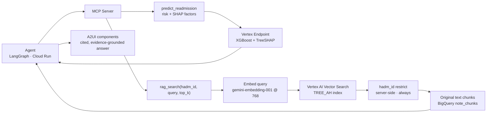

# Agentic RAG — Evidence-Grounded Retrieval

Retrieval over unstructured clinical notes that grounds the agent's qualitative
reasoning in real chart evidence. Implemented as the second tool on the agent's MCP
server, alongside `predict_readmission`.

## Overview

The readmission model produces a **quantitative** signal: a risk score and the SHAP
factors driving it, computed from 49 tabular features. RAG supplies the **qualitative**
evidence the model cannot see — the clinical narrative in unstructured discharge notes
(social determinants, medication adherence, follow-up plans, clinician assessment).
Together they support clinician review; neither alone is sufficient.

RAG exists so the agent grounds its reasoning in real chart evidence rather than
generating a plausible-sounding explanation. It is exposed as an MCP tool,
`rag_search`, registered the same way as `predict_readmission`.

## Architecture

## How it works

**The embedding is only a lookup key.** Notes are split with a section-aware chunker,
embedded once, and stored in a vector index alongside their original text. At query time
the tool embeds the question, performs a nearest-neighbor search, and returns the
**original English passages** — the agent reasons over text, never over vectors.

**Filtering is the correctness requirement.** A `hadm_id` restrict is applied
server-side on every query, so retrieval can never cross patients: a summary for one
admission is never contaminated by another patient's notes.

## Tool contract

`rag_search(hadm_id, query, top_k=5)` → plain-JSON passages with citations.

- **`hadm_id`** — MIMIC-IV admission; scopes retrieval to this admission only
- **`query`** — natural-language question formed from the prediction context
- **`top_k`** — maximum passages to return (1–20, default 5)
- **Returns** original text chunks with provenance (note, admission) for citation

A companion tool, `rag_search_sections`, retrieves one cited passage per discharge-note
section for structured summarization.

## Agent workflow

1. `predict_readmission(hadm_id)` → risk score, decision, top factors.
2. The agent forms a retrieval query from that context.
3. `rag_search(query, filter=hadm_id)` → top-k original note chunks for this admission.
4. The agent fuses the structured prediction and the retrieved passages into a single
   grounded, evidence-cited answer.

## Implementation decisions

| Decision | Choice |
|---|---|
| Corpus | MIMIC-IV discharge notes, held-out test split (~34k notes) |
| Chunking | Section-aware splitter; whitelisted sections merged greedily |
| Embedding | `gemini-embedding-001`, 768 dimensions |
| Vector index | Vertex AI Vector Search — `TREE_AH` (with a `BRUTE_FORCE` validation index) |
| Distance | Dot-product |
| Filtering | `hadm_id` restrict applied server-side on every query |
| Chunk store | BigQuery `note_chunks`, keyed by datapoint ID |
| Tool exposure | MCP tool, same registration as `predict_readmission` |

## Validation

- Retrieval validated end-to-end against the live Vector Search endpoint
- Agent integration tests exercise the `hadm_id` restrict and citation path
- The evaluation rubric includes **groundedness** and **citation accuracy** dimensions
  (98.7% and 99.7% on the 300-trace golden set)

## Related

- [Main project README](../../README.md) — system overview and architecture
- [Agent Harness](../agent-harness/) — the agent and MCP server this tool serves
- [rag_requirements.md](../../docs/rag_requirements.md) — the requirements this implements
- [RAG_BUILD_GUIDE.md](../agent-harness/docs/RAG_BUILD_GUIDE.md) — the build guide
