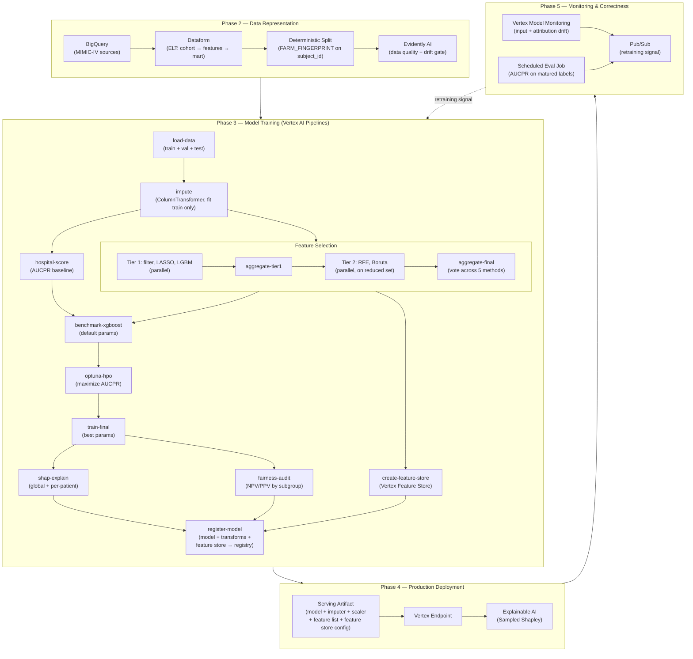

# MLOps — Readmission Risk

The machine learning system: cohort construction, feature engineering, model training,
and the served endpoint that returns a risk score with its explanation.

## Architecture



## The prediction task

Predict whether a patient discharged from Beth Israel Deaconess Medical Center will be
readmitted within 30 days. The prediction is made **at discharge**, so every feature
must be knowable at that moment — no post-discharge leakage.

The dataset is heavily imbalanced, which is why **AUCPR** is the headline metric rather
than AUROC.

## Baseline

Any learned model has to beat **HOSPITAL**, a published clinical risk score
(Hemoglobin, Oncology, Sodium, Procedure, Index admission type, Prior admissions,
Length of stay). Implementing it as a pipeline component rather than quoting the
literature means the comparison runs on the same cohort, the same split, and the same
metric.

| | AUCPR |
|---|---|
| HOSPITAL baseline | 0.332 |

## Approach

**Data representation.** Dataform runs the ELT DAG (`sources → staging → features →
analytics_dataset`) in BigQuery. Splits use `FARM_FINGERPRINT(subject_id)` so
assignment is deterministic and patient-level — a patient never appears in both train
and test. Assertions enforce non-null keys and disjoint splits.

**Feature selection.** Five methods across two tiers — filter, LASSO, and LightGBM
importance in parallel, then RFE and Boruta on the reduced set — aggregated by vote.
Result: **49 features across 23 parent groups**.

**Training.** Imputation is fit on train only. A default-parameter XGBoost benchmark is
gated on beating HOSPITAL before Optuna HPO (TPE sampler, median pruner) runs against
AUCPR. Final training is followed by SHAP interpretability and a fairness audit
(NPV/PPV by subgroup) before registration.

**Serving.** The registered bundle is a native XGBoost booster (`model.bst`) plus a
manifest of feature order and parent groups plus the decision threshold. A Custom
Prediction Routine container computes **TreeSHAP** at inference and aggregates
attributions to parent groups, so each response carries its own explanation:

```json
{
  "probability": 0.1314,
  "decision": 1,
  "threshold": 0.12,
  "base_value": -1.3386,
  "top_factors": [
    {"feature": "prior_inpatient_days", "contribution": -0.1143},
    {"feature": "age",                  "contribution": -0.0859},
    {"feature": "rdw_max",              "contribution": -0.0646}
  ]
}
```

This response shape is what the [agent harness](../agent-harness/) consumes as its
`predict_readmission` tool.

## Layout

```text
mlops/
├── pipelines/     # Vertex AI Pipelines components + CPR serving container
├── scripts/       # deploy_cpr.py, smoke_test.py, build_images.sh
├── src/           # shared library code
├── notebooks/     # exploration
└── docs/          # detail below
```

## Deeper reading

| Document | Contents |
|---|---|
| [architecture.md](docs/architecture.md) | Component-by-component design for each phase |
| [workflow.md](docs/workflow.md) | The full five-phase methodology |
| [hospital_baseline.md](docs/hospital_baseline.md) | HOSPITAL score implementation and validation |
| [feature_selection_results.md](docs/feature_selection_results.md) | Selection output and the surviving feature set |
