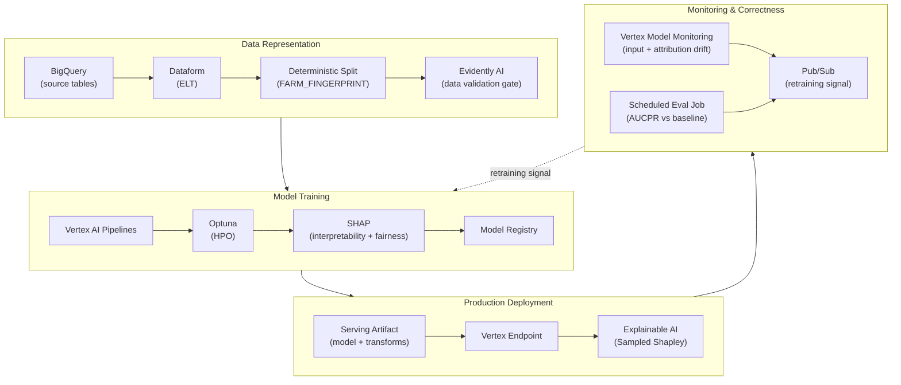

# MLOps — Architecture

The **HOW (design)** for the readmission-risk MLOps project: the exact components and services behind each workflow phase. See the master architecture for shared foundation; see [workflow.md](workflow.md) for the WHAT.

## Diagram

## Components by Phase

### Phase 2 — Data Representation

_Placeholder — BigQuery datasets, Dataform ELT, the split implementation, Evidently validation._

### Phase 3 — Model Training

_Placeholder — Vertex AI Pipelines, Optuna HPO, model registry, SHAP analysis._

### Phase 4 — Production Deployment

_Placeholder — serving artifact, Vertex endpoint, Explainable AI (Sampled Shapley) config._

### Phase 5 — Monitoring & Correctness

_Placeholder — Vertex Model Monitoring, scheduled evaluation job, Pub/Sub retraining signal._

---
