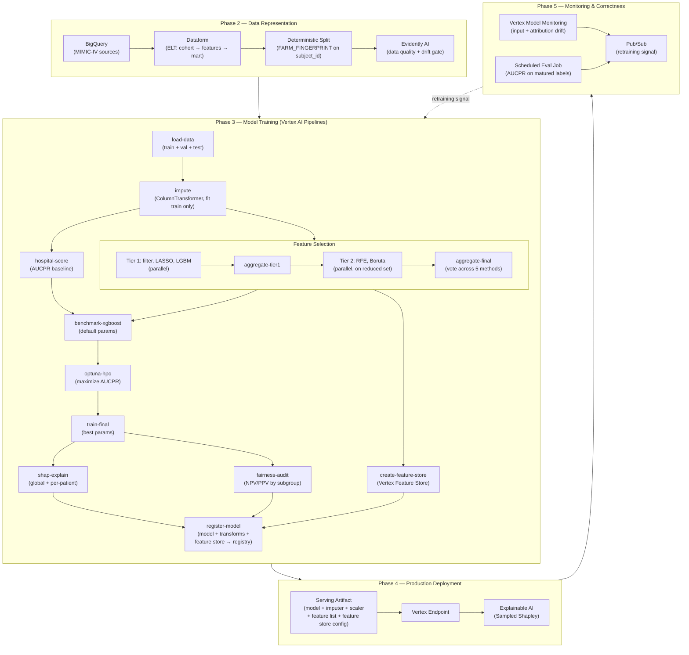

# MLOps — Architecture

The **HOW (design)** for the readmission-risk MLOps project: the exact components and services behind each workflow phase. See the master architecture for shared foundation; see [workflow.md](workflow.md) for the WHAT.

## Diagram

## Components by Phase

### Phase 2 — Data Representation

BigQuery stores the mirrored MIMIC-IV source tables. Dataform executes the ELT DAG: `sources → staging (cohort, split) → features → features_clean → analytics_dataset`. The split uses `FARM_FINGERPRINT(subject_id)` for deterministic, patient-level assignment. Built-in Dataform assertions enforce non-null keys, valid split names, and disjoint patient groups. Evidently AI runs as a post-build gate, comparing current data distributions against a reference baseline and blocking the pipeline if drift or quality thresholds are breached.

### Phase 3 — Model Training

Runs as a Vertex AI Pipeline. The DAG proceeds through: data load → imputation (ColumnTransformer fit on train only) → feature selection (5 methods in two parallel tiers, vote-aggregated) in parallel with the HOSPITAL clinical baseline. Once the feature shortlist is determined, the pipeline forks: the training chain (benchmark XGBoost gated to beat HOSPITAL → Optuna HPO with TPE sampler and median pruner → final XGBoost training → SHAP interpretability → fairness audit) runs in parallel with Vertex AI Feature Store creation (registers the selected features and ingests the offline values for online serving). Both forks converge at model registration, where the model, imputer, scaler, feature list, and feature store reference are bundled into a single serving artifact.

### Phase 4 — Production Deployment

_Placeholder — serving artifact, Vertex endpoint, Explainable AI (Sampled Shapley) config._

### Phase 5 — Monitoring & Correctness

_Placeholder — Vertex Model Monitoring, scheduled evaluation job, Pub/Sub retraining signal._

---
