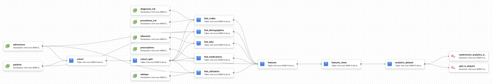

# MLOps — Runbook

The **HOW (execution)** for the readmission-risk MLOps project: exact steps, commands, and configuration. Built modularly — each section is filled in as that step is executed.

## Steps

_Placeholder — execution steps will be added here as the system is built, one section per implemented step._

## Dataform Pipeline Execution

<p align="center">
  
</p>

When **Start Execution → All actions** is triggered from the GCP Dataform UI, Dataform evaluates the dependency graph across all `.sqlx` files and executes them in the correct topological order, parallelizing where possible. Below is the step-by-step breakdown of every action that runs.

### Phase 1 — Source Registration (`sources/`)

Dataform registers the 7 mirrored MIMIC-IV tables as declared sources so downstream models can reference them safely. No data is moved — this is a pure metadata registration step confirming these tables exist in the target project.

| Source | MIMIC-IV Table | Purpose |
|---|---|---|
| `admissions` | `mimiciv_3_1_hosp.admissions` | Index hospital encounters |
| `patients` | `mimiciv_3_1_hosp.patients` | Patient demographics |
| `diagnoses_icd` | `mimiciv_3_1_hosp.diagnoses_icd` | ICD diagnosis codes |
| `procedures_icd` | `mimiciv_3_1_hosp.procedures_icd` | ICD procedure codes |
| `prescriptions` | `mimiciv_3_1_hosp.prescriptions` | Medication orders |
| `labevents` | `mimiciv_3_1_hosp.labevents` | Lab measurements |
| `edstays` | `mimiciv_ed.edstays` | Emergency department visits |

### Phase 2 — Staging & Splitting (`staging/`)

**Step 1 — `cohort`**

Selects the base universe of hospital encounters and applies exclusion rules:
- Removes elective and surgical same-day admissions (planned encounters).
- Excludes patients who died during the index stay (readmission is impossible).
- Excludes stays under one day (not true inpatient admissions).

This defines the exact population eligible for 30-day readmission prediction.

**Step 2 — `cohort_split`**

Applies a deterministic, cryptographic split on the cohort. The implementation:
1. Computes `FARM_FINGERPRINT(CAST(subject_id AS STRING))` to produce a stable 64-bit hash.
2. Takes `MOD(ABS(hash), 100)` to assign each patient an integer bucket `h` in `[0, 99]`.
3. Maps buckets to named splits by range:

| Range | Split Name | Share | Purpose |
|---|---|---|---|
| `h < 14` | `validation` | 14% | Hyperparameter tuning |
| `14 ≤ h < 28` | `test` | 14% | Final model evaluation |
| `h = 28` | `prod_test` | 1% | Production endpoint smoke test |
| `h = 29` | `demo` | 1% | Demo holdout |
| `30 ≤ h < 100` | `train` | 70% | Model training |

Splitting on `subject_id` (not `hadm_id`) guarantees every admission for a given patient lands in exactly one group, preventing patient-level data leakage across train/validation/test boundaries.

### Phase 3 — Feature Engineering (`features/`)

These models have no dependencies on each other and **execute in parallel** to minimize wall-clock time. Each aggregates raw clinical data into one-row-per-admission summaries.

| Model | Source Tables | What It Computes |
|---|---|---|
| `feat_demographics` | `patients`, `admissions` | Age, gender, marital status, language, ethnicity, insurance, admission type, discharge location |
| `feat_labs` | `labevents` | Aggregated lab values (item IDs 51279, 51277, 50931, 52074) prior to discharge |
| `feat_codes` | `diagnoses_icd`, `procedures_icd` | Binary flags for presence of specific ICD diagnosis and procedure codes |
| `feat_medications` | `prescriptions` | Drug class counts and timing relative to admission |
| `feat_utilization` | `admissions`, `edstays` | Prior admission count, total prior inpatient days, recent ED visits, index length of stay |
| `feat_target` | `admissions` | 30-day all-cause readmission label: 1 if any subsequent admission exists within 30 days of discharge, 0 otherwise |

### Phase 4 — Feature Assembly (`features/`)

**Step 1 — `features`**

Performs a comprehensive `LEFT JOIN` of all Phase 3 feature tables onto the `cohort_split` spine. This binds every admission's split bucket to its computed labs, codes, medications, demographics, and utilization history in a single wide table.

**Step 2 — `features_clean`**

Finalizes the feature set by passing all columns through cleanly. Missing values are intentionally preserved as `NULL` — imputation is deferred to the downstream training pipeline (LightGBM/XGBoost via native missing-value handling or BigQuery ML `TRANSFORM`), avoiding premature information loss from mean/median fill.

### Phase 5 — Mart Materialization & Assertions (`marts/`, `assertions/`)

**Step 1 — `analytics_dataset`**

Materializes the final flat table `readmission.analytics_dataset` — the single source of truth consumed by the Vertex AI training pipeline. This table is the data contract surface between the ELT layer and the ML layer.

**Step 2 — Data Contract Assertions (post-build tests)**

Dataform automatically runs these tests against the materialized table immediately after creation:

| Assertion | Type | Rule |
|---|---|---|
| `nonNull` | Column constraint | `subject_id`, `hadm_id`, `split_name`, and `readmission_30d` must never be `NULL` |
| `rowConditions` | Row constraint | `split_name` must be one of `train`, `validation`, `test`, `prod_test`, `demo`; `readmission_30d` must be 0 or 1 |
| `split_is_disjoint` | Cross-row assertion | No `subject_id` may appear under more than one `split_bucket` |

A green run on all three assertions certifies the dataset as structurally sound and production-ready. Any failure blocks the pipeline and must be resolved before downstream training can consume the data.

### Configuration Reference

```yaml
# workflow_settings.yaml
defaultProject: "trim-icon-498815-a0"
defaultLocation: "US"
defaultDataset: "readmission"
defaultAssertionDataset: "readmission_assertions"
vars:
  mimic_database: "trim-icon-498815-a0"
  mimic_hosp_schema: "mimiciv_3_1_hosp"
  mimic_icu_schema: "mimiciv_3_1_icu"
  mimic_ed_schema: "mimiciv_ed"
```

> **Note:** `defaultLocation` is set to `"US"` (multi-region) to match the location of the mirrored MIMIC-IV datasets. BigQuery requires query execution and data storage to share the same region. The `mimic_database` variable points to locally-mirrored copies within the project to bypass PhysioNet Data Use Agreement (DUA) restrictions that block GCP service accounts from reading `physionet-data` directly.

---
